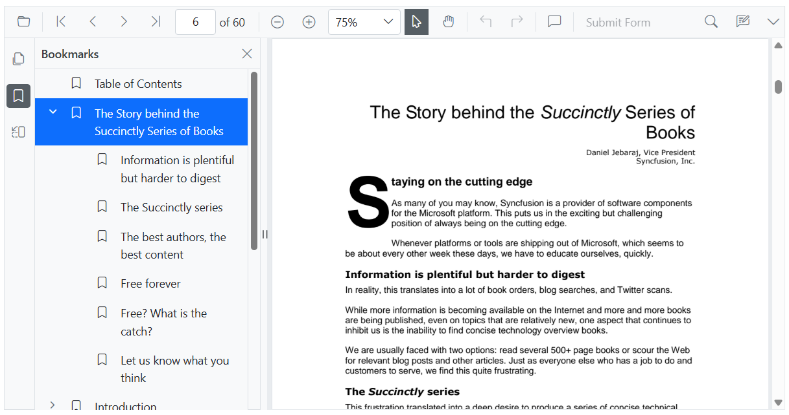

# Bookmark navigation in Blazor SfPdfViewer Component

This section explains how to enable, view, and use the bookmark panel to navigate to labeled destinations in a PDF.

Bookmarks embedded in the PDF are loaded automatically and listed in the bookmark panel. Selecting a bookmark navigates to its target. Nested bookmarks are supported and are displayed as collapsible children. When a document has no bookmarks, the panel is still visible but appears empty.



## Enable or disable the bookmark panel

Show or hide the bookmark panel by setting the [EnableBookmarkPanel](https://help.syncfusion.com/cr/blazor/Syncfusion.Blazor.SfPdfViewer.PdfViewerBase.html#Syncfusion_Blazor_SfPdfViewer_PdfViewerBase_EnableBookmarkPanel) property. This property controls only the panel's visibility; bookmarks are read from the PDF document.

```cshtml

@using Syncfusion.Blazor.SfPdfViewer

<SfPdfViewer2 Height="100%" Width="100%" DocumentPath="@DocumentPath" EnableBookmarkPanel="true" />

@code{
    private string DocumentPath { get; set; } = "wwwroot/Data/PDF_Succinctly.pdf";
}

```

## Bookmark rendering styles

Blazor PDF Viewer supports rendering bookmark text in view-only mode with the formatting styles defined in the source document. This enhancement ensures that bookmarks are displayed exactly as authored, preserving their original styling and structure while improving readability and navigation.


## See also

* [Page thumbnail navigation in Blazor SfPdfViewer](./page-thumbnail)