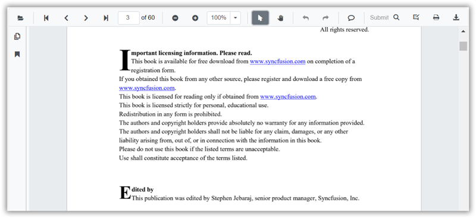

# Hyperlink navigation in SfPdfViewer

Use hyperlinks in a PDF to navigate either to external URLs or to destinations within the same document. Hyperlinks are detected from the PDF content and work by default.

- External links (HTTP/HTTPS, etc.) open in the browser according to browser security and settings (for example, a new tab or window).
- In-document links navigate directly to the referenced page or location in the viewer.

If a document does not contain hyperlinks, no link-specific highlighting appears.

## See Also

* [Table of content navigation in Blazor SfPdfViewer](./table-of-content-navigation)