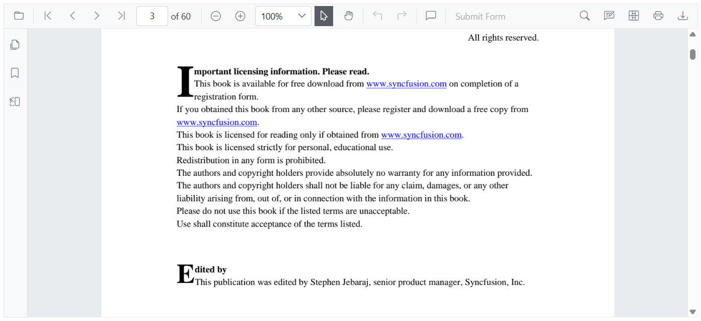

# Hyperlink navigation in Blazor SfPdfViewer Component

Use hyperlinks in a PDF to navigate to external URLs or to destinations within the same document. Hyperlinks are extracted from the PDF and enabled by default.



## Enable or disable hyperlink navigation

Toggle hyperlink navigation by setting the [EnableHyperlink](https://help.syncfusion.com/cr/blazor/Syncfusion.Blazor.SfPdfViewer.PdfViewerBase.html#Syncfusion_Blazor_SfPdfViewer_PdfViewerBase_EnableHyperlink) property. The feature is enabled by default; set it to `false` to disable link highlighting and click behavior.

```cshtml
@using Syncfusion.Blazor.SfPdfViewer

<SfPdfViewer2 Height="100%" Width="100%" DocumentPath="@DocumentPath" EnableHyperlink="true" />

@code{
    private string DocumentPath { get; set; } = "wwwroot/Data/PDF_Succinctly.pdf";
}
```

## External links

External links (HTTP/HTTPS, etc.) open in the browser according to browser settings (for example, in a new tab or window). Control where they open using the [HyperlinkOpenState](https://help.syncfusion.com/cr/blazor/Syncfusion.Blazor.SfPdfViewer.PdfViewerBase.html#Syncfusion_Blazor_SfPdfViewer_PdfViewerBase_HyperlinkOpenState) property (for example, a new tab).

```cshtml
@using Syncfusion.Blazor.SfPdfViewer

<SfPdfViewer2 Height="100%"
              Width="100%" DocumentPath="@DocumentPath"
              EnableHyperlink="true"
              HyperlinkOpenState="LinkTarget.NewTab" />

@code{
    private string DocumentPath { get; set; } = "wwwroot/Data/PDF_Succinctly.pdf";
}
```

## In-document links

In-document links navigate directly to the referenced page or location in the viewer. They always navigate within the viewer, regardless of the `HyperlinkOpenState` setting.

If a document contains no hyperlinks, the viewer shows no link highlighting.

## See also

* [Table of content navigation in Blazor SfPdfViewer](./table-of-content)
* [Bookmark navigation in Blazor SfPdfViewer](./bookmark)
* [Page thumbnail navigation in Blazor SfPdfViewer](./page-thumbnail)
* [Modern navigation panel in Blazor SfPdfViewer](./modern-panel)