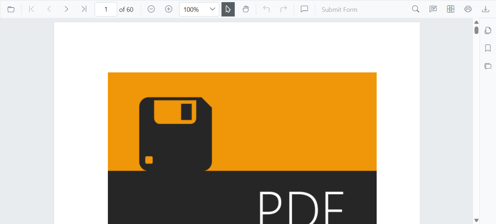
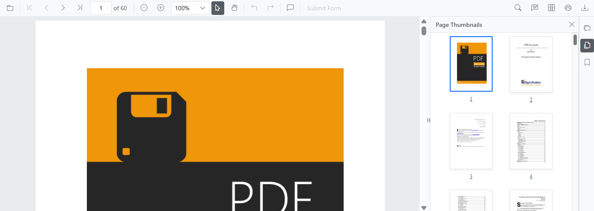
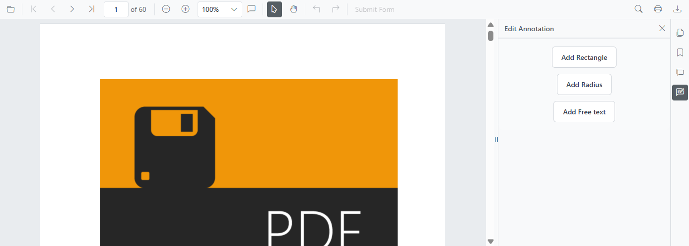
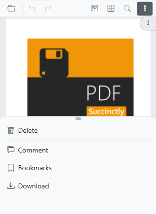

# Modern navigation panel in SfPdfViewer

The modern navigation panel consolidates thumbnails, bookmarks, comments, and custom panels in a single, flexible side panel for a streamlined navigation experience.

Enable the modern navigation panel using the [EnableNavigationPanel](https://help.syncfusion.com/cr/blazor/Syncfusion.Blazor.SfPdfViewer.PdfViewerBase.html#Syncfusion_Blazor_SfPdfViewer_PdfViewerBase_EnableNavigationPanel) property. Visibility can be toggled from the UI or programmatically.

The following example enables the modern navigation panel:

```cshtml

@using Syncfusion.Blazor.SfPdfViewer;

<SfPdfViewer2 DocumentPath="https://cdn.syncfusion.com/content/pdf/pdf-succinctly.pdf"
              Height="100%"
              Width="100%" 
              EnableNavigationPanel="true">
</SfPdfViewer2>

```


## Default items in the navigation panel

The modern navigation panel contains the following built-in items:

- Comment panel
- Thumbnail panel
- Bookmark panel

## Rearrange default items in the navigation panel

Use the `BuiltInItems` property, which accepts a list of [NavigationToolbarItem](https://help.syncfusion.com/cr/blazor/Syncfusion.Blazor.SfPdfViewer.NavigationToolbarItem.html) enums. The viewer renders the navigation icons in the exact sequence provided.

The following example displays Thumbnails first, followed by Bookmarks and the Comment panel.

```cshtml

@using Syncfusion.Blazor.SfPdfViewer;

<SfPdfViewer2 DocumentPath="https://cdn.syncfusion.com/content/pdf/pdf-succinctly.pdf"
              Height="100%"
              Width="100%" 
              EnableNavigationPanel="true">
              <NavigationToolbarSettings BuiltInItems="navigationToolbarItems"></NavigationToolbarSettings>
</SfPdfViewer2>

@code {
    // Defines the list of built-in navigation items in the desired order.
    List<NavigationToolbarItem> navigationToolbarItems = new List<NavigationToolbarItem>()
    {
        NavigationToolbarItem.Thumbnails,
        NavigationToolbarItem.Bookmarks,
        NavigationToolbarItem.CommentPanel,
    };
}

```



## Open or close the navigation panel programmatically

Open or close a navigation panel programmatically by calling the [ToggleItemByIndex](https://help.syncfusion.com/cr/blazor/Syncfusion.Blazor.SfPdfViewer.PdfViewerBase.html#Syncfusion_Blazor_SfPdfViewer_PdfViewerBase_ToggleItemByIndex_System_Int32_) method. Indices are zero-based and apply to the combined sequence of built-in and custom items.

The following example toggles the visibility of the second item in the navigation panel (index 1).

```cshtml

@using Syncfusion.Blazor.SfPdfViewer;

<button id="toggle-custom-panel-visibility-api-btn" @onclick="OpenCustomPanel">OpenCustomPanel</button>
<SfPdfViewer2 DocumentPath="https://cdn.syncfusion.com/content/pdf/pdf-succinctly.pdf"
              @ref="pdfViewer"
              Height="100%"
              Width="100%" 
              EnableNavigationPanel="true">
</SfPdfViewer2>

@code {
    private SfPdfViewer2? pdfViewer;
    private async Task OpenCustomPanel()
    {
        // Toggles the visibility of the navigation panel item at the specified index (1 in this case).
        await pdfViewer.ToggleItemByIndex(1);
    }
}

```

   

### Add custom items to the navigation panel

You can add custom items to the SfPdfViewer navigation toolbar. Create a list of [CustomNavigationToolbarItem](https://help.syncfusion.com/cr/blazor/Syncfusion.Blazor.SfPdfViewer.CustomNavigationToolbarItem.html) objects and assign it to the `CustomItems` property.

Each CustomNavigationToolbarItem object includes:
- Index: Position of the item in the toolbar.
- Name: Display name of the item.
- TooltipText: Text shown on hover.
- HeaderText: Header displayed at the top of the custom panel.
- IconCss: CSS class for the item's icon.
- Template: Custom template for panel content.
- ItemType: Item type, such as [NavigationToolbarItemType.Button](https://help.syncfusion.com/cr/blazor/Syncfusion.Blazor.SfPdfViewer.NavigationToolbarItemType.html#Syncfusion_Blazor_SfPdfViewer_NavigationToolbarItemType_Button) or [NavigationToolbarItemType.Separator](https://help.syncfusion.com/cr/blazor/Syncfusion.Blazor.SfPdfViewer.NavigationToolbarItemType.html#Syncfusion_Blazor_SfPdfViewer_NavigationToolbarItemType_Separator).

### Add a custom template for the navigation panel

Define a custom UI for a navigation panel by assigning a RenderFragment to the `Template` property of a [CustomNavigationToolbarItem](https://help.syncfusion.com/cr/blazor/Syncfusion.Blazor.SfPdfViewer.CustomNavigationToolbarItem.html).

The following example adds a default toolbar with a custom item containing a small, interactive panel with a customized UI.

```cshtml

@using Syncfusion.Blazor.SfPdfViewer

<SfPdfViewer2 @ref="pdfViewer"
              DocumentPath="https://cdn.syncfusion.com/content/pdf/pdf-succinctly.pdf"
              Height="100%"
              Width="100%" EnableNavigationPanel="true">
    <PdfViewerToolbarSettings ToolbarItems="ToolbarItems"></PdfViewerToolbarSettings>
    <NavigationToolbarSettings BuiltInItems="navigationToolbarItems" CustomItems="customNavigationToolbarItems"></NavigationToolbarSettings>
</SfPdfViewer2>

@code {
    SfPdfViewer2 pdfViewer;
    // List of standard toolbar items.
    List<ToolbarItem> ToolbarItems = new List<ToolbarItem>()
    {
        ToolbarItem.OpenOption,
        ToolbarItem.PageNavigationTool,
        ToolbarItem.MagnificationTool,
        ToolbarItem.CommentTool,
        ToolbarItem.SelectionTool,
        ToolbarItem.PanTool,
        ToolbarItem.UndoRedoTool,
        ToolbarItem.SubmitForm,
        ToolbarItem.SearchOption,
        ToolbarItem.PrintOption,
        ToolbarItem.DownloadOption
    };
    // List of built-in navigation panel items.
    List<NavigationToolbarItem> navigationToolbarItems = new List<NavigationToolbarItem>()
    {
        NavigationToolbarItem.Thumbnails,
        NavigationToolbarItem.Bookmarks,
        NavigationToolbarItem.CommentPanel,
    };
    // List to hold the custom navigation toolbar items.
    List<CustomNavigationToolbarItem> customNavigationToolbarItems;

    // Initializes the component and sets up the custom navigation items.
    protected override void OnInitialized()
    {
        customNavigationToolbarItems = new List<CustomNavigationToolbarItem>()
        {
            new CustomNavigationToolbarItem()
            {
                Name = "Edit Annotation",
                HeaderText = "Edit Annotation",
                IconCss = "e-pv-annotation-icon e-pv-icon",
                Index = 4,
                TooltipText = "Edit Annotation",
                ItemType = NavigationToolbarItemType.Button,
                Template = EditAnnotationTemplate()
            }
        };
    }

    // Defines the RenderFragment for the custom panel's content.
    private RenderFragment EditAnnotationTemplate()
    {
        return @<div style="padding: 16px 24px; background-color: #f9fafb; border-top: 1px solid #e5e7eb; display: flex; flex-direction: column; align-items: center; gap: 12px; border-bottom-left-radius: 12px; border-bottom-right-radius: 12px;">
            <button style="background: #ffffff; color: #374151; border: 1px solid #d1d5db; padding: 10px 18px; border-radius: 6px; font-size: 14px; font-weight: 500; cursor: pointer;" @onclick="AddRectangle">
                Add Rectangle
            </button>
            <button style="background: #ffffff; color: #374151; border: 1px solid #d1d5db; padding: 10px 18px; border-radius: 6px; font-size: 14px; font-weight: 500; cursor: pointer;" @onclick="AddRadius">
                Add Radius
            </button>
            <button style="background: #ffffff; color: #374151; border: 1px solid #d1d5db; padding: 10px 18px; border-radius: 6px; font-size: 14px; font-weight: 500; cursor: pointer;" @onclick="AddFreeText">
                Add Free text
            </button>
        </div>;
    }

    // Sets the annotation mode to Rectangle.
    private async Task AddRectangle()
    {
        await pdfViewer.SetAnnotationModeAsync(AnnotationType.Rectangle);
    }

    // Sets the annotation mode to Radius.
    private async Task AddRadius()
    {
        await pdfViewer.SetAnnotationModeAsync(AnnotationType.Radius);
    }

    // Sets the annotation mode to FreeText.
    private async Task AddFreeText()
    {
        await pdfViewer.SetAnnotationModeAsync(AnnotationType.FreeText);
    }
}

```



### Demand rendering for the navigation panel

SfPdfViewer supports different loading strategies for navigation panel content to optimize performance. The available options are:

* **Dynamic** : The content for a panel is only loaded into the DOM when that panel is selected. When you switch to a different panel, the previous content is removed and replaced.
* **Init** : The content for all navigation panels is rendered during the initial load and is always present in the DOM.
* **Demand** : The content for a panel is loaded into the DOM the first time it is selected. The content is then kept in the DOM, even if you navigate to other panels.

The following example sets the loading strategy to Demand.

```cshtml

@using Syncfusion.Blazor.SfPdfViewer;
@using Syncfusion.Blazor.Navigations;

<SfPdfViewer2 DocumentPath="https://cdn.syncfusion.com/content/pdf/pdf-succinctly.pdf"
              Height="100%"
              Width="100%" 
              EnableNavigationPanel="true">
              <NavigationToolbarSettings LoadOn="ContentLoad.Demand"></NavigationToolbarSettings>
</SfPdfViewer2>

```

### Modern navigation panel in mobile view

On mobile devices, the navigation toolbar collapses into a toggle menu to save space. Any custom items appear at the beginning of this menu.


