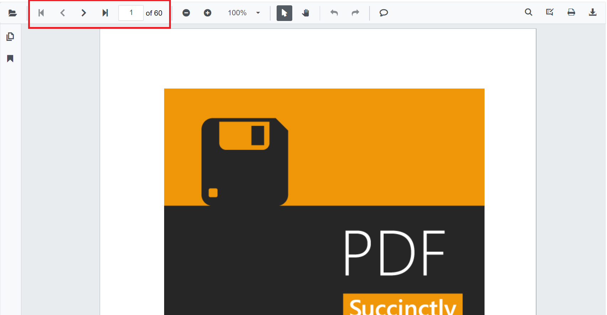

# Page navigation in SfPdfViewer

Move between pages using the built-in toolbar or programmatic APIs.

The built-in toolbar of SfPdfViewer contains the following page navigation tools:

* **First page**: Navigates to the first page in the document.
* **Previous page**: Scrolls backward one page at a time.
* **Next page**: Scrolls forward one page at a time.
* **Last page**: Navigates to the last page in the document.
* **Go to page**: Jumps to a specified page number.



The navigation tools appear in the primary toolbar. Enable or disable these buttons by setting the [EnableNavigation](https://help.syncfusion.com/cr/blazor/Syncfusion.Blazor.SfPdfViewer.PdfViewerBase.html#Syncfusion_Blazor_SfPdfViewer_PdfViewerBase_EnableNavigation) property. This setting affects only the toolbar buttons; programmatic navigation APIs remain available regardless of this value.

```cshtml

@using Syncfusion.Blazor.SfPdfViewer

<SfPdfViewer2 Width="100%"
              Height="100%"
              DocumentPath="@DocumentPath"
              EnableNavigation="false" />

@code{
    public string DocumentPath { get; set; } = "wwwroot/Data/PDF_Succinctly.pdf";
}

```

Page navigation can also be performed programmatically. The following example shows how to navigate between pages using APIs. 

N> GoToPageAsync expects a 1-based page number.

```cshtml

@using Syncfusion.Blazor.Buttons
@using Syncfusion.Blazor.Inputs
@using Syncfusion.Blazor.SfPdfViewer

<div style="display:inline-block">
    <SfButton OnClick="OnFirstPageClick">Go To First Page</SfButton>
</div>

<div style="display:inline-block">
    <SfButton OnClick="OnLastPageClick">Go To Last Page</SfButton>
</div>

<div style="display:inline-block">
    <SfButton OnClick="OnNextPageClick">Go To Next Page</SfButton>
</div>

<div style="display:inline-block">
    <SfTextBox @ref="@TextBox"></SfTextBox>
</div>

<div style="display:inline-block;">
    <SfButton OnClick="OnPageClick">Go To Page</SfButton>
</div>

<div style="display:inline-block">
    <SfButton OnClick="OnPreviousPageClick">Go To Previous Page</SfButton>
</div>

<SfPdfViewer2 Width="100%" Height="100%" DocumentPath="@DocumentPath" @ref="@Viewer" />

@code{
    SfPdfViewer2 Viewer;
    SfTextBox TextBox;
    public string DocumentPath { get; set; } = "wwwroot/data/PDF_Succinctly.pdf";

    public async void OnFirstPageClick(MouseEventArgs args)
    {
        await Viewer.GoToFirstPageAsync();
    }

    public async void OnLastPageClick(MouseEventArgs args)
    {
        await Viewer.GoToLastPageAsync();
    }

    public async void OnNextPageClick(MouseEventArgs args)
    {
        await Viewer.GoToNextPageAsync();
    }

    public async void OnPageClick(MouseEventArgs args)
    {
        int pageIndex =  int.Parse(TextBox.Value.ToString());
        await Viewer.GoToPageAsync(pageIndex);
    }

    public async void OnPreviousPageClick(MouseEventArgs args)
    {
        await Viewer.GoToPreviousPageAsync();
    }
}

```