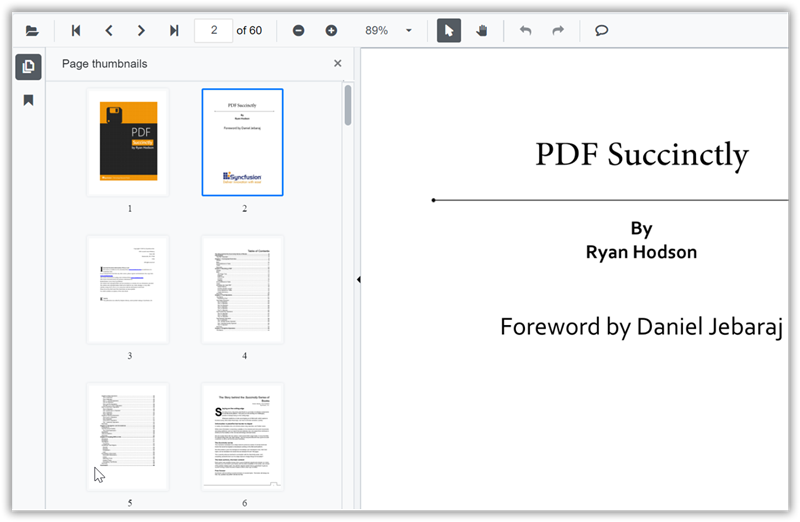

# Page thumbnail navigation in SfPdfViewer

Use the thumbnail panel to preview pages and navigate quickly through a PDF. Each thumbnail represents a page; selecting one navigates to that page in the viewer.



Enable or disable the thumbnail panel by setting the [EnableThumbnailPanel](https://help.syncfusion.com/cr/blazor/Syncfusion.Blazor.SfPdfViewer.PdfViewerBase.html#Syncfusion_Blazor_SfPdfViewer_PdfViewerBase_EnableThumbnailPanel) property. This property enables the feature; visibility at load time is controlled separately.

```cshtml

@using Syncfusion.Blazor.SfPdfViewer

<SfPdfViewer2 Height="100%" Width="100%" DocumentPath="@DocumentPath" EnableThumbnailPanel="true"/>

@code{
    public string DocumentPath { get; set; } = "wwwroot/Data/PDF_Succinctly.pdf";
}

```

## Open thumbnail panel programmatically

To show the thumbnail panel when the document loads, set the [IsThumbnailPanelOpen](https://help.syncfusion.com/cr/blazor/Syncfusion.Blazor.SfPdfViewer.PdfViewerBase.html#Syncfusion_Blazor_SfPdfViewer_PdfViewerBase_IsThumbnailPanelOpen) property to true. This controls initial visibility and works when the thumbnail feature is enabled.

The following example opens the thumbnail panel at initial render.

```cshtml

@using Syncfusion.Blazor.SfPdfViewer

<!--IsThumbnailPanelOpen property will enable the thumbnail panel on initial rendering itself-->
<SfPdfViewer2 @ref="@SfPdfViewer"
              DocumentPath="@DocumentPath"
              IsThumbnailPanelOpen="true"
              Height="100%"
              Width="100%">
</SfPdfViewer2>

@code {

    public SfPdfViewer2 SfPdfViewer { get; set; }
    //Sets the PDF document path for initial loading.
    private string DocumentPath { get; set; } = "wwwroot/Data/PDF_Succinctly.pdf";
}

```

[View sample in GitHub](https://github.com/SyncfusionExamples/blazor-pdf-viewer-examples/tree/master/Thumbnail/Show%20thumbnail%20panel).

## See Also

* [Hyperlink navigation in Blazor SfPdfViewer](./hyperlink-navigation)