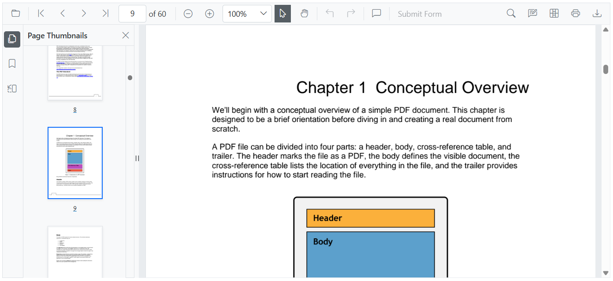

# Page thumbnail navigation in Blazor SfPdfViewer Component

Use the thumbnail panel to preview pages and quickly navigate a PDF. Each thumbnail previews a page; selecting a thumbnail navigates the viewer to that page by default.



## Enable or disable the thumbnail panel

Show or hide the thumbnail panel by setting the [EnableThumbnailPanel](https://help.syncfusion.com/cr/blazor/Syncfusion.Blazor.SfPdfViewer.PdfViewerBase.html#Syncfusion_Blazor_SfPdfViewer_PdfViewerBase_EnableThumbnailPanel) property to `true` or `false`. To show the thumbnail panel when the document loads, also set the [IsThumbnailPanelOpen](https://help.syncfusion.com/cr/blazor/Syncfusion.Blazor.SfPdfViewer.PdfViewerBase.html#Syncfusion_Blazor_SfPdfViewer_PdfViewerBase_IsThumbnailPanelOpen) property to `true`. `EnableThumbnailPanel` controls the feature; `IsThumbnailPanelOpen` controls initial visibility at load time.

```cshtml

@using Syncfusion.Blazor.SfPdfViewer

<SfPdfViewer2 @ref="@SfPdfViewer"
              DocumentPath="@DocumentPath"
              EnableThumbnailPanel="true"
              IsThumbnailPanelOpen="true"
              Height="100%"
              Width="100%">
</SfPdfViewer2>

@code {
    private SfPdfViewer2 SfPdfViewer { get; set; }
    //Sets the PDF document path for initial loading.
    private string DocumentPath { get; set; } = "wwwroot/Data/PDF_Succinctly.pdf";
}

```

[View sample in GitHub](https://github.com/SyncfusionExamples/blazor-pdf-viewer-examples/tree/master/Thumbnail/Show%20thumbnail%20panel).

## See also

* [Hyperlink navigation in Blazor SfPdfViewer](./hyperlink)
* [Bookmark navigation in Blazor SfPdfViewer](./bookmark)
* [Page navigation in Blazor SfPdfViewer](./pages)