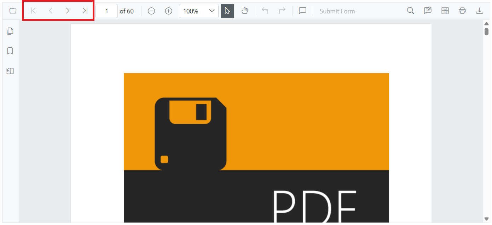

# Page navigation in SfPdfViewer

Navigate pages using the toolbar or programmatic APIs.

SfPdfViewer's toolbar includes these page navigation tools:

* **First page**: Navigate to the first page.
* **Previous page**: Scroll backward one page.
* **Next page**: Scroll forward one page.
* **Last page**: Navigate to the last page.
* **Go to page**: Jump to a specified page number.



These toolbar buttons are controlled by the [EnableNavigation](https://help.syncfusion.com/cr/blazor/Syncfusion.Blazor.SfPdfViewer.PdfViewerBase.html#Syncfusion_Blazor_SfPdfViewer_PdfViewerBase_EnableNavigation) property. The programmatic navigation APIs remain available even when the toolbar buttons are hidden.

```cshtml

@using Syncfusion.Blazor.SfPdfViewer

<SfPdfViewer2 Width="100%"
              Height="100%"
              DocumentPath="@DocumentPath"
              EnableNavigation="false" />

@code{
    private string DocumentPath { get; set; } = "wwwroot/data/PDF_Succinctly.pdf";
}

```

Navigate pages programmatically using the APIs shown in the example below.

N> `GoToPageAsync` expects a 1‑based page number.

```cshtml

@using Syncfusion.Blazor.Buttons
@using Syncfusion.Blazor.Inputs
@using Syncfusion.Blazor.SfPdfViewer

<div style="display:inline-block">
    <SfButton OnClick="OnFirstPageClick">Go To First Page</SfButton>
</div>

<div style="display:inline-block">
    <SfButton OnClick="OnPreviousPageClick">Go To Previous Page</SfButton>
</div>

<div style="display:inline-block">
    <SfButton OnClick="OnNextPageClick">Go To Next Page</SfButton>
</div>

<div style="display:inline-block">
    <SfButton OnClick="OnLastPageClick">Go To Last Page</SfButton>
</div>

<div style="display:inline-block">
    <SfTextBox @ref="@TextBox"></SfTextBox>
</div>

<div style="display:inline-block;">
    <SfButton OnClick="OnPageClick">Go To Page</SfButton>
</div>

<SfPdfViewer2 Width="100%" Height="100%" DocumentPath="@DocumentPath" @ref="@Viewer" />

@code{
    private SfPdfViewer2 Viewer;
    SfTextBox TextBox;
    private string DocumentPath { get; set; } = "wwwroot/data/PDF_Succinctly.pdf";

    private async Task OnFirstPageClick(MouseEventArgs args)
    {
        await Viewer.GoToFirstPageAsync();
    }

    private async Task OnLastPageClick(MouseEventArgs args)
    {
        await Viewer.GoToLastPageAsync();
    }

    private async Task OnNextPageClick(MouseEventArgs args)
    {
        await Viewer.GoToNextPageAsync();
    }

    private async Task OnPageClick(MouseEventArgs args)
    {        // GoToPageAsync expects a 1-based page number.        int pageIndex =  int.Parse(TextBox.Value.ToString());
        await Viewer.GoToPageAsync(pageIndex);
    }

    private async Task OnPreviousPageClick(MouseEventArgs args)
    {
        await Viewer.GoToPreviousPageAsync();
    }
}

```

## See also

* [Hyperlink navigation in Blazor SfPdfViewer](./hyperlink)
* [Bookmark navigation in Blazor SfPdfViewer](./bookmark)
* [Page thumbnail navigation in Blazor SfPdfViewer](./page-thumbnail)
* [Magnification in Blazor SfPdfViewer](../magnification)