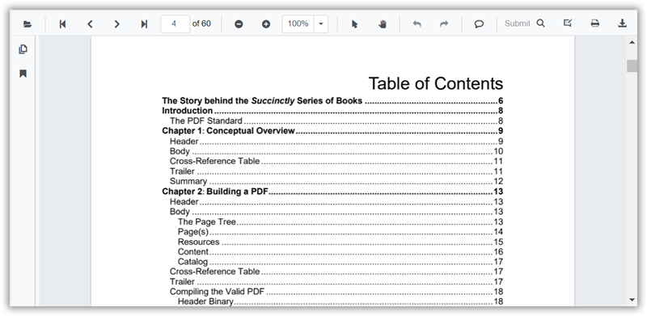

# Table of contents navigation in SfPdfViewer

Use the table of contents (TOC) to jump to sections within a PDF. Each TOC entry maps to a location in the document; selecting one navigates to that destination.



Enable or disable both hyperlink and TOC navigation by setting the [EnableHyperlink](https://help.syncfusion.com/cr/blazor/Syncfusion.Blazor.SfPdfViewer.PdfViewerBase.html#Syncfusion_Blazor_SfPdfViewer_PdfViewerBase_EnableHyperlink) property. TOC entries are parsed from the PDF; if the document has no TOC, no entries appear.

```cshtml

@using Syncfusion.Blazor.SfPdfViewer

<SfPdfViewer2 Height="100%" Width="100%" DocumentPath="@DocumentPath" EnableHyperlink="true" />

@code{
    public string DocumentPath { get; set; } = "wwwroot/Data/PDF_Succinctly.pdf";
}

```

Control where external hyperlinks open by using the [HyperlinkOpenState](https://help.syncfusion.com/cr/blazor/Syncfusion.Blazor.SfPdfViewer.PdfViewerBase.html#Syncfusion_Blazor_SfPdfViewer_PdfViewerBase_HyperlinkOpenState) property (for example, a new tab). In-document TOC links always navigate within the viewer.

```cshtml

@using Syncfusion.Blazor.SfPdfViewer

<SfPdfViewer2 Height="100%"
              Width="100%" DocumentPath="@DocumentPath"
              EnableHyperlink="true"
              HyperlinkOpenState="LinkTarget.NewTab" />

@code{
    public string DocumentPath { get; set; } = "wwwroot/Data/PDF_Succinctly.pdf";
}
```