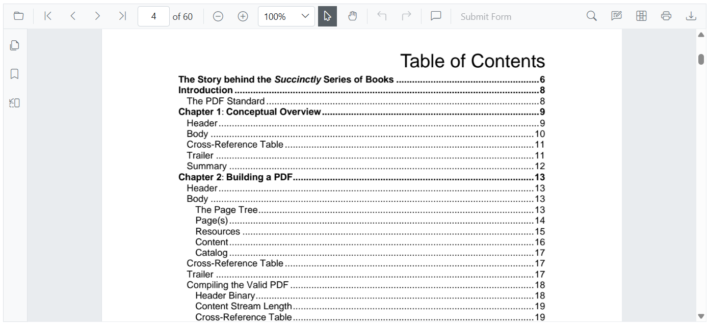

# Table of contents navigation in Blazor SfPdfViewer

Use the table of contents (TOC) to jump to sections within a PDF. Each entry maps to a location in the document; selecting one navigates to that destination.



Enable hyperlink navigation, which also enables click behavior on TOC links, by setting the [EnableHyperlink](https://help.syncfusion.com/cr/blazor/Syncfusion.Blazor.SfPdfViewer.PdfViewerBase.html#Syncfusion_Blazor_SfPdfViewer_PdfViewerBase_EnableHyperlink) property to `true`. TOC entries are parsed from the PDF; if the document has no TOC, no entries appear.
```cshtml

@using Syncfusion.Blazor.SfPdfViewer

<SfPdfViewer2 Height="100%" Width="100%" DocumentPath="@DocumentPath" EnableHyperlink="true" />

@code{
    private string DocumentPath { get; set; } = "wwwroot/Data/PDF_Succinctly.pdf";
}

```

Control where external hyperlinks open using the [HyperlinkOpenState](https://help.syncfusion.com/cr/blazor/Syncfusion.Blazor.SfPdfViewer.PdfViewerBase.html#Syncfusion_Blazor_SfPdfViewer_PdfViewerBase_HyperlinkOpenState) property (for example, a new tab). In-document TOC links always navigate within the viewer.

```cshtml

@using Syncfusion.Blazor.SfPdfViewer

<SfPdfViewer2 Height="100%"
              Width="100%" DocumentPath="@DocumentPath"
              EnableHyperlink="true"
              HyperlinkOpenState="LinkTarget.NewTab" />

@code{
    private string DocumentPath { get; set; } = "wwwroot/Data/PDF_Succinctly.pdf";
}

```

## See also

* [Modern navigation panel in Blazor SfPdfViewer](./modern-panel)
* [Hyperlink navigation in Blazor SfPdfViewer](./hyperlink)
* [Bookmark navigation in Blazor SfPdfViewer](./bookmark)
* [Page thumbnail navigation in Blazor SfPdfViewer](./page-thumbnail)
* [Page navigation in Blazor SfPdfViewer](./pages)