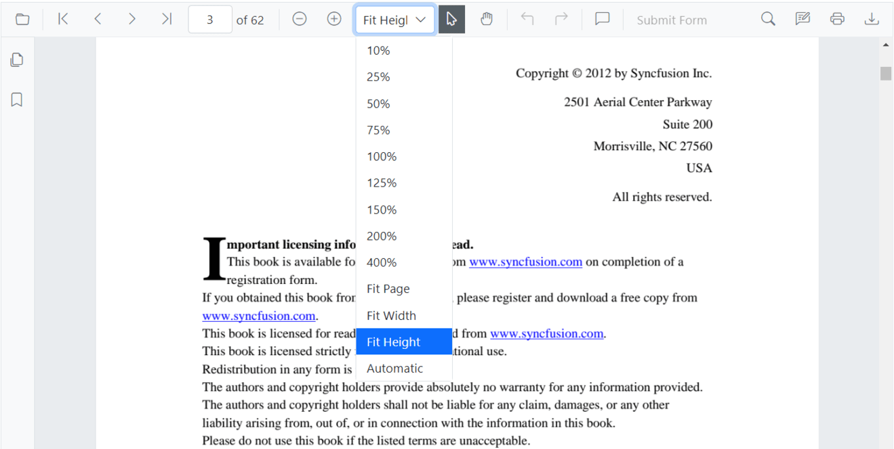
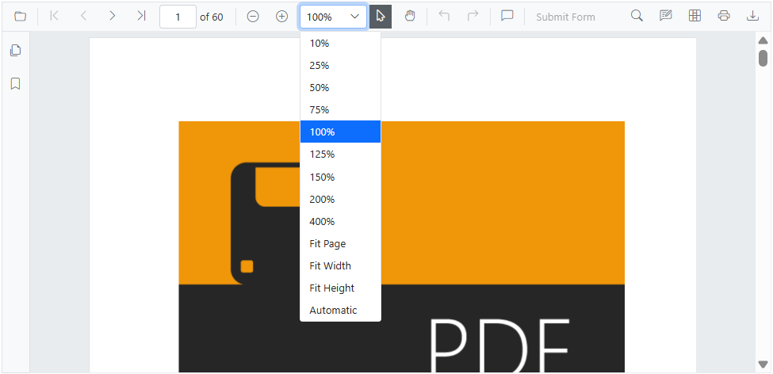
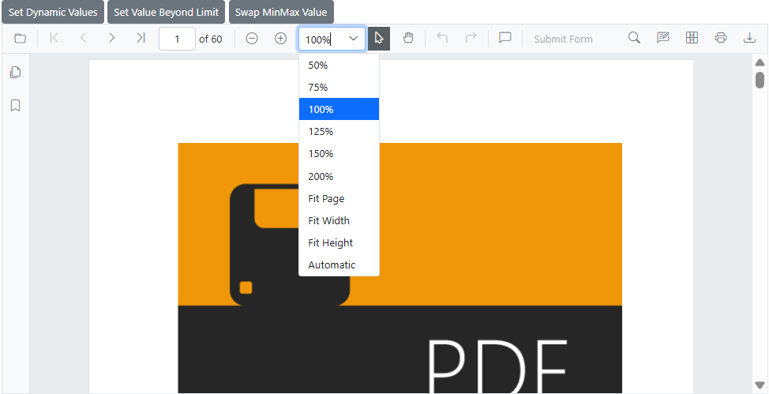
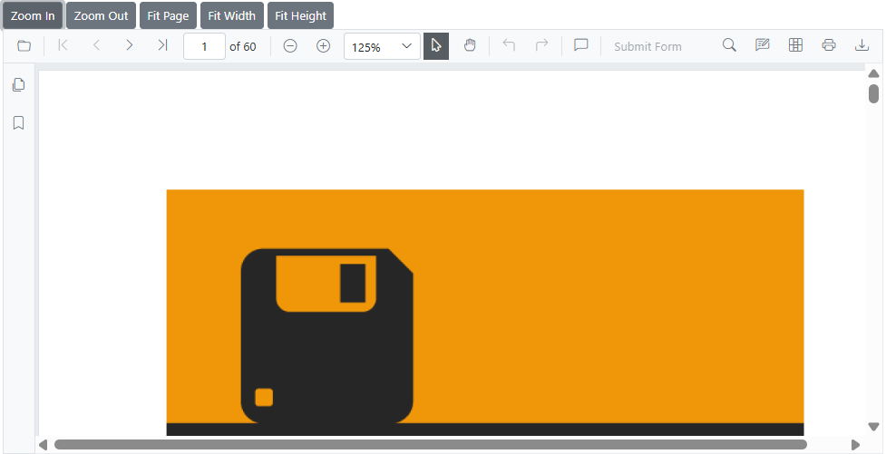
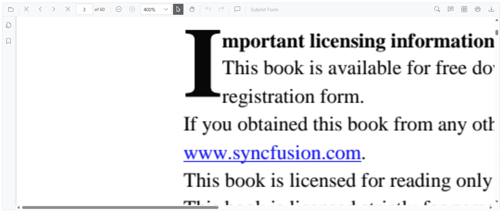

# Magnification in Blazor SfPdfViewer Component

The built-in toolbar of SfPdfViewer includes the following zoom options:

* **Zoom** **In**: Increases the zoom level (document magnification) by preset steps.
* **Zoom** **Out**: Decreases the zoom level by preset steps.
* **Zoom** **To**: Sets the zoom level to a specified value.
* **Fit** **Page**: Fits the entire page within the available viewport.
* **Fit** **Width**: Fits the page to the viewport width.
* **Fit** **Height**: Fits the page to the viewport height.



## Enable or Disable Magnification in Blazor SfPdfViewer Component

Enable or disable magnification in the default toolbar by setting the [EnableMagnification](https://help.syncfusion.com/cr/blazor/Syncfusion.Blazor.SfPdfViewer.PdfViewerBase.html#Syncfusion_Blazor_SfPdfViewer_PdfViewerBase_EnableMagnification) property.

```cshtml

@using Syncfusion.Blazor.SfPdfViewer

<SfPdfViewer2 Height="100%"
              Width="100%"
              DocumentPath="@DocumentPath"
              EnableMagnification="false" />

@code{
    public string DocumentPath { get; set; } = "wwwroot/data/PDF_Succinctly.pdf";
}

```
## Programmatic Zoom Operations

Zoom operations can also be performed programmatically using APIs such as [ZoomInAsync](https://help.syncfusion.com/cr/blazor/Syncfusion.Blazor.SfPdfViewer.PdfViewerBase.html#Syncfusion_Blazor_SfPdfViewer_PdfViewerBase_ZoomInAsync), [ZoomOutAsync](https://help.syncfusion.com/cr/blazor/Syncfusion.Blazor.SfPdfViewer.PdfViewerBase.html#Syncfusion_Blazor_SfPdfViewer_PdfViewerBase_ZoomOutAsync), [ZoomAsync](https://help.syncfusion.com/cr/blazor/Syncfusion.Blazor.SfPdfViewer.PdfViewerBase.html#Syncfusion_Blazor_SfPdfViewer_PdfViewerBase_ZoomAsync_System_Int32_), [FitToPageAsync](https://help.syncfusion.com/cr/blazor/Syncfusion.Blazor.SfPdfViewer.PdfViewerBase.html#Syncfusion_Blazor_SfPdfViewer_PdfViewerBase_FitToPageAsync), [FitToWidthAsync](https://help.syncfusion.com/cr/blazor/Syncfusion.Blazor.SfPdfViewer.PdfViewerBase.html#Syncfusion_Blazor_SfPdfViewer_PdfViewerBase_FitToWidthAsync), and [FitToHeightAsync](https://help.syncfusion.com/cr/blazor/Syncfusion.Blazor.SfPdfViewer.PdfViewerBase.html#Syncfusion_Blazor_SfPdfViewer_PdfViewerBase_FitToHeightAsync).

```cshtml

@using Syncfusion.Blazor.Buttons
@using Syncfusion.Blazor.Inputs
@using Syncfusion.Blazor.SfPdfViewer

<div style="display:inline-block">
    <SfButton OnClick="OnZoomInClick">Zoom In</SfButton>
</div>

<div style="display:inline-block">
    <SfButton OnClick="OnZoomOutClick">Zoom Out</SfButton>
</div>

<div style="display:inline-block">
    <SfTextBox @ref="@TextBox"></SfTextBox>
</div>

<div style="display:inline-block">
    <SfButton OnClick="OnZoomClick">Zoom</SfButton>
</div>

<div style="display:inline-block;">
    <SfButton OnClick="OnFitPageClick">Fit To Page</SfButton>
</div>

<div style="display:inline-block">
    <SfButton OnClick="OnFitWidthClick">Fit To Width</SfButton>
</div>

<div style="display:inline-block"> 
    <SfButton OnClick="OnFitHeightClick">Fit To Height</SfButton> 
</div> 

<SfPdfViewer2 Height="100%"
              Width="100%"
              DocumentPath="@DocumentPath"
              @ref="@Viewer" />

@code {
    SfPdfViewer2 Viewer;
    SfTextBox TextBox;
    public string DocumentPath { get; set; } = "wwwroot/data/PDF_Succinctly.pdf";

    public async void OnZoomInClick(MouseEventArgs args)
    {
        await Viewer.ZoomInAsync();
    }

    public async void OnZoomOutClick(MouseEventArgs args)
    {
        await Viewer.ZoomOutAsync();
    }

    public async void OnFitPageClick(MouseEventArgs args)
    {
        await Viewer.FitToPageAsync();
    }

    public async void OnZoomClick(MouseEventArgs args)
    {
        int zoomValue = int.Parse(TextBox.Value.ToString());
        await Viewer.ZoomAsync(zoomValue);
    }

    public async void OnFitWidthClick(MouseEventArgs args)
    {
        await Viewer.FitToWidthAsync();
    }

    public async void OnFitHeightClick(MouseEventArgs args) 
    { 
        await Viewer.FitToHeightAsync(); 
    } 
}

```

N> SfPdfViewer supports zoom values from 10% to 400%.

## Minimum and Maximum Zoom Values in Blazor SfPdfViewer Component

Configure minimum and maximum zoom levels using the [MinZoomValue](https://help.syncfusion.com/cr/blazor/Syncfusion.Blazor.SfPdfViewer.PdfViewerBase.html#Syncfusion_Blazor_SfPdfViewer_PdfViewerBase_MinZoomValue) and [MaxZoomValue](https://help.syncfusion.com/cr/blazor/Syncfusion.Blazor.SfPdfViewer.PdfViewerBase.html#Syncfusion_Blazor_SfPdfViewer_PdfViewerBase_MaxZoomValue) properties. These settings help:

* Define a zoom range for better usability
* Prevent excessive zooming that can distort content or impact performance
* Ensure readability on smaller screens
* Maintain consistent zoom behavior across devices

### Setting minimum and maximum zoom values

Specify the zoom limits during component initialization with integer values representing percentages.

N> SfPdfViewer supports zoom values from 10% to 400%.

### Basic usage of Minimum and Maximum Zoom Values

```cshtml

@using Syncfusion.Blazor.SfPdfViewer

<SfPdfViewer2 DocumentPath="@DocumentPath"
              MinZoomValue="50"
              MaxZoomValue="200"
              Width="100%"
              Height="100%">
</SfPdfViewer2>

@code {
    private string DocumentPath { get; set; } = "wwwroot/Data/PDF_Succinctly.pdf";
}

```

See the following image.




### Zoom range scenarios

* Limit zoom to a specific range for readability and usability.
* Prevent distortion or performance issues due to excessive zooming.
* Ensure readability on smaller screens by setting a minimum zoom.

### Invalid input handling

SfPdfViewer handles invalid input values as follows:

* **Values below 1**: Automatically fall back to the default minimum (10)
* **MinZoomValue > MaxZoomValue**: MaxZoomValue is adjusted to match MinZoomValue

### Dynamic zoom value configuration

Minimum and maximum zoom values can be changed dynamically at runtime.

```cshtml

@using Syncfusion.Blazor.SfPdfViewer
@using Syncfusion.Blazor.Buttons

<SfButton OnClick="SetDynamicValues">Set Dynamic Values</SfButton>
<SfButton OnClick="SetValueBeyondLimit">Set Value Beyond Limit</SfButton>
<SfButton OnClick="SwapMinMaxValue">Swap MinMax Value</SfButton>

<SfPdfViewer2 @ref="viewer" 
              DocumentPath="@DocumentPath" 
              Height="100%" 
              Width="100%" 
              MaxZoomValue="@maxZoom" 
              MinZoomValue="@minZoom">
</SfPdfViewer2>

@code {
    public SfPdfViewer2? viewer;
    private string DocumentPath { get; set; } = "wwwroot/Data/PDF_Succinctly.pdf";

    public int maxZoom = 200;
    public int minZoom = 50;

    public void SetDynamicValues()
    {
        maxZoom = 260;
        minZoom = 25;
    }

    public void SetValueBeyondLimit()
    {
        maxZoom = 500; // Beyond default limit
        minZoom = 2;   // Beyond default limit
    }

    public void SwapMinMaxValue()
    {
        maxZoom = 50;  // Less than minZoom
        minZoom = 200; // Greater than maxZoom
    }
}

```

See the following image.



### Integration with zoom operations

The configured zoom limits apply to all zoom operations, including programmatic methods.

```cshtml

@using Syncfusion.Blazor.SfPdfViewer
@using Syncfusion.Blazor.Buttons

<SfButton OnClick="OnZoomInClick">Zoom In</SfButton>
<SfButton OnClick="OnZoomOutClick">Zoom Out</SfButton>
<SfButton OnClick="OnFitPageClick">Fit Page</SfButton>
<SfButton OnClick="OnFitWidthClick">Fit Width</SfButton>
<SfButton OnClick="OnFitHeightClick">Fit Height</SfButton>

<SfPdfViewer2 @ref="viewer" 
              DocumentPath="@DocumentPath" 
              Height="100%" 
              Width="100%" 
              MaxZoomValue="200" 
              MinZoomValue="50">
</SfPdfViewer2>

@code {
    public SfPdfViewer2? viewer;
    private string DocumentPath { get; set; } = "wwwroot/Data/PDF_Succinctly.pdf";

    public async void OnZoomInClick()
    {
        await viewer.ZoomInAsync();
    }

    public async void OnZoomOutClick()
    {
        await viewer.ZoomOutAsync();
    }

    public async void OnFitPageClick()
    {
        await viewer.FitToPageAsync();
    }

    public async void OnFitWidthClick()
    {
        await viewer.FitToWidthAsync();
    }

    public async void OnFitHeightClick() 
    { 
        await viewer.FitToHeightAsync();
    } 
}

```

See the following image.



### Integration with tile rendering

Zoom limits work with tile rendering to improve performance at higher zoom levels. The example demonstrates broader limits for illustration; apply appropriate bounds for production scenarios. The viewer supports 10%–400% by default unless otherwise configured.

```cshtml

@using Syncfusion.Blazor.SfPdfViewer
@using Syncfusion.Blazor.Buttons

<SfButton OnClick="EnableTileRendering">Enable Tile Rendering</SfButton>

<SfPdfViewer2 @ref="viewer" 
              DocumentPath="@DocumentPath" 
              Height="100%" 
              Width="100%" 
              MaxZoomValue="500" 
              MinZoomValue="25">
    <PdfViewerTileRenderingSettings EnableTileRendering="enableTile" 
                                   X="@xValue" 
                                   Y="@yValue">
    </PdfViewerTileRenderingSettings>
</SfPdfViewer2>

@code {
    public SfPdfViewer2? viewer;
    public bool enableTile = false;
    public int xValue = 3;
    public int yValue = 3;
    private string DocumentPath { get; set; } = "wwwroot/Data/PDF_Succinctly.pdf";

    public void EnableTileRendering()
    {
        enableTile = true;
    }
}
```

## Optimizing Zoom Performance with RestrictZoomRequest

Use the [RestrictZoomRequest](https://help.syncfusion.com/cr/blazor/Syncfusion.Blazor.SfPdfViewer.PdfViewerBase.html#Syncfusion_Blazor_SfPdfViewer_PdfViewerBase_RestrictZoomRequest) property to optimize performance during zoom operations. This property controls how page images are regenerated on the client during zoom changes.

### RestrictZoomRequest Property

**Property Value**: A boolean value that controls how images are regenerated during zoom operations. By default it is false.

* When set to `true`: A single image is generated at 100% zoom and reused across all zoom levels. This reduces client-side processing and improves performance on resource-constrained devices, with potential clarity reduction at zoom levels other than 100%.
* When set to `false` (default): Page images are regenerated for each zoom level, providing a more visually accurate experience at the cost of increased client-side processing.

### Basic Usage of RestrictZoomRequest in Blazor SfPdfViewer Component

```cshtml

@using Syncfusion.Blazor.SfPdfViewer

<SfPdfViewer2 DocumentPath="@DocumentPath"
              Height="600px"
              Width="100%"
              RestrictZoomRequest="true">
</SfPdfViewer2>

@code {
    private string DocumentPath { get; set; } = "https://cdn.syncfusion.com/content/pdf/pdf-succinctly.pdf";
}

```

See the following image.



## See also

* [Navigation in Blazor SfPdfViewer Component](./interactive-pdf-navigation)