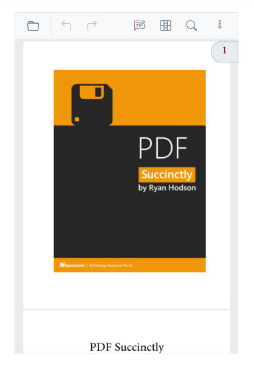
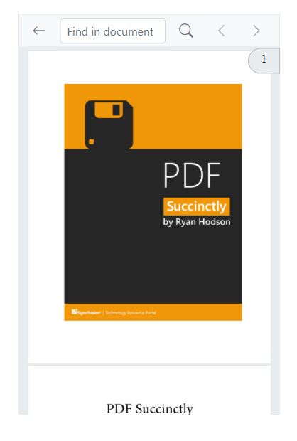
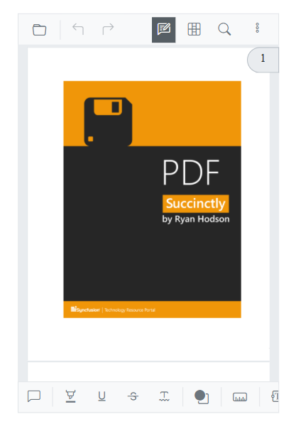
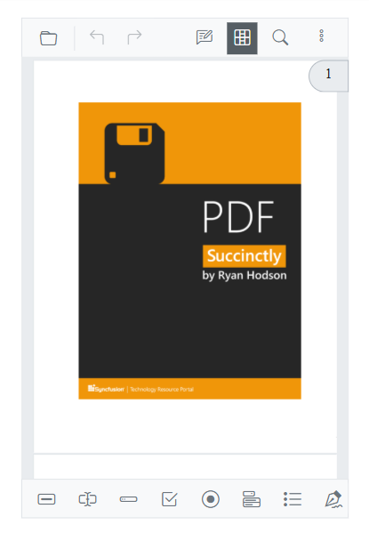
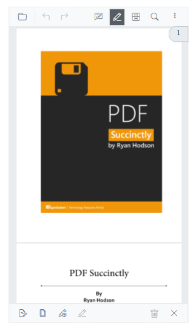
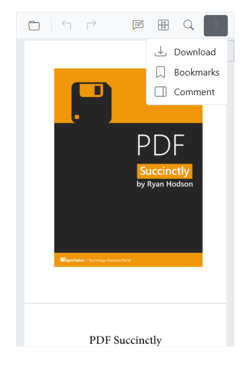
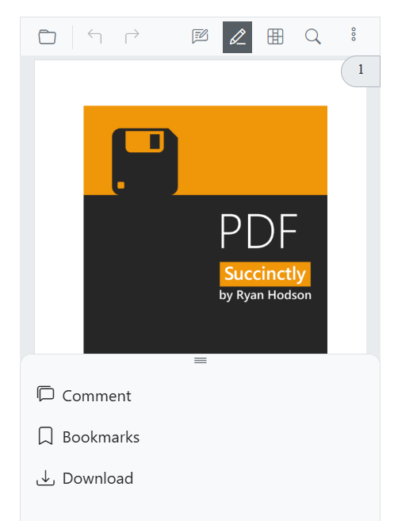

# Mobile Toolbar Interface in Blazor SfPdfViewer Component

The Mobile PDF Viewer offers a variety of features for viewing, searching, annotating, and managing PDF documents on mobile devices. It includes essential tools like search, download, bookmarking, annotation, form designer and Redaction. Users also have the option to enable desktop toolbar features in mobile mode, providing a more extensive set of actions.

## Mobile Mode Toolbar Configuration
In mobile mode, the toolbar is optimized for ease of use on small screens, presenting users with the most common actions for interacting with a PDF document. Below are the key features available in mobile mode:



### Main Toolbar Options:

**OpenOption:** Tap to load a PDF document.

**SearchOption:** Access the search bar to find text within the document.



**UndoRedoTool:** Quickly undo or redo any annotations made.

**AnnotationEditTool:** Activate or deactivate annotation editing to add or modify annotations.



N> In mobile mode, the annotation toolbar is conveniently displayed at the bottom of the viewer.

**FormDesignerTool:** Enable or disable form design mode to add, edit, or delete form fields in the PDF document.



N> In mobile mode, the Form Designer toolbar is conveniently displayed at the bottom of the viewer.

**RedactionTool:** Opens Redaction Toolbar, allowing users to mark and remove sensitive content.



Use the following code-snippet to add redaction toolbar in the PDF Viewer.

```chstml
@page "/";

<SfPdfViewer2 @ref="SfPdfViewer2" Height="640px" Width="100%" DocumentPath="@DocumentPath">
<PdfViewerToolbarSettings ToolbarItems="ToolbarItems" MobileToolbarItems="MobileToolbarItems"></PdfViewerToolbarSettings>
</SfPdfViewer2>
@code {    
SfPdfViewer2? SfPdfViewer2;    
bool redactionToolbar;
    private string DocumentPath { get; set; } = "https://cdn.syncfusion.com/content/pdf/pdf-succinctly.pdf";
    public List<ToolbarItem>? ToolbarItems { get; set; }
    public List<MobileToolbarItem>? MobileToolbarItems { get; set; }
protected override void OnInitialized()
    {
        ToolbarItems = new List<ToolbarItem>(){
        ToolbarItem.OpenOption,
        ToolbarItem.PageNavigationTool,
        ToolbarItem.MagnificationTool,
        ToolbarItem.SelectionTool,
        ToolbarItem.PanTool,
        ToolbarItem.UndoRedoTool,
        ToolbarItem.CommentTool,
        ToolbarItem.SubmitForm,
        ToolbarItem.SearchOption,
        ToolbarItem.AnnotationEditTool,
        ToolbarItem.Redaction,
        ToolbarItem.FormDesigner,
        ToolbarItem.PrintOption,
        ToolbarItem.DownloadOption
        };
        MobileToolbarItems = new List<MobileToolbarItem>()
        {
            MobileToolbarItem.Open,
            MobileToolbarItem.UndoRedo,
            MobileToolbarItem.EditAnnotation,
            MobileToolbarItem.Redaction,
            MobileToolbarItem.FormDesigner,
            MobileToolbarItem.Search
        };
    }
}
```

N> In mobile mode, Redaction toolbar is conveniently displayed at the bottom of the viewer.

### More Options Menu:
When you open the "more options" menu, you will see additional actions such as:

**DownloadOption:** Tap to download the currently opened PDF document.

**BookmarkOption:** Allows you to view bookmarks within the document.



## Enabling Desktop Mode in Mobile

The desktop version of the toolbar can be enabled on mobile devices by using the `EnableDesktopMode` API. This API allows you to bring desktop-like features to the mobile PDF viewer, providing access to additional toolbar actions that are typically available on desktop platforms.

### Steps to Enable Desktop Mode:

**Step 1:** Set `EnableDesktopMode` to true in the API configuration.

**Step 2:** This will replace the mobile toolbar with the desktop toolbar layout, allowing access to more actions and controls.

```cshtml
@using Syncfusion.Blazor.SfPdfViewer

<SfPdfViewer2 DocumentPath="https://cdn.syncfusion.com/content/pdf/pdf-succinctly.pdf"
              Height="100%"
              Width="100%" EnableDesktopMode="true">
</SfPdfViewer2>
```

## Modern Navigation Panel in Mobile view

On mobile devices, the navigation toolbar is collapsed into a toggle menu to save space. Custom items you add will appear at the beginning of this menu.



You can achieve this modern Navigation by setting the `EnableNavigationPanel` option to **true**.

```chstml
@using Syncfusion.Blazor.SfPdfViewer

<SfPdfViewer2 DocumentPath="https://cdn.syncfusion.com/content/pdf/pdf-succinctly.pdf"
              Height="100%"
              Width="100%" EnableNavigationPanel="true">
</SfPdfViewer2>
```

## Enable Scrolling in Desktop Mode with Touch Gestures

To ensure smooth scrolling of PDF documents on a mobile device in desktop mode, it is important to enable touch gesture scrolling. You can achieve this by setting the `EnableTextSelection` option to **false**.

```cshtml
@using Syncfusion.Blazor.SfPdfViewer

<SfPdfViewer2 DocumentPath="https://cdn.syncfusion.com/content/pdf/pdf-succinctly.pdf"
              Height="100%"
              Width="100%" EnableDesktopMode="true" EnableTextSelection="true">
</SfPdfViewer2>
```

## Print Option Not Available

The Print option is not available in mobile mode by default. However, if you need to use the print functionality on mobile devices, we recommend enabling the desktop toolbar on mobile using the `EnableDesktopMode` API.

### How to Use Print on Mobile:

**Enable Desktop Mode:** Set `EnableDesktopMode` to true to load the desktop version of the toolbar on your mobile device.

**Print Option:** Once desktop mode is enabled, the print option will be available, allowing you to print the document directly from your mobile device.

N> In mobile mode, the print functionality will not be available unless desktop mode is enabled.

## See also

* [Annotations in Mobile View](./annotation/annotations-in-mobile-view)
* [FormDesigner in Mobile View](./form-designer/form-designer-in-mobile-view)