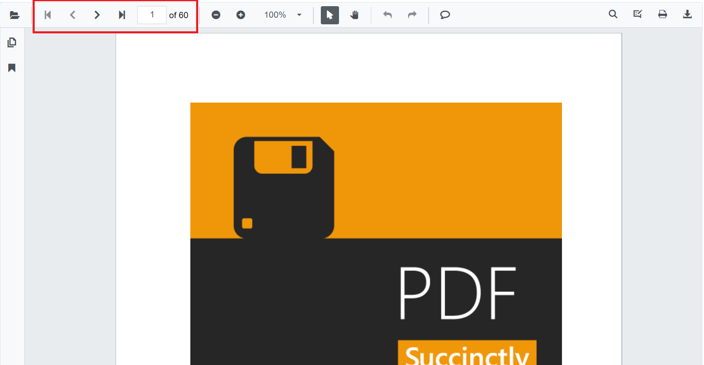
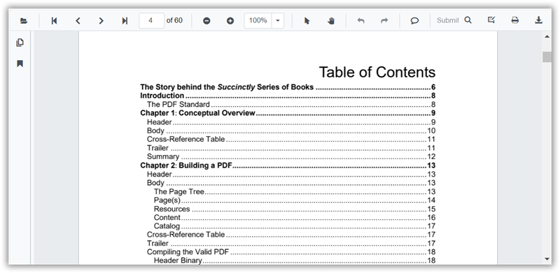
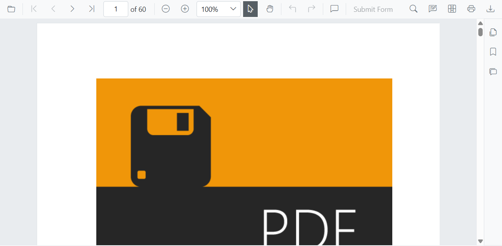
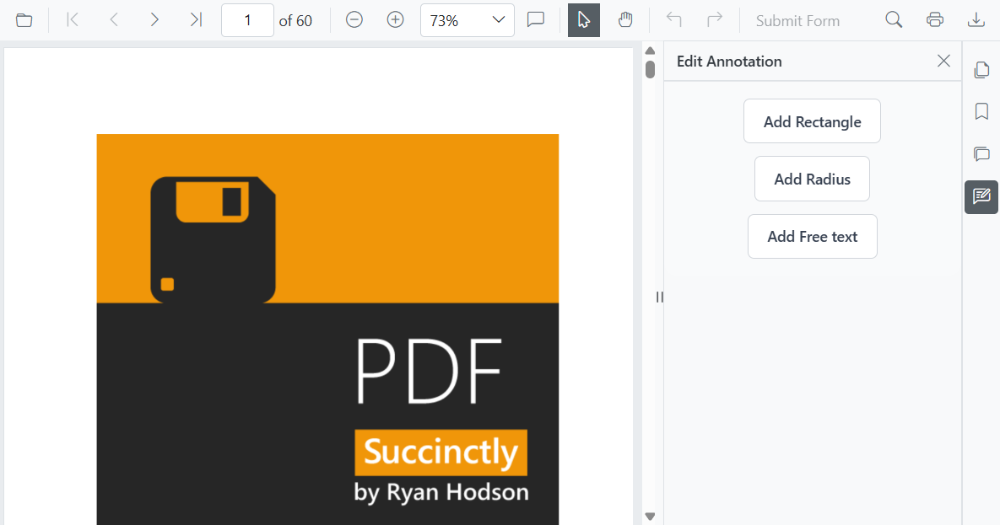

# Navigation in Blazor SfPdfViewer Component

You can navigate between pages in Syncfusion<sup style="font-size:70%">&reg;</sup> SfPdfViewer in the following ways:

* Scroll through the pages.
* Click Go to pages in the built-in toolbar.
* Click the desired bookmark in bookmark pane.
* Click the desired page in thumbnail pane.
* Click hyperlink and table of contents.

## Page navigation

The built-in toolbar of SfPdfViewer contains the following page navigation tools:

* **First** **Page**: Navigates you to the first page in the document.
* **Last** **Page**: Navigates you to the last page in the document.
* **Next** **Page**: Scrolls forwards through pages, one page at a time.
* **Go** **To**: Allows you to quickly jump to the desired page number.
* **Previous** **Page**: Scrolls backwards through pages, one page at a time.



You can enable or disable the page navigation option in SfPdfViewer default toolbar by setting the [EnableNavigation](https://help.syncfusion.com/cr/blazor/Syncfusion.Blazor.SfPdfViewer.PdfViewerBase.html#Syncfusion_Blazor_SfPdfViewer_PdfViewerBase_EnableNavigation) property.

```cshtml

@using Syncfusion.Blazor.SfPdfViewer

<SfPdfViewer2 Width="100%"
              Height="100%"
              DocumentPath="@DocumentPath"
              EnableNavigation="false" />

@code{
    public string DocumentPath { get; set; } = "wwwroot/Data/PDF_Succinctly.pdf";
}

```

Also, you can programmatically perform page navigation as follows.

```cshtml

@using Syncfusion.Blazor.Buttons
@using Syncfusion.Blazor.Inputs
@using Syncfusion.Blazor.SfPdfViewer

<div style="display:inline-block">
    <SfButton OnClick="OnFirstPageClick">Go To First Page</SfButton>
</div>

<div style="display:inline-block">
    <SfButton OnClick="OnLastPageClick">Go To Last Page</SfButton>
</div>

<div style="display:inline-block">
    <SfButton OnClick="OnNextPageClick">Go To Next Page</SfButton>
</div>

<div style="display:inline-block">
    <SfTextBox @ref="@TextBox"></SfTextBox>
</div>

<div style="display:inline-block;">
    <SfButton OnClick="OnPageClick">Go To Page</SfButton>
</div>

<div style="display:inline-block">
    <SfButton OnClick="OnPreviousPageClick">Go To Previous Page</SfButton>
</div>

<SfPdfViewer2 Width="100%" Height="100%" DocumentPath="@DocumentPath" @ref="@Viewer" />

@code{
    SfPdfViewer2 Viewer;
    SfTextBox TextBox;
    public string DocumentPath { get; set; } = "wwwroot/data/PDF_Succinctly.pdf";

    public async void OnFirstPageClick(MouseEventArgs args)
    {
        await Viewer.GoToFirstPageAsync();
    }

    public async void OnLastPageClick(MouseEventArgs args)
    {
        await Viewer.GoToLastPageAsync();
    }

    public async void OnNextPageClick(MouseEventArgs args)
    {
        await Viewer.GoToNextPageAsync();
    }

    public async void OnPageClick(MouseEventArgs args)
    {
        int pageIndex =  int.Parse(TextBox.Value.ToString());
        await Viewer.GoToPageAsync(pageIndex);
    }

    public async void OnPreviousPageClick(MouseEventArgs args)
    {
        await Viewer.GoToPreviousPageAsync();
    }
}

```

## Bookmark navigation

The bookmarks saved in PDF files are loaded and listed in the bookmark pane (in the left navigation pane). The users can jump to areas of interest by clicking the desired bookmark easily.


You can enable or disable the bookmark navigation pane by setting the [EnableBookmark](https://help.syncfusion.com/cr/blazor/Syncfusion.Blazor.SfPdfViewer.PdfViewerBase.html#Syncfusion_Blazor_SfPdfViewer_PdfViewerBase_EnableBookmarkPanel) property.

```cshtml

@using Syncfusion.Blazor.SfPdfViewer

<SfPdfViewer2 Height="100%" Width="100%" DocumentPath="@DocumentPath" EnableBookmarkPanel="true" />

@code{
    public string DocumentPath { get; set; } = "wwwroot/Data/PDF_Succinctly.pdf";
}

```

## Page thumbnail navigation

Page thumbnails is the miniature representation of actual pages in the PDF files. This feature displays thumbnails of the pages and represents a link to the respective pages. Clicking a page thumbnail will display the respective page in the document view.


You can enable or disable the thumbnail navigation pane by setting the [EnableThumbnail](https://help.syncfusion.com/cr/blazor/Syncfusion.Blazor.SfPdfViewer.PdfViewerBase.html#Syncfusion_Blazor_SfPdfViewer_PdfViewerBase_EnableThumbnailPanel) property.

```cshtml

@using Syncfusion.Blazor.SfPdfViewer

<SfPdfViewer2 Height="100%" Width="100%" DocumentPath="@DocumentPath" EnableThumbnailPanel="true"/>

@code{
    public string DocumentPath { get; set; } = "wwwroot/Data/PDF_Succinctly.pdf";
}

```

### Open thumbnail panel programmatically

You can view the thumbnail navigation initially while loading the PDF document in the PDFViewer using the [IsThumbnailPanelOpen](https://help.syncfusion.com/cr/blazor/Syncfusion.Blazor.SfPdfViewer.PdfViewerBase.html#Syncfusion_Blazor_SfPdfViewer_PdfViewerBase_IsThumbnailPanelOpen) property.

The following code illustrates how to open thumbnail panel programmatically.

```cshtml

@using Syncfusion.Blazor.SfPdfViewer

<!--IsThumbnailPanelOpen property will enable the thumbnail panel on initial rendering itself-->
<SfPdfViewer2 @ref="@SfPdfViewer"
              DocumentPath="@DocumentPath"
              IsThumbnailPanelOpen="true"
              Height="100%"
              Width="100%">
</SfPdfViewer2>

@code {

    public SfPdfViewer2 SfPdfViewer { get; set; }
    //Sets the PDF document path for initial loading.
    private string DocumentPath { get; set; } = "wwwroot/Data/PDF_Succinctly.pdf";
}

```

[View sample in GitHub](https://github.com/SyncfusionExamples/blazor-pdf-viewer-examples/tree/master/Thumbnail/Show%20thumbnail%20panel).

## Hyperlink navigation

Hyperlink navigation features enables navigation to the URLs (website links) in a PDF file.


## Table of content navigation

Table of contents navigation allows users to navigate to different parts of a PDF file that are listed in the table of contents section.



You can enable or disable both hyperlink and table of content navigation by setting the `EnableHyperlink` property.

```cshtml

@using Syncfusion.Blazor.SfPdfViewer

<SfPdfViewer2 Height="100%" Width="100%" DocumentPath="@DocumentPath" EnableHyperlink="true" />

@code{
    public string DocumentPath { get; set; } = "wwwroot/Data/PDF_Succinctly.pdf";
}

```

You can set the target attribute for a hyperlink in SfPdfViewer using the [HyperlinkOpenState](https://help.syncfusion.com/cr/blazor/Syncfusion.Blazor.SfPdfViewer.PdfViewerBase.html#Syncfusion_Blazor_SfPdfViewer_PdfViewerBase_HyperlinkOpenState) property.

```cshtml

@using Syncfusion.Blazor.SfPdfViewer

<SfPdfViewer2 Height="100%"
              Width="100%" DocumentPath="@DocumentPath"
              EnableHyperlink="true"
              HyperlinkOpenState="LinkTarget.NewTab" />

@code{
    public string DocumentPath { get; set; } = "wwwroot/Data/PDF_Succinctly.pdf";
}
```

## Modern Navigation Panel

The SfPdfViewer includes a modern navigation panel that replaces the legacy panel. It expands the viewer's capabilities beyond simple thumbnails, bookmarks, and comments to offer a more comprehensive and interactive viewing experience.

You can toggle the visibility of this modern navigation panel using the [`EnableNavigationPanel`](https://help.syncfusion.com/cr/blazor/Syncfusion.Blazor.SfPdfViewer.PdfViewerBase.html#Syncfusion_Blazor_SfPdfViewer_PdfViewerBase_EnableNavigationPanel) property.

The following code snippet demonstrates how to enable the modern navigation panel:

```cshtml

@using Syncfusion.Blazor.SfPdfViewer;

<SfPdfViewer2 DocumentPath="https://cdn.syncfusion.com/content/pdf/pdf-succinctly.pdf"
              Height="100%"
              Width="100%" 
              EnableNavigationPanel="true">
</SfPdfViewer2>

```


### Default items in navigation panel

The modern navigation panel contains the following built-in items:

* **Comment** **panel**
* **Thumbnail** **panel**
* **Bookmark** **panel**

### Rearrange the default items of navigation panel

This customization is achieved using the `BuiltInItems` property, which accepts a list of [`NavigationToolbarItem`](https://help.syncfusion.com/cr/blazor/Syncfusion.Blazor.SfPdfViewer.NavigationToolbarItem.html) enums. The viewer will render the navigation icons in the exact sequence you provide in this list.

The following code snippet demonstrates how to set the navigation panel to display the Thumbnails first, followed by Bookmarks and comment panel.

```cshtml

@using Syncfusion.Blazor.SfPdfViewer;

<SfPdfViewer2 DocumentPath="https://cdn.syncfusion.com/content/pdf/pdf-succinctly.pdf"
              Height="100%"
              Width="100%" 
              EnableNavigationPanel="true">
              <NavigationToolbarSettings BuiltInItems="navigationToolbarItems"></NavigationToolbarSettings>
</SfPdfViewer2>

@code {
    // Defines the list of built-in navigation items in the desired order.
    List<NavigationToolbarItem> navigationToolbarItems = new List<NavigationToolbarItem>()
    {
        NavigationToolbarItem.Thumbnails,
        NavigationToolbarItem.Bookmarks,
        NavigationToolbarItem.CommentPanel,
    };
}

```



### Open or close navigation panel programmatically

You can programmatically open or close a navigation panel by calling the [`ToggleItemByIndex`](https://help.syncfusion.com/cr/blazor/Syncfusion.Blazor.SfPdfViewer.PdfViewerBase.html#Syncfusion_Blazor_SfPdfViewer_PdfViewerBase_ToggleItemByIndex_System_Int32_) method. This method takes the index of the panel item and toggles its state which opens it if closed, and then closes it if open.

The following code snippet demonstrates to toggle the visibility of the second item in the navigation panel (which has an index of 1).

```cshtml

@using Syncfusion.Blazor.SfPdfViewer;

<button id="toggle-custom-panel-visibility-api-btn" @onclick="OpenCustomPanel">OpenCustomPanel</button>
<SfPdfViewer2 DocumentPath="https://cdn.syncfusion.com/content/pdf/pdf-succinctly.pdf"
              @ref="pdfViewer"
              Height="100%"
              Width="100%" 
              EnableNavigationPanel="true">
</SfPdfViewer2>

@code {
    private SfPdfViewer2? pdfViewer;
    private async Task OpenCustomPanel()
    {
        // Toggles the visibility of the navigation panel item at the specified index (1 in this case).
        await pdfViewer.ToggleItemByIndex(1);
    }
}

```

   

### How to add customize items in the navigation panel

You can add custom items to the SfPdfViewer navigation toolbar. To do this, create a list of [`CustomNavigationToolbarItem`](https://help.syncfusion.com/cr/blazor/Syncfusion.Blazor.SfPdfViewer.CustomNavigationToolbarItem.html) objects and assign it to the `CustomItems` property.

Each CustomNavigationToolbarItem object has several properties to define its appearance and behavior: 
* **Index** : Sets the position of the item in the toolbar.
* **Name** : Assigns a custom name to the item.
* **TooltipText** : Defines the text that appears when hovering over the item.
* **HeaderText** : Sets the header text displayed at the top of the custom panel.
* **IconCss** : Specifies the CSS class for the item's icon.
* **Template** : Allows you to define a custom template for the panel's content. 
* **ItemType** : Determines the item's type, such as a clickable button [`NavigationToolbarItemType.Button`](https://help.syncfusion.com/cr/blazor/Syncfusion.Blazor.SfPdfViewer.NavigationToolbarItemType.html#Syncfusion_Blazor_SfPdfViewer_NavigationToolbarItemType_Button) or a visual separator [`NavigationToolbarItemType.Separator`](https://help.syncfusion.com/cr/blazor/Syncfusion.Blazor.SfPdfViewer.NavigationToolbarItemType.html#Syncfusion_Blazor_SfPdfViewer_NavigationToolbarItemType_Separator).

### How to add the customize template for the navigation panel

You can define a completely custom UI for a navigation panel by assigning a RenderFragment to the `Template` property of a [`CustomNavigationToolbarItem`](https://help.syncfusion.com/cr/blazor/Syncfusion.Blazor.SfPdfViewer.CustomNavigationToolbarItem.html).

The following code snippet demonstrates to add the default toolbar with a custom item containing a small, interactive panel with the customized UI.

```cshtml

@using Syncfusion.Blazor.SfPdfViewer

<SfPdfViewer2 @ref="pdfViewer"
              DocumentPath="https://cdn.syncfusion.com/content/pdf/pdf-succinctly.pdf"
              Height="100%"
              Width="100%" EnableNavigationPanel="true">
    <PdfViewerToolbarSettings ToolbarItems="ToolbarItems"></PdfViewerToolbarSettings>
    <NavigationToolbarSettings BuiltInItems="navigationToolbarItems" CustomItems="customNavigationToolbarItems"></NavigationToolbarSettings>
</SfPdfViewer2>

@code {
    SfPdfViewer2 pdfViewer;
    // List of standard toolbar items.
    List<ToolbarItem> ToolbarItems = new List<ToolbarItem>()
    {
        ToolbarItem.OpenOption,
        ToolbarItem.PageNavigationTool,
        ToolbarItem.MagnificationTool,
        ToolbarItem.CommentTool,
        ToolbarItem.SelectionTool,
        ToolbarItem.PanTool,
        ToolbarItem.UndoRedoTool,
        ToolbarItem.SubmitForm,
        ToolbarItem.SearchOption,
        ToolbarItem.PrintOption,
        ToolbarItem.DownloadOption
    };
    // List of built-in navigation panel items.
    List<NavigationToolbarItem> navigationToolbarItems = new List<NavigationToolbarItem>()
    {
        NavigationToolbarItem.Thumbnails,
        NavigationToolbarItem.Bookmarks,
        NavigationToolbarItem.CommentPanel,
    };
    // List to hold the custom navigation toolbar items.
    List<CustomNavigationToolbarItem> customNavigationToolbarItems;

    // Initializes the component and sets up the custom navigation items.
    protected override void OnInitialized()
    {
        customNavigationToolbarItems = new List<CustomNavigationToolbarItem>()
        {
            new CustomNavigationToolbarItem()
            {
                Name = "Edit Annotation",
                HeaderText = "Edit Annotation",
                IconCss = "e-pv-annotation-icon e-pv-icon",
                Index = 4,
                TooltipText = "Edit Annotation",
                ItemType = NavigationToolbarItemType.Button,
                Template = EditAnnotationTemplate()
            }
        };
    }

    // Defines the RenderFragment for the custom panel's content.
    private RenderFragment EditAnnotationTemplate()
    {
        return @<div style="padding: 16px 24px; background-color: #f9fafb; border-top: 1px solid #e5e7eb; display: flex; flex-direction: column; align-items: center; gap: 12px; border-bottom-left-radius: 12px; border-bottom-right-radius: 12px;">
            <button style="background: #ffffff; color: #374151; border: 1px solid #d1d5db; padding: 10px 18px; border-radius: 6px; font-size: 14px; font-weight: 500; cursor: pointer;" @onclick="AddRectangle">
                Add Rectangle
            </button>
            <button style="background: #ffffff; color: #374151; border: 1px solid #d1d5db; padding: 10px 18px; border-radius: 6px; font-size: 14px; font-weight: 500; cursor: pointer;" @onclick="AddRadius">
                Add Radius
            </button>
            <button style="background: #ffffff; color: #374151; border: 1px solid #d1d5db; padding: 10px 18px; border-radius: 6px; font-size: 14px; font-weight: 500; cursor: pointer;" @onclick="AddFreeText">
                Add Free text
            </button>
        </div>;
    }

    // Sets the annotation mode to Rectangle.
    private async Task AddRectangle()
    {
        await pdfViewer.SetAnnotationModeAsync(AnnotationType.Rectangle);
    }

    // Sets the annotation mode to Radius.
    private async Task AddRadius()
    {
        await pdfViewer.SetAnnotationModeAsync(AnnotationType.Radius);
    }

    // Sets the annotation mode to FreeText.
    private async Task AddFreeText()
    {
        await pdfViewer.SetAnnotationModeAsync(AnnotationType.FreeText);
    }
}

```



### Demand rendering for navigation panel

The SfPdfViewer allows you to specify a loading strategy for the content of the navigation panels to optimize performance. The available options are:

* **Dynamic** : The content for a panel is only loaded into the DOM when that panel is selected. When you switch to a different panel, the previous content is removed and replaced.
* **Init** : The content for all navigation panels is rendered during the initial load and is always present in the DOM.
* **Demand** : The content for a panel is loaded into the DOM the first time it is selected. The content is then kept in the DOM, even if you navigate to other panels.

The following code demonstrates how to set the loading strategy to Demand.

```cshtml

@using Syncfusion.Blazor.SfPdfViewer;
@using Syncfusion.Blazor.Navigations;

<SfPdfViewer2 DocumentPath="https://cdn.syncfusion.com/content/pdf/pdf-succinctly.pdf"
              Height="100%"
              Width="100%" 
              EnableNavigationPanel="true">
              <NavigationToolbarSettings LoadOn="ContentLoad.Demand"></NavigationToolbarSettings>
</SfPdfViewer2>

```

### Modern Navigation Panel in Mobile view

On mobile devices, the navigation toolbar is collapsed into a toggle menu to save space. Custom items you add will appear at the beginning of this menu.


## See also

* [Magnification in Blazor SfPdfViewer Component](./magnification)
* [Getting Started with SmartPdfViewer in Blazor Web App](../../Smart-PDF-Viewer/blazor/getting-started/web-app)