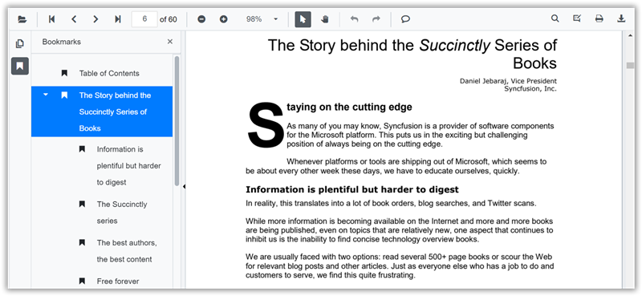
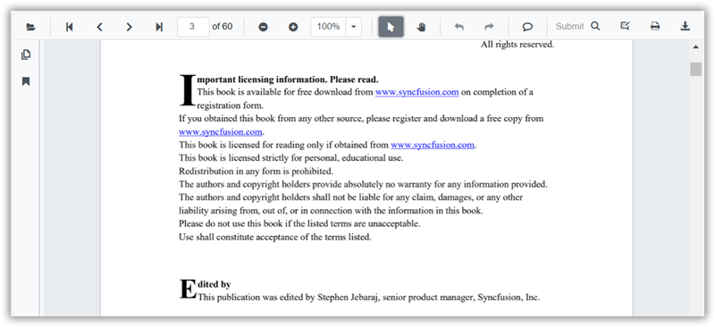
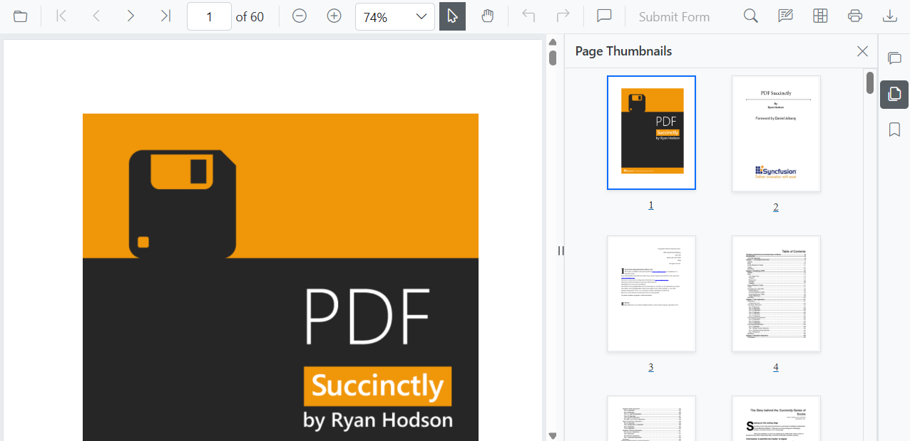
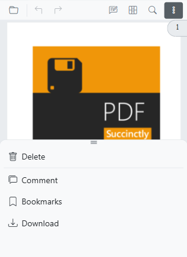

# Navigation in Blazor SfPdfViewer Component

You can navigate between pages in the SfPdfViewer component in the following ways:

* Scroll through the pages.
* Use the Go to page option in the built-in toolbar.
* Select a bookmark in the bookmark panel.
* Select a page in the thumbnail panel.
* Click hyperlinks or entries in the table of contents.

## Page navigation

The built-in toolbar of SfPdfViewer contains the following page navigation tools:

* **First** **Page**: Navigates to the first page in the document.
* **Last** **Page**: Navigates to the last page in the document.
* **Next** **Page**: Scrolls forward one page at a time.
* **Go** **To**: Quickly jumps to a specified page number.
* **Previous** **Page**: Scrolls backward one page at a time.


Enable or disable the page navigation tools in the default toolbar by setting the [EnableNavigation](https://help.syncfusion.com/cr/blazor/Syncfusion.Blazor.SfPdfViewer.PdfViewerBase.html#Syncfusion_Blazor_SfPdfViewer_PdfViewerBase_EnableNavigation) property.

```cshtml

@using Syncfusion.Blazor.SfPdfViewer

<SfPdfViewer2 Width="100%"
              Height="100%"
              DocumentPath="@DocumentPath"
              EnableNavigation="false" />

@code{
    public string DocumentPath { get; set; } = "wwwroot/Data/PDF_Succinctly.pdf";
}

```

You can also perform page navigation programmatically as follows.

```cshtml

@using Syncfusion.Blazor.Buttons
@using Syncfusion.Blazor.Inputs
@using Syncfusion.Blazor.SfPdfViewer

<div style="display:inline-block">
    <SfButton OnClick="OnFirstPageClick">Go To First Page</SfButton>
</div>

<div style="display:inline-block">
    <SfButton OnClick="OnLastPageClick">Go To Last Page</SfButton>
</div>

<div style="display:inline-block">
    <SfButton OnClick="OnNextPageClick">Go To Next Page</SfButton>
</div>

<div style="display:inline-block">
    <SfTextBox @ref="@TextBox"></SfTextBox>
</div>

<div style="display:inline-block;">
    <SfButton OnClick="OnPageClick">Go To Page</SfButton>
</div>

<div style="display:inline-block">
    <SfButton OnClick="OnPreviousPageClick">Go To Previous Page</SfButton>
</div>

<SfPdfViewer2 Width="100%" Height="100%" DocumentPath="@DocumentPath" @ref="@Viewer" />

@code{
    SfPdfViewer2 Viewer;
    SfTextBox TextBox;
    public string DocumentPath { get; set; } = "wwwroot/data/PDF_Succinctly.pdf";

    public async void OnFirstPageClick(MouseEventArgs args)
    {
        await Viewer.GoToFirstPageAsync();
    }

    public async void OnLastPageClick(MouseEventArgs args)
    {
        await Viewer.GoToLastPageAsync();
    }

    public async void OnNextPageClick(MouseEventArgs args)
    {
        await Viewer.GoToNextPageAsync();
    }

    public async void OnPageClick(MouseEventArgs args)
    {
        int pageIndex =  int.Parse(TextBox.Value.ToString());
        await Viewer.GoToPageAsync(pageIndex);
    }

    public async void OnPreviousPageClick(MouseEventArgs args)
    {
        await Viewer.GoToPreviousPageAsync();
    }
}

```

## Bookmark navigation

Bookmarks saved in the PDF are loaded and listed in the bookmark panel (left navigation pane). Users can jump to areas of interest by selecting a bookmark.



Enable or disable the bookmark panel by setting the [EnableBookmarkPanel](https://help.syncfusion.com/cr/blazor/Syncfusion.Blazor.SfPdfViewer.PdfViewerBase.html#Syncfusion_Blazor_SfPdfViewer_PdfViewerBase_EnableBookmarkPanel) property.

```cshtml

@using Syncfusion.Blazor.SfPdfViewer

<SfPdfViewer2 Height="100%" Width="100%" DocumentPath="@DocumentPath" EnableBookmarkPanel="true" />

@code{
    public string DocumentPath { get; set; } = "wwwroot/Data/PDF_Succinctly.pdf";
}

```

## Page thumbnail navigation

Page thumbnails are miniature representations of the document pages. Selecting a thumbnail navigates to the corresponding page in the viewer.


Enable or disable the thumbnail panel by setting the [EnableThumbnailPanel](https://help.syncfusion.com/cr/blazor/Syncfusion.Blazor.SfPdfViewer.PdfViewerBase.html#Syncfusion_Blazor_SfPdfViewer_PdfViewerBase_EnableThumbnailPanel) property.

```cshtml

@using Syncfusion.Blazor.SfPdfViewer

<SfPdfViewer2 Height="100%" Width="100%" DocumentPath="@DocumentPath" EnableThumbnailPanel="true"/>

@code{
    public string DocumentPath { get; set; } = "wwwroot/Data/PDF_Succinctly.pdf";
}

```

### Open thumbnail panel programmatically

To display the thumbnail panel initially when loading a document, set the [IsThumbnailPanelOpen](https://help.syncfusion.com/cr/blazor/Syncfusion.Blazor.SfPdfViewer.PdfViewerBase.html#Syncfusion_Blazor_SfPdfViewer_PdfViewerBase_IsThumbnailPanelOpen) property to true.

The following code illustrates how to open the thumbnail panel programmatically.

```cshtml

@using Syncfusion.Blazor.SfPdfViewer

<!--IsThumbnailPanelOpen property will enable the thumbnail panel on initial rendering itself-->
<SfPdfViewer2 @ref="@SfPdfViewer"
              DocumentPath="@DocumentPath"
              IsThumbnailPanelOpen="true"
              Height="100%"
              Width="100%">
</SfPdfViewer2>

@code {

    public SfPdfViewer2 SfPdfViewer { get; set; }
    //Sets the PDF document path for initial loading.
    private string DocumentPath { get; set; } = "wwwroot/Data/PDF_Succinctly.pdf";
}

```

[View sample in GitHub](https://github.com/SyncfusionExamples/blazor-pdf-viewer-examples/tree/master/Thumbnail/Show%20thumbnail%20panel).

## Hyperlink navigation

The hyperlink navigation feature enables navigation to URLs (website links) in a PDF file.



## Table of content navigation

Table of contents navigation allows users to move to different sections of a PDF listed in the table of contents.


Enable or disable both hyperlink and table of contents navigation by setting the [EnableHyperlink](https://help.syncfusion.com/cr/blazor/Syncfusion.Blazor.SfPdfViewer.PdfViewerBase.html#Syncfusion_Blazor_SfPdfViewer_PdfViewerBase_EnableHyperlink) property.

```cshtml

@using Syncfusion.Blazor.SfPdfViewer

<SfPdfViewer2 Height="100%" Width="100%" DocumentPath="@DocumentPath" EnableHyperlink="true" />

@code{
    public string DocumentPath { get; set; } = "wwwroot/Data/PDF_Succinctly.pdf";
}

```

Specify the target behavior for hyperlinks using the [HyperlinkOpenState](https://help.syncfusion.com/cr/blazor/Syncfusion.Blazor.SfPdfViewer.PdfViewerBase.html#Syncfusion_Blazor_SfPdfViewer_PdfViewerBase_HyperlinkOpenState) property.

```cshtml

@using Syncfusion.Blazor.SfPdfViewer

<SfPdfViewer2 Height="100%"
              Width="100%" DocumentPath="@DocumentPath"
              EnableHyperlink="true"
              HyperlinkOpenState="LinkTarget.NewTab" />

@code{
    public string DocumentPath { get; set; } = "wwwroot/Data/PDF_Succinctly.pdf";
}
```

## Modern Navigation Panel

The SfPdfViewer includes a modern navigation panel that replaces the legacy panel. It extends the viewer beyond thumbnails, bookmarks, and comments to provide a more comprehensive and interactive experience.

Toggle the visibility of the modern navigation panel using the [EnableNavigationPanel](https://help.syncfusion.com/cr/blazor/Syncfusion.Blazor.SfPdfViewer.PdfViewerBase.html#Syncfusion_Blazor_SfPdfViewer_PdfViewerBase_EnableNavigationPanel) property.

The following example enables the modern navigation panel:

```cshtml

@using Syncfusion.Blazor.SfPdfViewer;

<SfPdfViewer2 DocumentPath="https://cdn.syncfusion.com/content/pdf/pdf-succinctly.pdf"
              Height="100%"
              Width="100%" 
              EnableNavigationPanel="true">
</SfPdfViewer2>

```


### Default items in navigation panel

The modern navigation panel contains the following built-in items:

* **Comment** **panel**
* **Thumbnail** **panel**
* **Bookmark** **panel**

### Rearrange the default items of navigation panel

Use the `BuiltInItems` property, which accepts a list of [NavigationToolbarItem](https://help.syncfusion.com/cr/blazor/Syncfusion.Blazor.SfPdfViewer.NavigationToolbarItem.html) enums. The viewer renders the navigation icons in the exact sequence provided.

The following example displays Thumbnails first, followed by Bookmarks and the Comment panel.

```cshtml

@using Syncfusion.Blazor.SfPdfViewer;

<SfPdfViewer2 DocumentPath="https://cdn.syncfusion.com/content/pdf/pdf-succinctly.pdf"
              Height="100%"
              Width="100%" 
              EnableNavigationPanel="true">
              <NavigationToolbarSettings BuiltInItems="navigationToolbarItems"></NavigationToolbarSettings>
</SfPdfViewer2>

@code {
    // Defines the list of built-in navigation items in the desired order.
    List<NavigationToolbarItem> navigationToolbarItems = new List<NavigationToolbarItem>()
    {
        NavigationToolbarItem.Thumbnails,
        NavigationToolbarItem.Bookmarks,
        NavigationToolbarItem.CommentPanel,
    };
}

```


### Open or close navigation panel programmatically

Open or close a navigation panel programmatically by calling the [ToggleItemByIndex](https://help.syncfusion.com/cr/blazor/Syncfusion.Blazor.SfPdfViewer.PdfViewerBase.html#Syncfusion_Blazor_SfPdfViewer_PdfViewerBase_ToggleItemByIndex_System_Int32_) method. This method toggles the item at the specified index, opening it if closed and closing it if open.

The following example toggles the visibility of the second item in the navigation panel (index 1).

```cshtml

@using Syncfusion.Blazor.SfPdfViewer;

<button id="toggle-custom-panel-visibility-api-btn" @onclick="OpenCustomPanel">OpenCustomPanel</button>
<SfPdfViewer2 DocumentPath="https://cdn.syncfusion.com/content/pdf/pdf-succinctly.pdf"
              @ref="pdfViewer"
              Height="100%"
              Width="100%" 
              EnableNavigationPanel="true">
</SfPdfViewer2>

@code {
    private SfPdfViewer2? pdfViewer;
    private async Task OpenCustomPanel()
    {
        // Toggles the visibility of the navigation panel item at the specified index (1 in this case).
        await pdfViewer.ToggleItemByIndex(1);
    }
}

```

   

### How to add customize items in the navigation panel

You can add custom items to the SfPdfViewer navigation toolbar. Create a list of [CustomNavigationToolbarItem](https://help.syncfusion.com/cr/blazor/Syncfusion.Blazor.SfPdfViewer.CustomNavigationToolbarItem.html) objects and assign it to the `CustomItems` property.

Each CustomNavigationToolbarItem object has the following properties to define its appearance and behavior: 
* **Index** : Sets the position of the item in the toolbar.
* **Name** : Assigns a custom name to the item.
* **TooltipText** : Defines the text shown on hover.
* **HeaderText** : Sets the header text displayed at the top of the custom panel.
* **IconCss** : Specifies the CSS class for the item's icon.
* **Template** : Defines a custom template for the panel content.
* **ItemType** : Determines the item type, such as a clickable button [NavigationToolbarItemType.Button](https://help.syncfusion.com/cr/blazor/Syncfusion.Blazor.SfPdfViewer.NavigationToolbarItemType.html#Syncfusion_Blazor_SfPdfViewer_NavigationToolbarItemType_Button) or a visual separator [NavigationToolbarItemType.Separator](https://help.syncfusion.com/cr/blazor/Syncfusion.Blazor.SfPdfViewer.NavigationToolbarItemType.html#Syncfusion_Blazor_SfPdfViewer_NavigationToolbarItemType_Separator).

### How to add the customize template for the navigation panel

Define a custom UI for a navigation panel by assigning a RenderFragment to the `Template` property of a [CustomNavigationToolbarItem](https://help.syncfusion.com/cr/blazor/Syncfusion.Blazor.SfPdfViewer.CustomNavigationToolbarItem.html).

The following example adds a default toolbar with a custom item containing a small, interactive panel with a customized UI.

```cshtml

@using Syncfusion.Blazor.SfPdfViewer

<SfPdfViewer2 @ref="pdfViewer"
              DocumentPath="https://cdn.syncfusion.com/content/pdf/pdf-succinctly.pdf"
              Height="100%"
              Width="100%" EnableNavigationPanel="true">
    <PdfViewerToolbarSettings ToolbarItems="ToolbarItems"></PdfViewerToolbarSettings>
    <NavigationToolbarSettings BuiltInItems="navigationToolbarItems" CustomItems="customNavigationToolbarItems"></NavigationToolbarSettings>
</SfPdfViewer2>

@code {
    SfPdfViewer2 pdfViewer;
    // List of standard toolbar items.
    List<ToolbarItem> ToolbarItems = new List<ToolbarItem>()
    {
        ToolbarItem.OpenOption,
        ToolbarItem.PageNavigationTool,
        ToolbarItem.MagnificationTool,
        ToolbarItem.CommentTool,
        ToolbarItem.SelectionTool,
        ToolbarItem.PanTool,
        ToolbarItem.UndoRedoTool,
        ToolbarItem.SubmitForm,
        ToolbarItem.SearchOption,
        ToolbarItem.PrintOption,
        ToolbarItem.DownloadOption
    };
    // List of built-in navigation panel items.
    List<NavigationToolbarItem> navigationToolbarItems = new List<NavigationToolbarItem>()
    {
        NavigationToolbarItem.Thumbnails,
        NavigationToolbarItem.Bookmarks,
        NavigationToolbarItem.CommentPanel,
    };
    // List to hold the custom navigation toolbar items.
    List<CustomNavigationToolbarItem> customNavigationToolbarItems;

    // Initializes the component and sets up the custom navigation items.
    protected override void OnInitialized()
    {
        customNavigationToolbarItems = new List<CustomNavigationToolbarItem>()
        {
            new CustomNavigationToolbarItem()
            {
                Name = "Edit Annotation",
                HeaderText = "Edit Annotation",
                IconCss = "e-pv-annotation-icon e-pv-icon",
                Index = 4,
                TooltipText = "Edit Annotation",
                ItemType = NavigationToolbarItemType.Button,
                Template = EditAnnotationTemplate()
            }
        };
    }

    // Defines the RenderFragment for the custom panel's content.
    private RenderFragment EditAnnotationTemplate()
    {
        return @<div style="padding: 16px 24px; background-color: #f9fafb; border-top: 1px solid #e5e7eb; display: flex; flex-direction: column; align-items: center; gap: 12px; border-bottom-left-radius: 12px; border-bottom-right-radius: 12px;">
            <button style="background: #ffffff; color: #374151; border: 1px solid #d1d5db; padding: 10px 18px; border-radius: 6px; font-size: 14px; font-weight: 500; cursor: pointer;" @onclick="AddRectangle">
                Add Rectangle
            </button>
            <button style="background: #ffffff; color: #374151; border: 1px solid #d1d5db; padding: 10px 18px; border-radius: 6px; font-size: 14px; font-weight: 500; cursor: pointer;" @onclick="AddRadius">
                Add Radius
            </button>
            <button style="background: #ffffff; color: #374151; border: 1px solid #d1d5db; padding: 10px 18px; border-radius: 6px; font-size: 14px; font-weight: 500; cursor: pointer;" @onclick="AddFreeText">
                Add Free text
            </button>
        </div>;
    }

    // Sets the annotation mode to Rectangle.
    private async Task AddRectangle()
    {
        await pdfViewer.SetAnnotationModeAsync(AnnotationType.Rectangle);
    }

    // Sets the annotation mode to Radius.
    private async Task AddRadius()
    {
        await pdfViewer.SetAnnotationModeAsync(AnnotationType.Radius);
    }

    // Sets the annotation mode to FreeText.
    private async Task AddFreeText()
    {
        await pdfViewer.SetAnnotationModeAsync(AnnotationType.FreeText);
    }
}

```


### Demand rendering for navigation panel

SfPdfViewer supports different loading strategies for navigation panel content to optimize performance. The available options are:

* **Dynamic** : The content for a panel is only loaded into the DOM when that panel is selected. When you switch to a different panel, the previous content is removed and replaced.
* **Init** : The content for all navigation panels is rendered during the initial load and is always present in the DOM.
* **Demand** : The content for a panel is loaded into the DOM the first time it is selected. The content is then kept in the DOM, even if you navigate to other panels.

The following example sets the loading strategy to Demand.

```cshtml

@using Syncfusion.Blazor.SfPdfViewer;
@using Syncfusion.Blazor.Navigations;

<SfPdfViewer2 DocumentPath="https://cdn.syncfusion.com/content/pdf/pdf-succinctly.pdf"
              Height="100%"
              Width="100%" 
              EnableNavigationPanel="true">
              <NavigationToolbarSettings LoadOn="ContentLoad.Demand"></NavigationToolbarSettings>
</SfPdfViewer2>

```

### Modern Navigation Panel in Mobile view

On mobile devices, the navigation toolbar is collapsed into a toggle menu to save space. Custom items you add will appear at the beginning of this menu.



## See also

* [Magnification in Blazor SfPdfViewer Component](./magnification)
* [Getting Started with SmartPdfViewer in Blazor Web App](../../Smart-PDF-Viewer/blazor/getting-started/web-app)