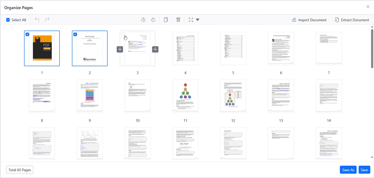
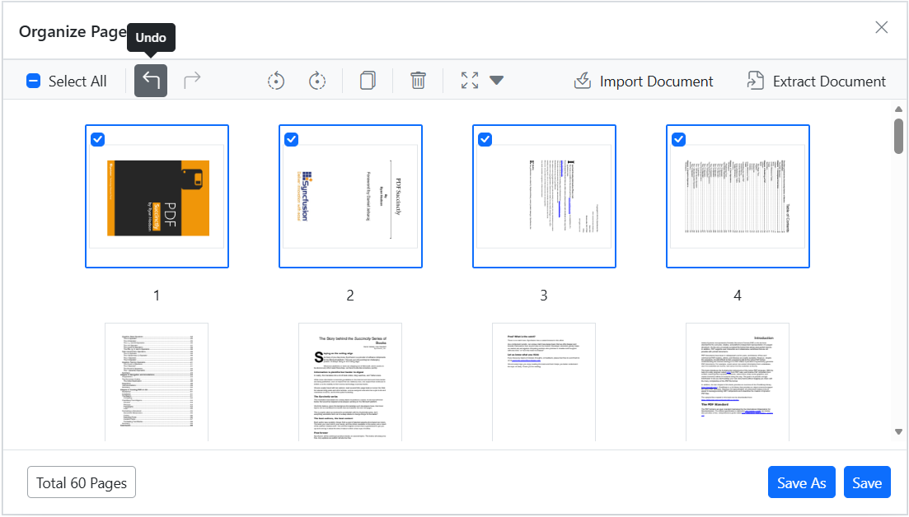

# Duplicate Pages in Blazor PDF Viewer

## Overview

This guide explains how to duplicate pages within the current PDF using the Organize Pages UI.

**Outcome**: Duplicated pages are inserted adjacent to the selection and included in exported PDFs.

## Prerequisites

- Blazor PDF Viewer (SfPdfViewer) installed
- Organize Pages feature enabled

## Steps

1. Open the Organize Pages view

	- Click the **Organize Pages** button in the viewer toolbar to open it.

2. Select pages to duplicate

	- Click a single thumbnail or use Shift+click/Ctrl+click to select multiple pages.

3. Duplicate selected pages

	- Click the **Duplicate Pages** button in the Organize Pages toolbar; duplicated pages are inserted to the right of the selected thumbnails. When multiple thumbnails are selected, the Duplicate action duplicates every selected page in order.

	

4. Undo or redo changes

	- Use **Undo** (Ctrl+Z) or **Redo** to revert or reapply recent changes.

	

5. Persist duplicated pages

	- Click **Save** or **Save As** to include duplicated pages in the saved/downloaded PDF.

## Programmatic approach

You can also duplicate pages programmatically using the Blazor PDF Viewer's `DuplicatePagesAsync` method:



@using Syncfusion.Blazor.Buttons

<SfButton OnClick="DuplicateMethod">Duplicate</SfButton>
<SfPdfViewer2 @ref=Viewer
			  DocumentPath="https://cdn.syncfusion.com/content/pdf/pdf-succinctly.pdf"
              Height="100%"
              Width="100%">
</SfPdfViewer2>

@code {
    private SfPdfViewer2? Viewer;

    private async Task DuplicateMethod() {
        await Viewer?.DuplicatePagesAsync([1,2]);
    }
}



For more details, see [Programmatic support for Organize Pages](./programmatic-support).

## Enable or disable Duplicate Pages button

To enable or disable the **Duplicate Pages** button in the Organize Pages toolbar, update the toolbar settings. See [Organize pages toolbar customization](./toolbar#enable-or-disable-the-duplicate-option) for the guidelines.

## Troubleshooting

- If duplicates are not created, verify that the changes are persisted by clicking **Save**.

## See also

- [Organize pages toolbar customization](./toolbar)
- [Organize pages event reference](./events)
