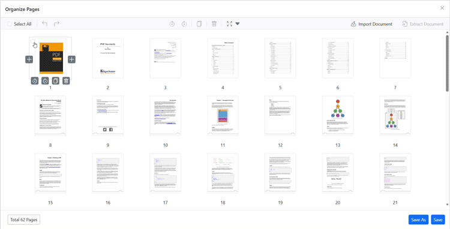

# Extract Pages in Blazor PDF Viewer

The Blazor PDF Viewer component provides an Extract Pages tool in the Organize Pages UI to export selected pages as a new PDF file. The Extract Pages tool is enabled by default.

## Extract Pages in Organize Pages

To extract pages from the PDF document:

1. Open the Organize Pages panel in the PDF Viewer toolbar.
2. Select the pages you want to extract by clicking the checkboxes next to the page thumbnails.
3. Click the **Extract Document** button in the Organize Pages toolbar.
4. The viewer downloads the selected pages as a new PDF document.

> **Note:** Page extraction will download only the selected pages as a separate PDF file. The original document remains unchanged.

## Programmatic options and APIs

You can also extract pages through code using the following methods:

### Extract pages programmatically

You can extract pages programmatically using the Blazor PDF Viewer's `ExtractPagesAsync` method. The following example extracts pages 1 and 2:



@using System.Collections.Generic
@using Syncfusion.Blazor.Buttons

<SfButton OnClick="ExtractMethod">Extract</SfButton>
<SfPdfViewer2 @ref="Viewer" DocumentPath="https://cdn.syncfusion.com/content/pdf/pdf-succinctly.pdf"
              Height="100%"
              Width="100%">
</SfPdfViewer2>

@code {
    private SfPdfViewer2? Viewer;

    private async Task ExtractMethod() {
        await Viewer?.ExtractPagesAsync([1,2]);
    }
}



### Extract pages and load the result programmatically

You can also extract pages and immediately load the extracted pages back into the viewer using the `ExtractPagesAsStreamAsync` method. The method returns the extracted PDF as a stream:



@using System.Collections.Generic
@using Syncfusion.Blazor.Buttons

<SfButton OnClick="ExtractMethodStream">Extract Stream</SfButton>
<SfPdfViewer2 @ref="Viewer" DocumentPath="https://cdn.syncfusion.com/content/pdf/pdf-succinctly.pdf"
              Height="100%"
              Width="100%">
</SfPdfViewer2>

@code {
    private SfPdfViewer2? Viewer;
    Stream? docStream;

    private async Task ExtractMethodStream() {
        docStream = await Viewer?.ExtractPagesAsStreamAsync([1,2]);
        await Viewer?.LoadAsync(docStream, null);
    }
}



[View sample in GitHub](https://github.com/SyncfusionExamples/blazor-pdf-viewer-examples/tree/master/Page%20Organizer/Organize-API-Support)

## See also

- [Overview](../overview)
- [UI interactions](../ui-interactions)
- [Programmatic support](../programmatic-support)
- [Toolbar](../toolbar)
- [Events](../events)
- [Mobile view](../mobile-view)
