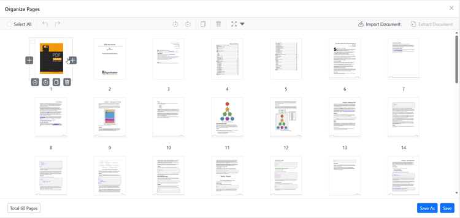

# Insert blank pages using the Organize Pages tool in Blazor PDF Viewer

## Overview

This guide describes inserting new blank pages into a PDF using the **Organize Pages** UI in the Blazor PDF Viewer.

**Outcome**: Blank pages are added at the chosen position and will appear in the document when saved or exported.

## Prerequisites

- [Blazor PDF Viewer](../overview) (SfPdfViewer) installed
- [Organize Pages](./overview) feature enabled

## Steps

1. Open the Organize Pages view

	- Click the **Organize Pages** button in the viewer toolbar to open the Organize Pages panel.

2. Insert blank pages

	- Click the **Insert** button (+ icon) in the Organize Pages toolbar.
	- Specify the position where you want to insert the blank page and the number of blank pages to add.
	- A new blank page thumbnail appears at the specified position.

	

3. Adjust and confirm

	- You can reposition the inserted blank page using drag-and-drop or remove it using the delete option if needed.

4. Persist the change

	- Click **Save** or **Save As** to include the blank pages in the exported PDF.

## Programmatic insert

You can also insert blank pages programmatically using the `InsertBlankPagesAsync` method.



@using Syncfusion.Blazor.Buttons

<SfButton OnClick="InsertBlankMethod">Insert</SfButton>
<SfPdfViewer2 @ref="Viewer" DocumentPath="https://cdn.syncfusion.com/content/pdf/pdf-succinctly.pdf"
              Height="100%"
              Width="100%">
</SfPdfViewer2>

@code {
    private SfPdfViewer2? Viewer;

    private async Task InsertBlankMethod() {
        await Viewer?.InsertBlankPagesAsync(2, 3);
    }
}



In this example, `InsertBlankPagesAsync(2, 3)` calls the API with the page index and the number of blank pages to insert as its two arguments; here, 3 blank pages are inserted starting at index 2.

For more details on programmatic support, see [Programmatic support for Organize Pages](./programmatic-support).

## Troubleshooting

- **Organize Pages button missing**: Verify that Organize Pages is enabled in the toolbar.
- **Inserted pages not saved**: Confirm that the changes are persisted using **Save** or **Save As**.

[View sample in GitHub](https://github.com/SyncfusionExamples/blazor-pdf-viewer-examples/blob/master/Page%20Organizer/Organize-API-Support/Components/Pages/Home.razor)

## See also

- [Organize pages toolbar customization](./toolbar)
- [Programmatic support for Organize Pages](./programmatic-support)
- [Organize pages event reference](./events)
- [Remove pages in Organize Pages](./remove-pages)
- [Reorder pages in Organize Pages](./reorder-pages)