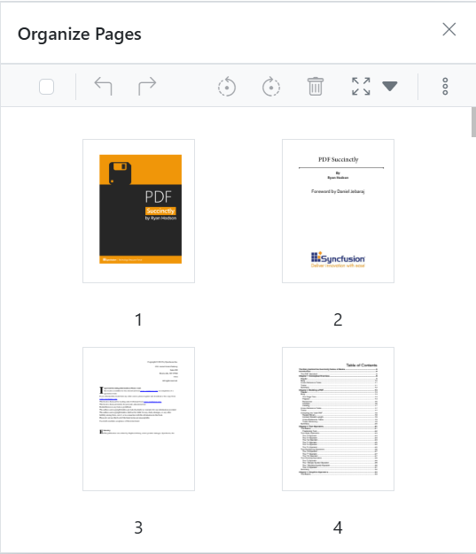
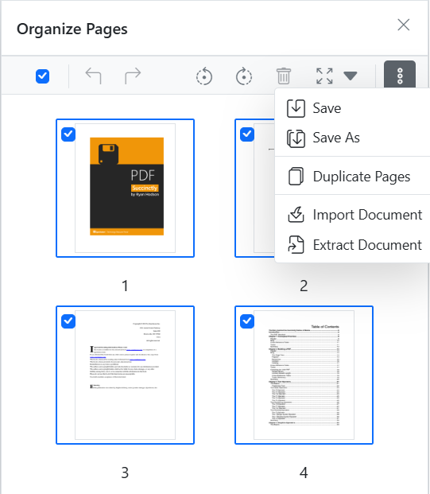

# Organize Pages in Mobile PDF Viewer Blazor
The PDF Viewer provides a mobile-responsive experience for the Organize Pages feature so users can manage pages comfortably on small screens.

## Mobile toolbar

On mobile, the `Organize Pages` toolbar appears in a bottom-anchored layout for easy one-handed use. It exposes the same core tools as desktop (insert, delete, rotate, etc.) with mobile-optimized spacing and icons.

## Context menu

Tap-and-hold a page thumbnail to open the context menu. Available actions include:

* **Rotate clockwise** — rotate the page 90° clockwise.
* **Rotate counter-clockwise** — rotate the page 90° counter-clockwise.
* **Rearrange pages** — drag thumbnails to update order.
* **Insert page** — insert a new page at the selected position.
* **Duplicate page** — create a copy of the selected page.
* **Delete page** — remove the selected page.
* **Select all** — select all pages in the document.
* **Import a PDF** — merge pages from another PDF file.
* **Extract pages** — export selected pages as a new PDF.
* **Save updates** — apply changes and use **Save** or **Save as** to download the modified PDF.

## Rearranging pages

To rearrange pages on mobile, tap-and-hold a thumbnail to select it, then drag it to the target position. A drop indicator shows the insertion point.

The mobile UI ensures users can manage document pages efficiently from any device.
