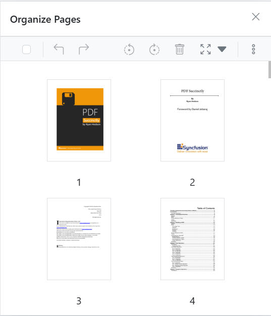
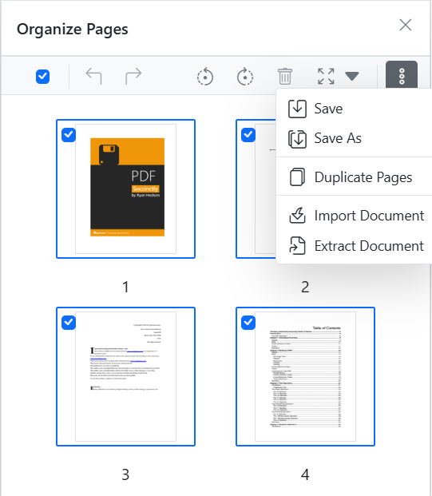

# Organize Pages in Mobile PDF Viewer Blazor

The PDF Viewer provides a mobile-responsive experience for the Organize Pages feature so users can manage pages comfortably on small screens. The mobile UI uses the same APIs as the desktop experience, so you can reuse the [programmatic support](./programmatic-support) when needed.

## Mobile toolbar

On mobile, the `Organize Pages` toolbar appears in a bottom-anchored layout for easy one-handed use. It exposes the same core tools as desktop (insert, delete, rotate, and so on) with mobile-optimized spacing and icons. For toolbar configuration, see [Organize pages toolbar customization](./toolbar).

## Context menu

Tap-and-hold a page thumbnail to open the context menu. Available actions include:

* **Rotate clockwise**: rotate the page 90° clockwise. See [Rotate pages](./rotate-pages).
* **Rotate counter-clockwise**: rotate the page 90° counter-clockwise. See [Rotate pages](./rotate-pages).
* **Rearrange pages**: drag thumbnails to update the page order. See [Rearrange pages](./reorder-pages).
* **Insert page**: insert a blank page at the selected position. See [Insert blank pages](./insert-blank-pages).
* **Duplicate page**: create a copy of the selected page. See [Duplicate pages](./duplicate-pages).
* **Delete page**: remove the selected page. See [Remove pages](./remove-pages).
* **Select all**: select all pages in the document.
* **Import a PDF**: merge pages from another PDF file. See [Import pages](./import-pages).
* **Extract pages**: export selected pages as a new PDF. See [Extract pages](./extract-pages).
* **Save updates**: apply changes and use **Save** or **Save as** to download the modified PDF.

## Rearrange pages

To rearrange pages on mobile, tap-and-hold a thumbnail to select it, then drag it to the target position. A drop indicator (a highlighted line between thumbnails) shows the insertion point. Release the thumbnail to drop it at the indicated position. For more details, see [Rearrange pages](./reorder-pages).

## See also

- [Organize pages overview](./overview)
- [Organize pages toolbar customization](./toolbar)
- [Programmatic support for Organize Pages](./programmatic-support)
- [Organize pages events](./events)
