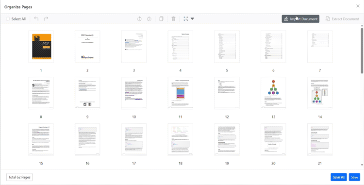
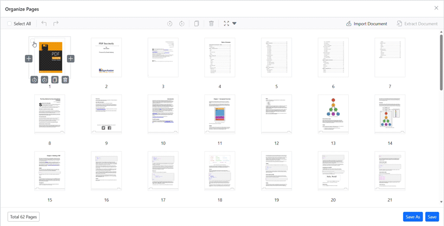
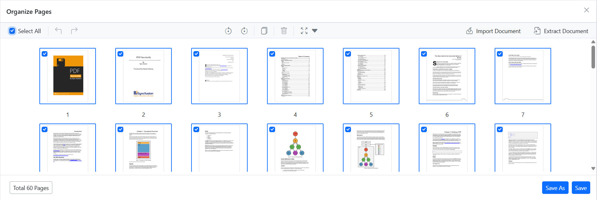

# Organize pages in SfPdfViewer

The Organize Pages feature in `SfPdfViewer` helps you manage PDF pages quickly — add, remove, rotate, reorder, duplicate, import, extract, and save changes with a few clicks.

## Getting started

Open a PDF in the viewer and choose **Organize Pages** from the left toolbar to open the organizer dialog.

## Common actions

### Rotate pages

- **Rotate clockwise** — rotate selected pages 90° clockwise.

- **Rotate counter-clockwise** — rotate selected pages 90° counter-clockwise.

### Rearrange pages

Drag and drop thumbnails to change page order.

### Insert, duplicate, delete

- **Insert page** — add a blank page to the left or right of the selection.

- **Duplicate page** — create a copy placed to the right of the original.

- **Delete page** — remove selected pages.

### Import and extract

- **Import PDF** — insert pages from another PDF; imported pages are merged when you save.

- **Extract pages** — export selected pages as a separate PDF.

### Select all and thumbnail zoom

- **Select all** — select every page for bulk actions.

- **Thumbnail zoom** — adjust thumbnail size with the zoom slider for better visibility or overview.

## Real-time edits and saving

Changes in the organizer are reflected in the viewer immediately. Use **Save** to overwrite the document or **Save As** to download a modified copy.

## Supported APIs

- `EnablePageOrganizer` (bool) — enable or disable the organizer. Default: `true`.



@page "/"

<SfPdfViewer2 DocumentPath="https://cdn.syncfusion.com/content/pdf/pdf-succinctly.pdf"
              Height="100%"
              Width="100%" EnablePageOrganizer="true">
</SfPdfViewer2>




- `PageOrganizerVisibility` (bool) — show the organizer dialog on load. Default: `false`.



@page "/"

<SfPdfViewer2 DocumentPath="https://cdn.syncfusion.com/content/pdf/pdf-succinctly.pdf"
              Height="100%"
              Width="100%" PageOrganizerVisibility="true">
</SfPdfViewer2>




- `PageOrganizerSettings` — controls available actions and thumbnail zoom settings. Common properties:

* `CanDelete` — allow delete. Default: `true`.
* `CanInsert` — allow insert. Default: `true`.
* `CanRotate` — allow rotate. Default: `true`.
* `CanDuplicate` — allow duplicate. Default: `true`.
* `CanRearrange` — allow rearrange. Default: `true`.
* `CanExtractPages` — allow extract. Default: `true`.
* `CanImport` — allow import. Default: `true`.
* `ShowImageZoomingSlider` — show thumbnail zoom slider. Default: `true`.
* `ImageZoom` — current thumbnail zoom. Default: `1`.
* `ImageZoomMin` — minimum zoom (1).
* `ImageZoomMax` — maximum zoom (5).
* `FooterButtons` — which footer buttons to show: `None`, `Save`, `SaveAs`, or combinations.



@page "/"

<SfPdfViewer2 DocumentPath="https://cdn.syncfusion.com/content/pdf/pdf-succinctly.pdf" Height="100%" Width="100%">
    <PageOrganizerSettings CanDelete="true" CanInsert="true" CanRotate="true" CanDuplicate="true" CanRearrange="true" CanImport="true" ImageZoom="1" ShowImageZoomingSlider="true" ImageZoomMin="1" ImageZoomMax="5" CanExtractPages="true" FooterButtons="FooterButton.Save | FooterButton.SaveAs"></PageOrganizerSettings>
</SfPdfViewer2>




## Keyboard shortcuts

- **Ctrl+Z** — undo.
- **Ctrl+Y** — redo.

## Conclusion

Organize Pages provides a compact, efficient interface to manage document pages in `SfPdfViewer`. Use the available settings and APIs to tailor the organizer to your application's needs.

[View sample in GitHub](https://github.com/SyncfusionExamples/blazor-pdf-viewer-examples/tree/master/Page%20Organizer)
