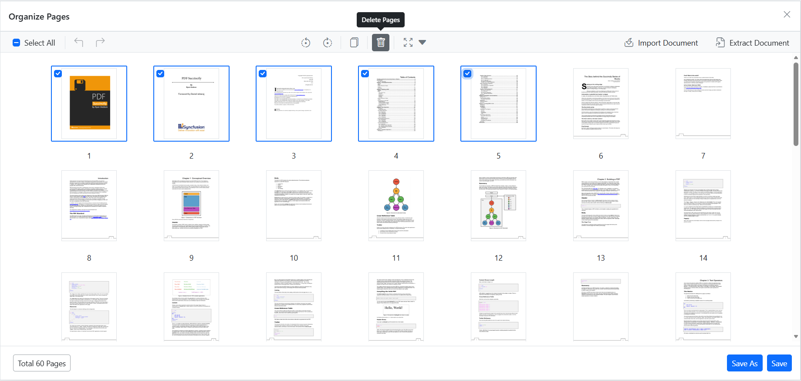
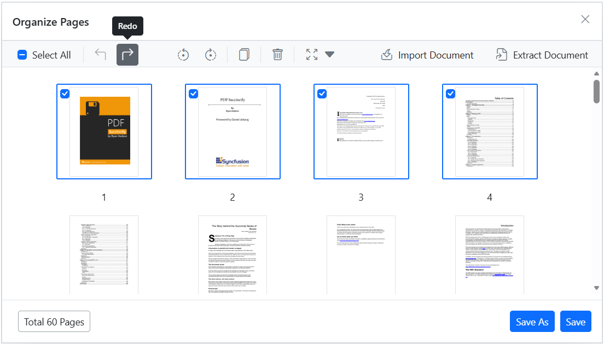

# Remove pages using the Organize Pages tool in Blazor PDF Viewer

## Overview

This guide shows how to delete single or multiple pages from a PDF using the **Organize Pages** UI in the Blazor SfPdfViewer. 

**Outcome**: You will remove unwanted pages and save or download the updated PDF.

## Prerequisites

- Blazor SfPdfViewer installed in your project
- Basic PDF Viewer setup with [`DocumentPath`](https://help.syncfusion.com/cr/blazor/Syncfusion.Blazor.SfPdfViewer.PdfViewerBase.html#Syncfusion_Blazor_SfPdfViewer_PdfViewerBase_DocumentPath) property configured

## Steps

1. Open the Organize Pages view

   - Click the **Organize Pages** button in the viewer toolbar to open the Organize Pages dialog.

2. Select pages to remove

   - Click a thumbnail to select a page. Use Shift+click or Ctrl+click to select multiple pages. Use the **Select all** button to select every page.

3. Delete selected pages

   - Click the **Delete Pages** icon in the Organize Pages toolbar to remove the selected pages. The thumbnails update immediately to reflect the deletion.

   - Delete a single page directly from its thumbnail: hover over the page thumbnail to reveal the per-page delete icon, then click that icon to remove only that page.

   

4. Undo or redo deletion

    - Use **Undo** (Ctrl+Z) to revert the last deletion.

    - Use **Redo** (Ctrl+Y) to reapply the last undone deletion.

    

5. Save the PDF after deletion

   - Click **Save** to apply changes to the currently loaded document, or **Save As** / **Download** to download a copy with the removed pages permanently applied.

## Enable or disable Remove Pages button

To enable or disable the **Remove Pages** button in the Organize Pages toolbar, update the `PageOrganizerSettings`. The following code snippet demonstrates how to enable or disable the delete functionality:



@using Syncfusion.Blazor.SfPdfViewer

<SfPdfViewer2 DocumentPath="https://cdn.syncfusion.com/content/pdf/pdf-succinctly.pdf"
              Width="100%"
              Height="100%">
    <PageOrganizerSettings CanDelete="true"></PageOrganizerSettings>
</SfPdfViewer2>



## Programmatic page deletion

You can delete pages programmatically using the `DeletePagesAsync` method. This method accepts an array of 0-based page indices to remove from the document.



@using Syncfusion.Blazor.SfPdfViewer
@using Syncfusion.Blazor.Buttons

<SfButton OnClick="DeletePagesAsync">Delete Pages</SfButton>

<SfPdfViewer2 @ref="viewer"
              DocumentPath="https://cdn.syncfusion.com/content/pdf/pdf-succinctly.pdf"
              Width="100%"
              Height="100%">
    <PageOrganizerSettings CanDelete="true"></PageOrganizerSettings>
</SfPdfViewer2>

@code {
    private SfPdfViewer2? viewer;

    private async Task DeletePagesAsync()
    {
        // Delete pages at indices 5 and 6 (0-based indexing)
        int[] pagesToDelete = { 5, 6 };
        await viewer.DeletePagesAsync(pagesToDelete);
    }
}



## Troubleshooting

- **Delete button disabled**: Ensure `PageOrganizerSettings.CanDelete` is not set to `false`.
- **Selection not working**: Verify that the Organize Pages dialog has focus; use Shift+click for range selection.

[View sample in GitHub](https://github.com/SyncfusionExamples/blazor-pdf-viewer-examples/blob/master/Page%20Organizer/Organize-API-Support/Components/Pages/Home.razor)

## See also

- [Organize pages toolbar customization](./toolbar)
- [Programmatic support for Organize Pages](./programmatic-support)
- [Organize pages event reference](./events)
