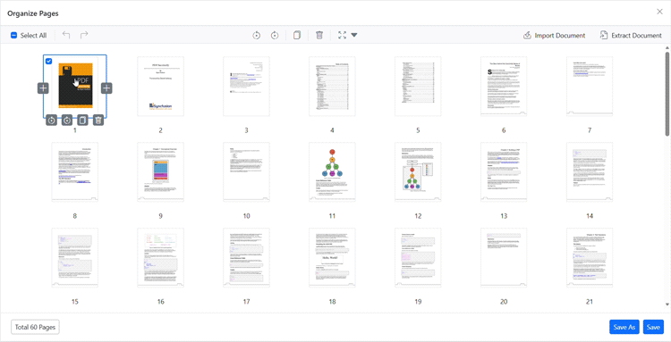

# Reorder pages using the Organize Pages view

## Overview

This guide describes how to rearrange pages in a PDF using the **Organize Pages** UI.

**Outcome**: Single or multiple pages can be reordered and the new sequence is preserved when the document is saved or exported.

## Prerequisites

- Syncfusion Blazor PDF Viewer component installed
- `EnablePageOrganizer` property enabled in the viewer

## Steps

1. Open the Organize Pages view

	- Click the **Organize Pages** button in the navigation toolbar to open the page thumbnails panel.

2. Reorder a single page

	- Drag a thumbnail to the desired position. The thumbnails update instantly to show the new order.

3. Reorder multiple pages

	- Select multiple thumbnails using Ctrl or Shift, then drag the selected group to the new location.

    

4. Verify and undo

	- Use **Undo** / **Redo** options to revert accidental changes.

    

5. Persist the updated order

	- Click **Save** or download the document using **Save As** to persist the new page sequence.

## Expected result

- Thumbnails reflect the new page order immediately and saved / downloaded PDFs preserve the reordered sequence.

## Enable or disable reorder option

To enable or disable the **Reorder pages** option in the Organize Pages, update the `PageOrganizerSettings.CanRearrange`. See [Organize pages toolbar customization](./toolbar#enable-or-disable-the-rearrange-option) for the guidelines

## Troubleshooting

- **Thumbnails won't move**: Confirm `PageOrganizerSettings.CanRearrange` is not set to `false`.
- **Changes not saved**: Verify that the server-side PDF processing is configured correctly.
- **Page organizer not visible**: Ensure `EnablePageOrganizer` is set to `true`.

## Related topics

- [Organize pages toolbar customization](./toolbar)
- [Organize pages event reference](./events)