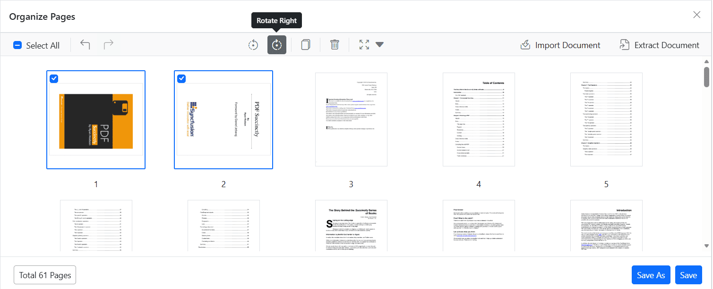

# Rotate pages using the Organize Pages view in Blazor PDF Viewer

## Overview

This guide explains how to rotate individual or multiple pages using the **Organize Pages** UI in the Blazor PDF Viewer. Each click rotates the selected page(s) by 90°; repeated clicks achieve 180° and 270° rotations.

**Outcome**: Pages are rotated in the viewer and persisted when saved or exported.

## Prerequisites

- Blazor PDF Viewer (SfPdfViewer) installed
- PDF Viewer configured with `DocumentPath` property or document loaded via `LoadAsync()` method

## Steps

1. Open the Organize Pages view

   - Click the **Organize Pages** button in the viewer toolbar to open the Organize Pages panel.

2. Select pages to rotate

   - Click a single thumbnail, or use Shift+click or Ctrl+click to select multiple pages.

3. Rotate pages using toolbar buttons

   - Use **Rotate Right** to rotate 90° clockwise.
   - Use **Rotate Left** to rotate 90° counter-clockwise.
   - Click the button again to apply additional 90° increments.

   

4. Rotate multiple pages at once

   - When multiple thumbnails are selected, the Rotate action applies to every selected page.

5. Undo or reset rotation

   - Use **Undo** (Ctrl+Z) or **Redo** (Ctrl+Y) in the Organize Pages toolbar to revert or reapply the last rotation.
   - Alternatively, click **Rotate Left** or **Rotate Right** again to step the page in 90° increments.

   

6. Persist rotations

   - Click **Save** or **Save As** to persist rotations in the saved/downloaded PDF. Exporting pages also preserves the new orientation.

## Expected result

- Pages rotate in-place in the Organize Pages panel when using the rotate controls.
- Saving or exporting the document preserves the new orientation.

## Enable or disable Rotate Pages button

To enable or disable the **Rotate Pages** button in the Organize Pages toolbar, update the [`pageOrganizerSettings`](https://help.syncfusion.com/cr/blazor/Syncfusion.Blazor.SfPdfViewer.PdfViewerBase.html#Syncfusion_Blazor_SfPdfViewer_PdfViewerBase_PageOrganizerSettings). See [Organize pages toolbar customization](./toolbar#enable-or-disable-the-rotate-option) for details

## Troubleshooting

- **Rotate controls disabled**: Ensure `PageOrganizerSettings.canRotate` is not set to `false`.
- **Changes not saved**: Verify that the server-side PDF processing is configured correctly.

[View sample in GitHub](https://github.com/SyncfusionExamples/blazor-pdf-viewer-examples/tree/master/Page%20Organizer/Page-Organizer-Settings)

## See also

- [Organize pages toolbar customization](./toolbar)
- [Organize pages event reference](./events)
