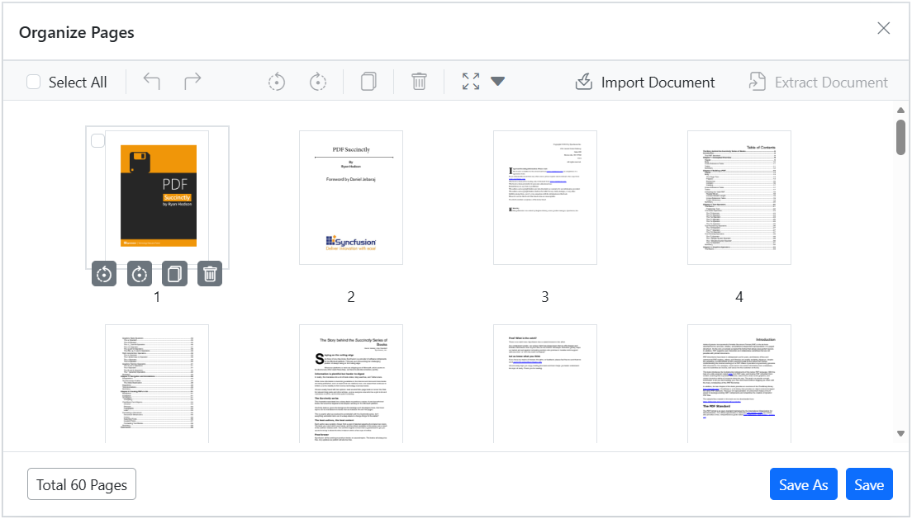
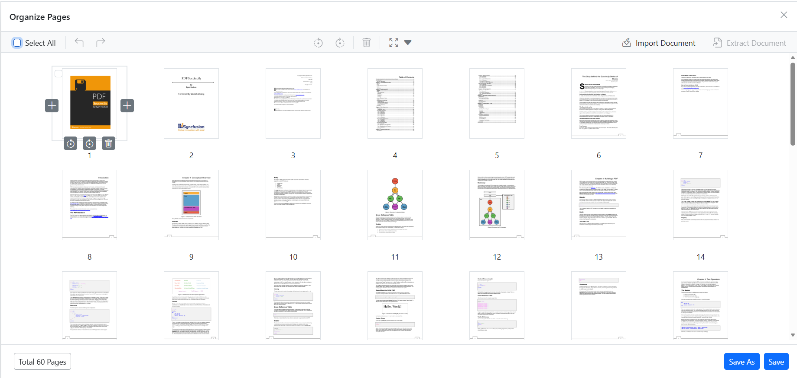
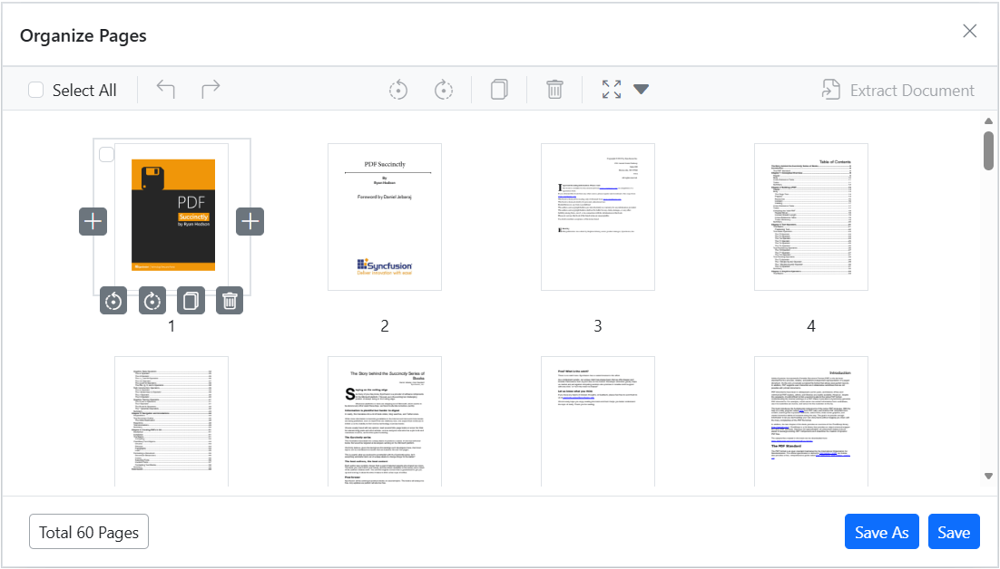
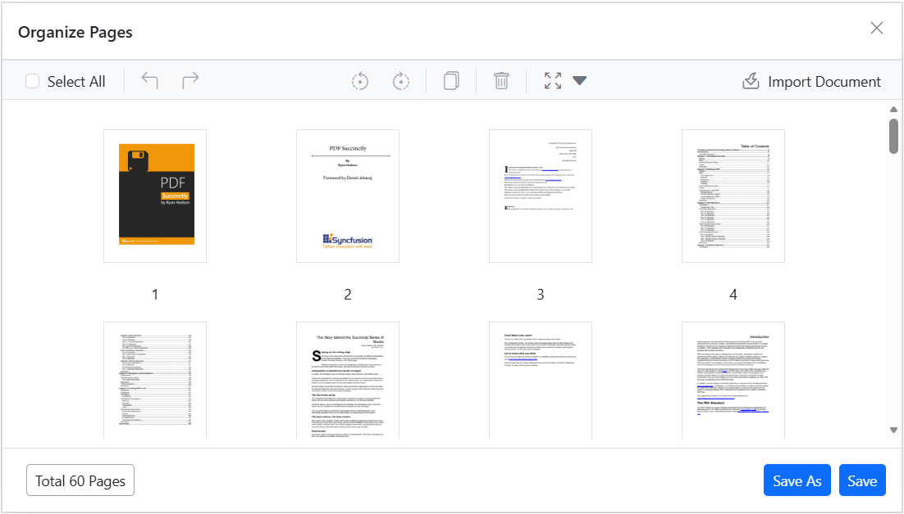

# Organize Page Toolbar Customization in Blazor PDF Viewer control

The PDF Viewer allows you to customize the toolbar for the organize pages feature, enabling you to show or hide specific tools based on your application's requirements. The `PageOrganizerSettings` API provides properties to control the visibility of each tool in the organize pages dialog.

## Show or hide the insert option

The `CanInsert` property controls the visibility of the insert tool. When set to `false`, the insert tool will be hidden from the toolbar.



@page "/"

<SfPdfViewer2 DocumentPath="https://cdn.syncfusion.com/content/pdf/pdf-succinctly.pdf"
              Height="100%"
              Width="100%">
              <PageOrganizerSettings CanInsert="false"></PageOrganizerSettings>
</SfPdfViewer2>




## Show or hide the delete option

The `CanDelete` property controls the visibility of the delete tool. When set to `false`, the delete tool will be hidden.



@page "/"

<SfPdfViewer2 DocumentPath="https://cdn.syncfusion.com/content/pdf/pdf-succinctly.pdf"
              Height="100%"
              Width="100%">
              <PageOrganizerSettings CanDelete="false"></PageOrganizerSettings>
</SfPdfViewer2>




## Show or hide the rotate option

The `CanRotate` property controls the visibility of the rotate tool. When set to `false`, the rotate tool will be hidden.



@page "/"

<SfPdfViewer2 DocumentPath="https://cdn.syncfusion.com/content/pdf/pdf-succinctly.pdf"
              Height="100%"
              Width="100%">
              <PageOrganizerSettings CanRotate="false"></PageOrganizerSettings>
</SfPdfViewer2>




## Show or hide the duplicate option

The `CanDuplicate` property controls the visibility of the copy tool. When set to `false`, the copy tool will be hidden.



@page "/"

<SfPdfViewer2 DocumentPath="https://cdn.syncfusion.com/content/pdf/pdf-succinctly.pdf"
              Height="100%"
              Width="100%">
              <PageOrganizerSettings CanDuplicate="false"></PageOrganizerSettings>
</SfPdfViewer2>




## Show or hide the import option

The `CanImport` property controls the visibility of the import tool. When set to `false`, the import tool will be hidden.



@page "/"

<SfPdfViewer2 DocumentPath="https://cdn.syncfusion.com/content/pdf/pdf-succinctly.pdf"
              Height="100%"
              Width="100%">
              <PageOrganizerSettings CanImport="false"></PageOrganizerSettings>
</SfPdfViewer2>




## Show or hide the extract option

The `CanExtractPages` property controls the visibility of the extract tool. When set to `false`, the extract tool will be hidden.



@page "/"

<SfPdfViewer2 DocumentPath="https://cdn.syncfusion.com/content/pdf/pdf-succinctly.pdf"
              Height="100%"
              Width="100%">
              <PageOrganizerSettings CanExtractPages="false"></PageOrganizerSettings>
</SfPdfViewer2>




## Show or hide the rearrange option

The `CanRearrange` property controls the ability to rearrange pages. When set to `false`, pages cannot be rearranged.



@page "/"

<SfPdfViewer2 DocumentPath="https://cdn.syncfusion.com/content/pdf/pdf-succinctly.pdf"
              Height="100%"
              Width="100%">
              <PageOrganizerSettings CanRearrange="false"></PageOrganizerSettings>
</SfPdfViewer2>




[View sample in GitHub](https://github.com/SyncfusionExamples/blazor-pdf-viewer-examples/tree/master/Page%20Organizer/Page-Organizer-Settings)