# UI Interactions for Organizing Pages in Blazor PDF Viewer

The PDF Viewer provides an intuitive user interface for managing and organizing pages within a PDF document. This section covers the various UI interactions available in the `Organize Pages` dialog.

## Rotating PDF pages

You can adjust the orientation of pages to ensure proper alignment. The rotate icon in the Organize Pages dialog provides the following options:

*   **Rotate clockwise**: Rotate the selected pages 90 degrees clockwise.

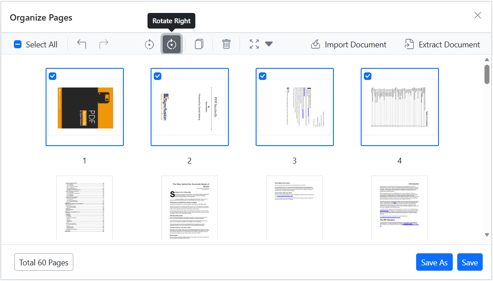

*   **Rotate counter-clockwise**: Rotate the selected pages 90 degrees counter-clockwise.

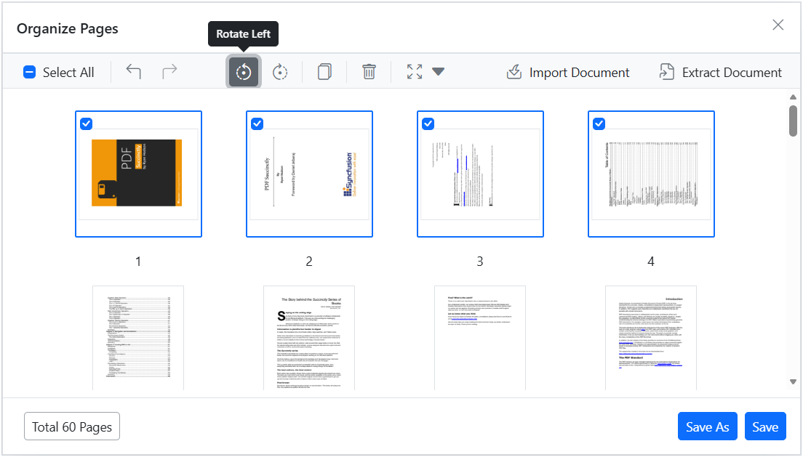

## Rearranging PDF pages

Easily change the sequence of pages using the drag-and-drop method:

*   **Drag and drop**: Click and drag a page thumbnail to the desired position within the document, then release it to reorder the pages.

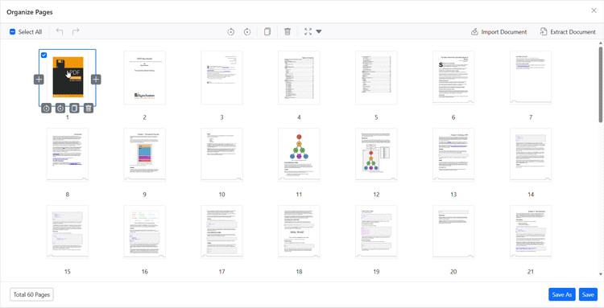

## Inserting new pages

Effortlessly add blank pages to your document with the following options:

*   **Insert blank page left**: Insert a blank page to the left of the selected page.
*   **Insert blank page right**: Insert a blank page to the right of the selected page.

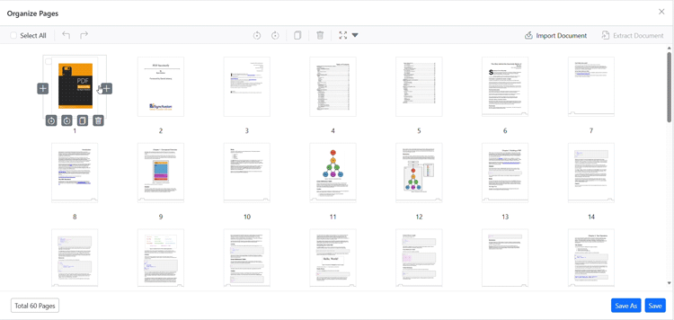

## Deleting PDF pages

Remove unwanted pages from your document with these steps:

1.  **Select pages to delete**: Click on the thumbnails of the pages you wish to remove. You can select multiple pages at once.
2.  **Delete selected pages**: Use the delete option in the Organize Pages pane to remove the selected pages from the document.

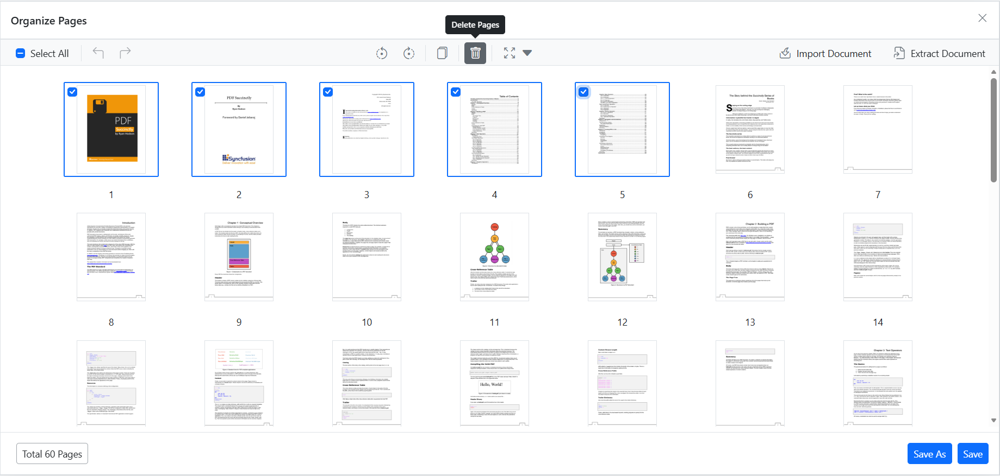

## Duplicating PDF pages

Duplicate pages within your PDF document effortlessly:

*   **Select pages to duplicate**: Click on the page thumbnails you wish to duplicate.
*   **Duplicate selected pages**: Use the duplicate option to create duplicates. The copied pages will be added to the right of the selected pages.

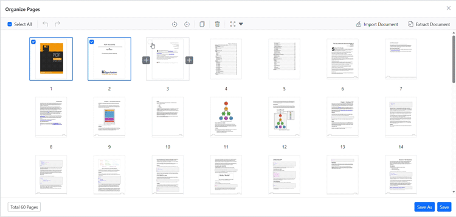

## Importing a PDF document

Seamlessly import another PDF document into your current document:

*   **Import PDF document**: Click the **Import Document** button to select and import a PDF. The imported document will be inserted as a thumbnail. If a page is selected, the thumbnail will be added to its right. If no pages are selected, it will be added as the first page. The imported PDF will be merged with the current document upon saving.

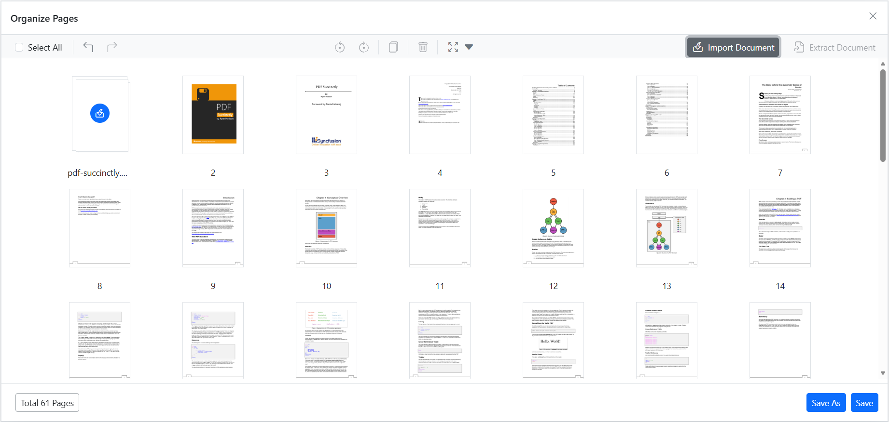

### Extract Document Pages

* `Extract Document Pages`: Click the **Extract Document** button to extract a PDF pages. If a pages are selected, the selected pages are extracted as a separate document.

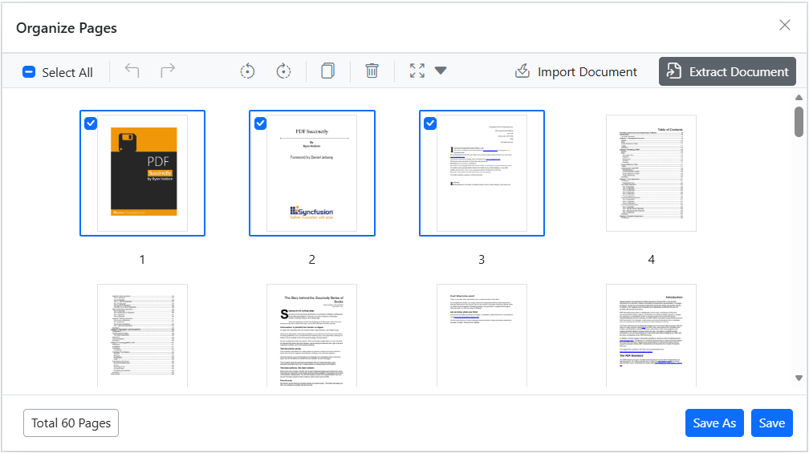

## Selecting all pages

Select all pages simultaneously to perform bulk operations, such as rotating or deleting all pages at once.

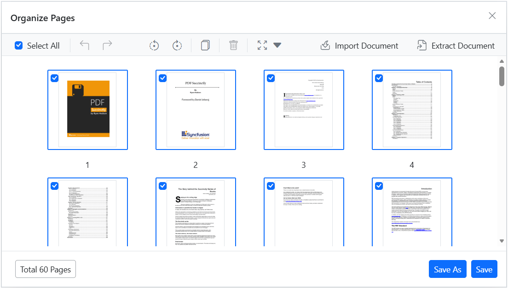

## Zooming page thumbnails

Adjust the size of page thumbnails for better visibility and precision:

*   Use the zoom slider to increase or decrease the thumbnail size.
*   Zoom in to see more detail on each page.
*   Zoom out to view more pages at once.

## Real-time updates and saving

All changes are reflected instantly in the Organize Pages dialog. Click the **Save** button to apply the modifications to the document. Use the **Save As** feature to download a new version of the PDF with your changes.

## Keyboard shortcuts

The following keyboard shortcuts are available in the Organize Pages dialog:

*   **Ctrl+Z**: Undo the last action.

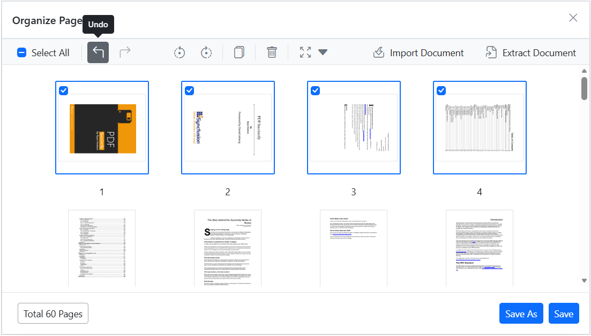

*   **Ctrl+Y**: Redo the last undone action.

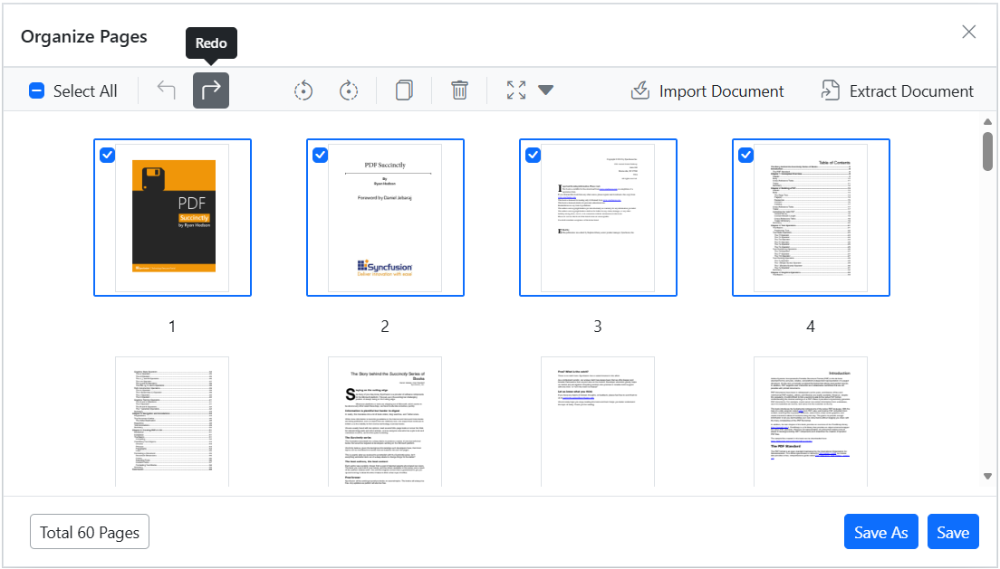
