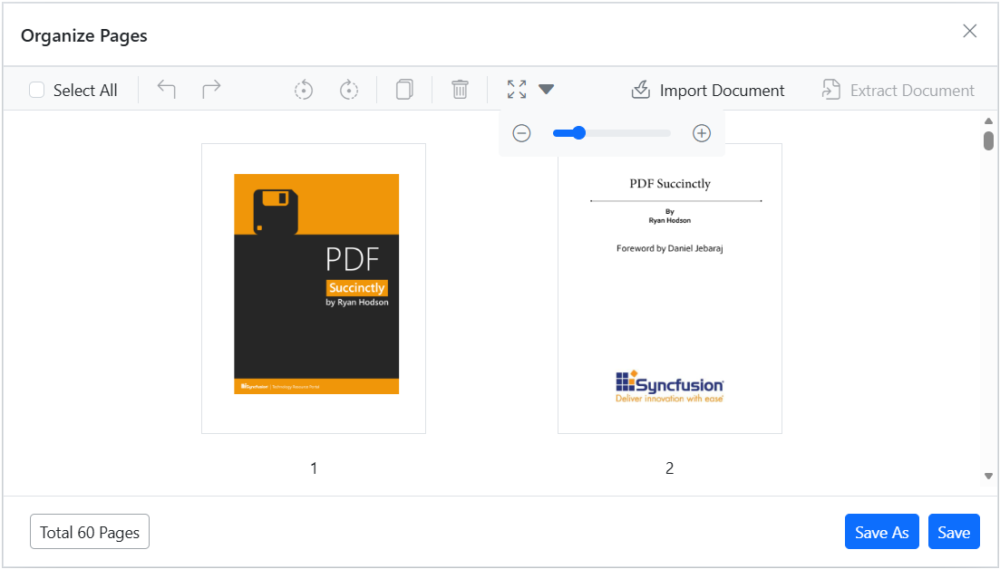

# Zoom pages using the Organize Pages tool in Blazor

## Overview

This guide explains how to change the thumbnail zoom level in the **Organize Pages** UI so you can view more detail or see more pages at once.

## Prerequisites

- EJ2 Blazor PDF Viewer installed
- [`PageOrganizerSettings`](https://help.syncfusion.com/cr/blazor/Syncfusion.Blazor.SfPdfViewer.PdfViewerBase.html#Syncfusion_Blazor_SfPdfViewer_PdfViewerBase_PageOrganizerSettings) configured in the PDF Viewer component

## Steps

1. Open the Organize Pages view

	- Click the **Organize Pages** button in the viewer toolbar to open the thumbnails panel.

2. Locate the zoom control

	- Find the thumbnail zoom slider in the Organize Pages toolbar.

3. Adjust zoom

	- Drag the slider to increase or decrease thumbnail size.

    

	- Select a zoom level that balances page detail and the number of visible thumbnails for your task.

## Expected result

- Thumbnails resize interactively; larger thumbnails show more detail while smaller thumbnails allow viewing more pages at once.

## Configure thumbnail zoom settings

To customize the thumbnail zoom behavior, use the [`PageOrganizerSettings`](https://help.syncfusion.com/cr/blazor/Syncfusion.Blazor.SfPdfViewer.PdfViewerBase.html#Syncfusion_Blazor_SfPdfViewer_PdfViewerBase_PageOrganizerSettings) property with the following options:

| Property | Type | Description |
|---|---|---|
| `ImageZoom` | double | Sets the current thumbnail zoom level |
| `ImageZoomMin` | int | Minimum zoom level (2 to 5) |
| `ImageZoomMax` | int | Maximum zoom level (2 to 5) |
| `ShowImageZoomingSlider` | bool | Shows or hides the zoom slider |



<SfPdfViewer2 DocumentPath="https://cdn.syncfusion.com/content/pdf/pdf-succinctly.pdf" Height="100%" Width="100%">
    <PageOrganizerSettings ShowImageZoomingSlider="true" ImageZoom="3" ImageZoomMin="2" ImageZoomMax="5"></PageOrganizerSettings>
</SfPdfViewer2>



N> The `ImageZoomMin` and `ImageZoomMax` properties accept values from 2 to 5 only.

## Show or hide the Zoom Pages slider

To show or hide the **Zoom Pages** slider in the Organize Pages toolbar, set the `ShowImageZoomingSlider` property in [`PageOrganizerSettings`](https://help.syncfusion.com/cr/blazor/Syncfusion.Blazor.SfPdfViewer.PdfViewerBase.html#Syncfusion_Blazor_SfPdfViewer_PdfViewerBase_PageOrganizerSettings).

## Troubleshooting

- **Zoom control not visible**: Confirm `ShowImageZoomingSlider` is set to `true` in the `PageOrganizerSettings`.
- **Zoom slider not responding**: Ensure `ImageZoomMin` is less than or equal to `ImageZoomMax`.

[View sample in GitHub](https://github.com/SyncfusionExamples/blazor-pdf-viewer-examples/tree/master/Page%20Organizer/Page-Organizer-Settings)

## See also

- [Organize pages toolbar customization](./toolbar)
- [Organize pages event reference](./events)
