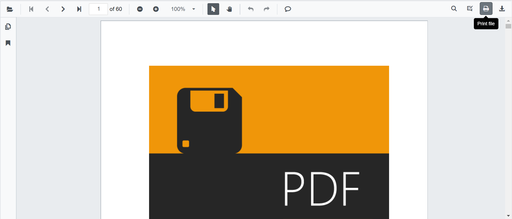

# Print in Blazor SfPdfViewer Component

The SfPdfViewer supports printing the loaded PDF by default. Enable or disable the toolbar Print option by setting the [EnablePrint](https://help.syncfusion.com/cr/blazor/Syncfusion.Blazor.SfPdfViewer.PdfViewerBase.html#Syncfusion_Blazor_SfPdfViewer_PdfViewerBase_EnablePrint) property.

```cshtml

@using Syncfusion.Blazor.SfPdfViewer

<SfPdfViewer2 Height="100%"
              Width="100%"
              DocumentPath="@DocumentPath"
              EnablePrint="true" />

@code{
    public string DocumentPath { get; set; } = "wwwroot/Data/PDF_Succinctly.pdf";
}

```



```cshtml

@using Syncfusion.Blazor.SfPdfViewer
@using Syncfusion.Blazor.Buttons

<SfButton OnClick="OnClick">Print</SfButton>
<SfPdfViewer2 Width="100%"
              Height="100%"
              DocumentPath="@DocumentPath"
              @ref="@Viewer" />

@code{
    SfPdfViewer2 Viewer;
    public string DocumentPath { get; set; } = "wwwroot/data/PDF_Succinctly.pdf";

    public async void OnClick(MouseEventArgs args)
    {
        await Viewer.PrintAsync();
    }
}

```

## EnablePrintRotation

[EnablePrintRotation](https://help.syncfusion.com/cr/blazor/Syncfusion.Blazor.SfPdfViewer.PdfViewerBase.html#Syncfusion_Blazor_SfPdfViewer_PdfViewerBase_EnablePrintRotation) controls whether landscape pages are auto-rotated to best fit when printing. Default: true. Set to false to preserve the original page orientation and suppress automatic rotation during print.

```cshtml

@using Syncfusion.Blazor.SfPdfViewer

<SfPdfViewer2 Height="100%"
              Width="100%"
              DocumentPath="@DocumentPath"
              EnablePrintRotation="true" />

@code{
    public string DocumentPath { get; set; } = "wwwroot/Data/PDF_Succinctly.pdf";
}

```

## Print modes

[PrintMode](https://help.syncfusion.com/cr/blazor/Syncfusion.Blazor.SfPdfViewer.PdfViewerBase.html#Syncfusion_Blazor_SfPdfViewer_PdfViewerBase_PrintMode) specifies how the print dialog is opened. Default: PrintMode.Default (prints from the same window). Supported values:

- [PrintMode.Default](https://help.syncfusion.com/cr/blazor/Syncfusion.Blazor.SfPdfViewer.PrintMode.html#Syncfusion_Blazor_SfPdfViewer_PrintMode_Default): Opens the print dialog in the same window.
- [PrintMode.NewWindow](https://help.syncfusion.com/cr/blazor/Syncfusion.Blazor.SfPdfViewer.PrintMode.html#Syncfusion_Blazor_SfPdfViewer_PrintMode_NewWindow): Opens the print dialog from a new browser window/tab, which can be useful depending on browser popup policies.

```cshtml

@using Syncfusion.Blazor.SfPdfViewer

<SfPdfViewer2 Height="100%"
              Width="100%"
              DocumentPath="@DocumentPath"
              PrintMode="PrintMode.NewWindow" />

@code{
    public string DocumentPath { get; set; } = "wwwroot/Data/PDF_Succinctly.pdf";
}

```

## PrintScaleFactor

[PrintScaleFactor](https://help.syncfusion.com/cr/blazor/Syncfusion.Blazor.SfPdfViewer.PdfViewerBase.html#Syncfusion_Blazor_SfPdfViewer_PdfViewerBase_PrintScaleFactor) sets the scale used when rendering pages for printing. By default the scale factor set as 1.0 (prints at the on-screen scale). Valid range from 0.5 to 5.0. Higher values can improve output clarity for documents with smaller page dimensions and may increase print processing time.

```cshtml

@using Syncfusion.Blazor.SfPdfViewer

<SfPdfViewer2 Height="100%"
              Width="100%"
              DocumentPath="@DocumentPath"
              PrintScaleFactor="2" />

@code{
    public string DocumentPath { get; set; } = "wwwroot/Data/PDF_Succinctly.pdf";
}

```

## Print Events

The following events are available for print in the SfPdfViewer component.

|Name|Description|
|---|---|
|PrintStart|Triggers when a print action starts.|
|PrintEnd|Triggers when a print action is completed.|

### PrintStart Event

The [PrintStart](https://help.syncfusion.com/cr/blazor/Syncfusion.Blazor.SfPdfViewer.PdfViewerEvents.html#Syncfusion_Blazor_SfPdfViewer_PdfViewerEvents_PrintStart) event triggers when the print action is started.

#### Event Arguments

See [PrintStartEventArgs](https://help.syncfusion.com/cr/blazor/Syncfusion.Blazor.SfPdfViewer.PrintStartEventArgs.html) for details such as Filename, Cancel option.

- If the [Cancel](https://help.syncfusion.com/cr/blazor/Syncfusion.Blazor.SfPdfViewer.PrintStartEventArgs.html#Syncfusion_Blazor_SfPdfViewer_PrintStartEventArgs_Cancel) property is set to true in the PrintStart event, the print operation is canceled and the print dialog will not open.
- By default, Cancel is false. Set it to true to prevent printing.

The following example illustrates how to handle the PrintStart event.

```cshtml

@using Syncfusion.Blazor.SfPdfViewer 
<SfPdfViewer2 DocumentPath="@DocumentPath" Height="100%" Width="100%"> 
    <PdfViewerEvents PrintStart="@PrintStart"></PdfViewerEvents>
</SfPdfViewer2>
@code{ 
    private string DocumentPath { get; set; } = "wwwroot/Data/PDF_Succintly.pdf"; 
    public async Task PrintStart(PrintStartEventArgs args) 
    {
        Console.WriteLine($"Printed File Name: {args.FileName}");
    }	 
}

```

### PrintEnd Event

The [PrintEnd](https://help.syncfusion.com/cr/blazor/Syncfusion.Blazor.SfPdfViewer.PdfViewerEvents.html#Syncfusion_Blazor_SfPdfViewer_PdfViewerEvents_PrintEnd) event triggers when an annotation is added to a page in the PDF document.

#### Event Arguments

See [PrintEndEventArgs](https://help.syncfusion.com/cr/blazor/Syncfusion.Blazor.SfPdfViewer.PrintEndEventArgs.html) for details such as Filename.

The following example illustrates how to handle the PrintEnd event.

```cshtml

@using Syncfusion.Blazor.SfPdfViewer 
<SfPdfViewer2 DocumentPath="@DocumentPath" Height="100%" Width="100%"> 
    <PdfViewerEvents PrintEnd="@PrintEnd"></PdfViewerEvents>
</SfPdfViewer2>
@code{ 
    private string DocumentPath { get; set; } = "wwwroot/Data/PDF_Succintly.pdf"; 
    public async Task PrintEnd(PrintEndEventArgs args) 
    {
        Console.WriteLine($"Printed File Name: {args.FileName}");
    }	 
}

```

## See also

* [Download in Blazor SfPdfViewer component](https://help.syncfusion.com/document-processing/pdf/pdf-viewer/blazor/saving-pdf-file#download-in-blazor-sfpdfviewer-component)

* [How to print in the same window](./faqs/how-to-perform-print-in-same-window)

* [How to print the SfPdfViewer inside the Dialog](./faqs/how-to-print-the-sfpdfiewer-inside-the-dialog-component)
