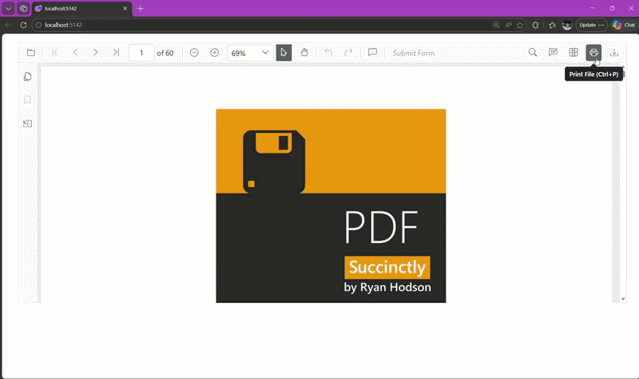

# Enable Print Rotation in Blazor PDF Viewer

The [EnablePrintRotation](https://help.syncfusion.com/cr/blazor/Syncfusion.Blazor.SfPdfViewer.PdfViewerBase.html#Syncfusion_Blazor_SfPdfViewer_PdfViewerBase_EnablePrintRotation) property in the Blazor PDF Viewer controls how landscape pages are handled during printing. When enabled, the viewer automatically rotates landscape-oriented pages to match the printer's paper orientation, so the content fits within the paper margins and is not clipped. Portrait pages are unaffected.

| Property | Type | Default | Applies to |
|----------|------|---------|------------|
| `EnablePrintRotation` | `bool` | `true` | `SfPdfViewer2` (via `PdfViewerBase`) |

When set to `false`, pages retain their original orientation and are printed without any automatic rotation.

## When to use print rotation

Enable this feature when printing documents that include landscape pages and you want them to align with the printer's paper orientation. This helps improve readability and ensures that content is not cut off during printing. Rotation is applied regardless of the [print mode](./print-modes) (Default or NewWindow).

## Enabling print rotation

The `EnablePrintRotation` property is set during the initialization of the PDF Viewer component. Since the default is `true`, explicit configuration is normally used only to disable rotation.

The following example keeps the default behavior.



@using Syncfusion.Blazor.SfPdfViewer

<SfPdfViewer2 Height="100%"
              Width="100%"
              DocumentPath="@DocumentPath"
              EnablePrintRotation="true" />

@code{
    private string DocumentPath { get; set; } = "wwwroot/Data/PDF_Succinctly.pdf";
}



## Disabling print rotation

Set `EnablePrintRotation` to `false` to print pages in their original orientation without any automatic rotation.



@using Syncfusion.Blazor.SfPdfViewer

<SfPdfViewer2 Height="100%"
              Width="100%"
              DocumentPath="@DocumentPath"
              EnablePrintRotation="false" />

@code{
    private string DocumentPath { get; set; } = "wwwroot/Data/PDF_Succinctly.pdf";
}



[View Sample in GitHub](https://github.com/SyncfusionExamples/blazor-pdf-viewer-examples/tree/master/Print)

## See also

- [Overview](./overview)
- [Print modes](./print-modes)
- [Print events](./events)
