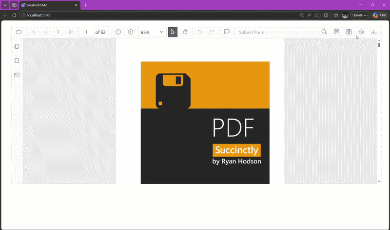

# Print PDF in Blazor PDF Viewer

The Blazor PDF Viewer includes built-in printing via the toolbar and APIs so users can control how documents are printed and monitor the process.

Select **Print** in the built-in toolbar to open the browser print dialog.

## Enable or Disable Print in Blazor PDF Viewer

Control whether printing is available by setting the [EnablePrint](https://help.syncfusion.com/cr/blazor/Syncfusion.Blazor.SfPdfViewer.PdfViewerBase.html#Syncfusion_Blazor_SfPdfViewer_PdfViewerBase_EnablePrint) property (`true` enables printing; `false` disables it).

The following Blazor example renders the PDF Viewer with printing disabled.



@using Syncfusion.Blazor.SfPdfViewer

<SfPdfViewer2 Height="100%"
              Width="100%"
              DocumentPath="@DocumentPath"
              EnablePrint="false" />

@code{
    private string DocumentPath { get; set; } = "wwwroot/Data/PDF_Succinctly.pdf";
}



## Print programmatically in Blazor PDF Viewer

To start printing from code, call the [PrintAsync()](https://help.syncfusion.com/cr/blazor/Syncfusion.Blazor.SfPdfViewer.SfPdfViewer.html#Syncfusion_Blazor_SfPdfViewer_SfPdfViewer_PrintAsync) method after the document is fully loaded. This approach is useful when wiring up custom UI or initiating printing automatically.

> If called before the document finishes loading, `PrintAsync()` produces no output or an empty print dialog.



@using Syncfusion.Blazor.SfPdfViewer
@using Syncfusion.Blazor.Buttons
@using Microsoft.AspNetCore.Components.Web

<SfButton OnClick="OnClick">Print</SfButton>
<SfPdfViewer2 Width="100%"
              Height="100%"
              DocumentPath="@DocumentPath"
              @ref="@Viewer" />

@code{
    private SfPdfViewer2? Viewer;
    private string DocumentPath { get; set; } = "wwwroot/Data/PDF_Succinctly.pdf";

    private async Task OnClick(MouseEventArgs args)
    {
        await Viewer.PrintAsync();
    }
}



## Key capabilities

- Enable or disable printing with the [EnablePrint](https://help.syncfusion.com/cr/blazor/Syncfusion.Blazor.SfPdfViewer.PdfViewerBase.html#Syncfusion_Blazor_SfPdfViewer_PdfViewerBase_EnablePrint) property
- Start printing from UI (toolbar Print) or programmatically using [PrintAsync()](https://help.syncfusion.com/cr/blazor/Syncfusion.Blazor.SfPdfViewer.SfPdfViewer.html#Syncfusion_Blazor_SfPdfViewer_SfPdfViewer_PrintAsync).
- Auto‑rotate pages during print using [EnablePrintRotation](./enable-print-rotation)
- Choose where printing happens with [PrintMode](./print-modes) (Default or NewWindow)
- Track the life cycle with [PrintStart and PrintEnd events](./events)

[View Sample in GitHub](https://github.com/SyncfusionExamples/blazor-pdf-viewer-examples/tree/master/Print)

## See also

- [Enable print rotation](./enable-print-rotation)
- [Print modes](./print-modes)
- [Print events](./events)
