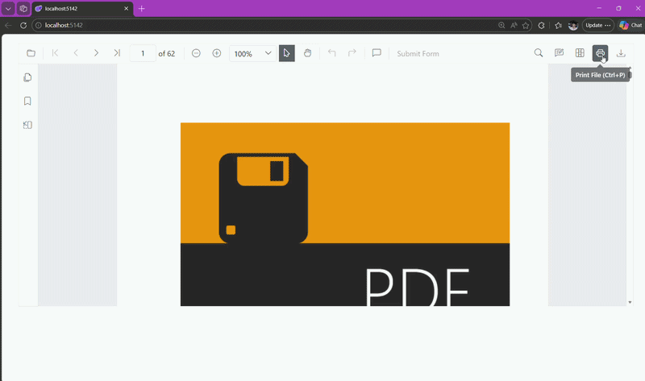

# Print Modes in Blazor PDF Viewer

The [`PrintMode`](https://help.syncfusion.com/cr/blazor/Syncfusion.Blazor.SfPdfViewer.PdfViewerBase.html#Syncfusion_Blazor_SfPdfViewer_PdfViewerBase_PrintMode) property determines how the print dialog is opened in the PDF Viewer. By default, it is set to `PrintMode.Default`, which opens the print dialog from the same browser window.

## Available print modes

- [PrintMode.Default](https://help.syncfusion.com/cr/blazor/Syncfusion.Blazor.SfPdfViewer.PrintMode.html#Syncfusion_Blazor_SfPdfViewer_PrintMode_Default): Opens the print dialog from the current browser window.
- [PrintMode.NewWindow](https://help.syncfusion.com/cr/blazor/Syncfusion.Blazor.SfPdfViewer.PrintMode.html#Syncfusion_Blazor_SfPdfViewer_PrintMode_NewWindow): Opens the print dialog in a new browser window or tab. This mode may be blocked by browser pop-up blockers.

## Set print mode

You can configure the print mode during the initialization of the PDF Viewer component by setting the `PrintMode` property.




@using Syncfusion.Blazor.SfPdfViewer

<SfPdfViewer2 Height="100%"
              Width="100%"
              DocumentPath="@DocumentPath"
              PrintMode="PrintMode.NewWindow" />

@code {
    private string DocumentPath { get; set; } = "wwwroot/Data/PDF_Succinctly.pdf";
}




> Disable the browser's pop-up blocker for the site, or allow new windows/tabs, when using `PrintMode.NewWindow`.

[View samples on GitHub](https://github.com/SyncfusionExamples/blazor-pdf-viewer-examples/tree/master/Print)

## See also

- [Overview](./overview)
- [Enable print rotation](./enable-print-rotation)
- [Print events](./events)
