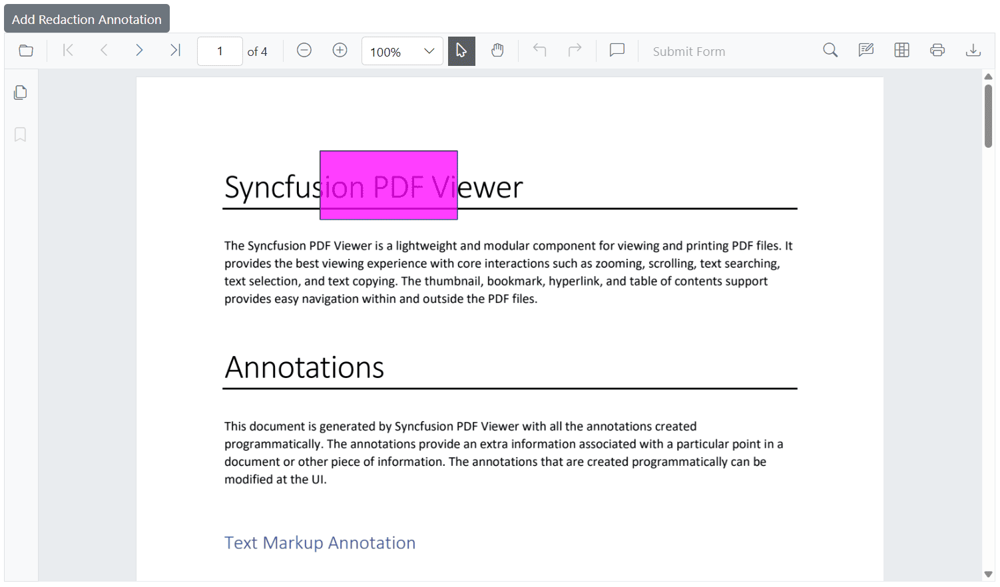
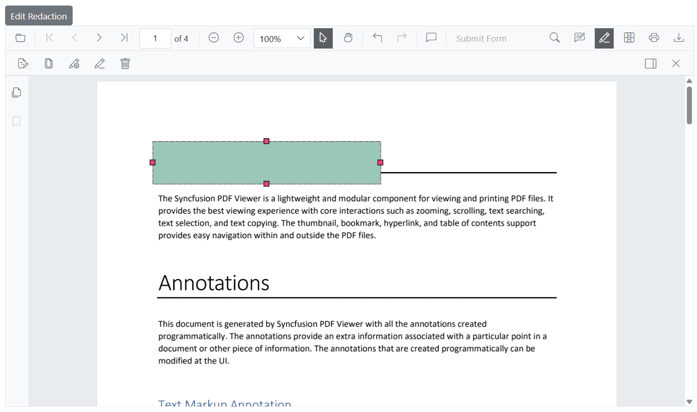
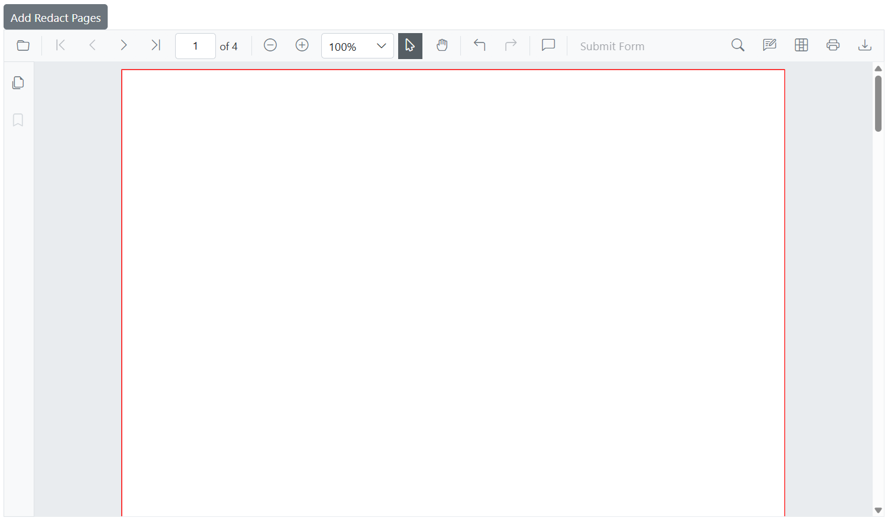
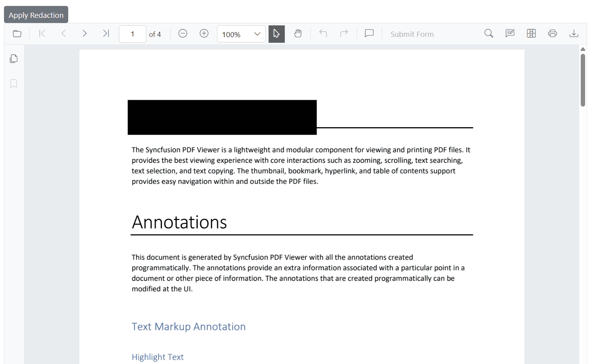

# Programmatic Support for Redaction in Blazor PDF Viewer

## Add redaction annotations programmatically

Use the [AddAnnotationAsync](https://help.syncfusion.com/cr/blazor/Syncfusion.Blazor.SfPdfViewer.PdfViewerBase.html#Syncfusion_Blazor_SfPdfViewer_PdfViewerBase_AddAnnotationAsync_Syncfusion_Blazor_SfPdfViewer_PdfAnnotation_) method to add a redaction annotation by creating a [PdfAnnotation](https://help.syncfusion.com/cr/blazor/Syncfusion.Blazor.SfPdfViewer.PdfAnnotation.html) instance. Configure redaction-specific settings with [RedactionProperties](https://help.syncfusion.com/cr/blazor/Syncfusion.Blazor.SfPdfViewer.RedactionProperties.html).

The example below creates a redaction annotation with custom appearance, redaction options, and position on the first page.

```cshtml
@page "/"

<SfButton OnClick="AddRedactionAnnotation">Add Redaction Annotation</SfButton>
<SfPdfViewer2 @ref="SfPdfViewer2" DocumentPath="@DocumentPath" Height="800px" Width="100%">
</SfPdfViewer2>

@code{

    private string DocumentPath { get; set; } = "wwwroot/data/Annotations.pdf";
    private SfPdfViewer2? SfPdfViewer2;

    // Adds a redaction annotation to the first page of the PDF Viewer
    private async void AddRedactionAnnotation()
    {
        // Create a redaction annotation with custom appearance and properties
        PdfAnnotation annotation = new PdfAnnotation()
        {
            Id = "redaction_Annotation",
            FontSize = 20,
            Bound = new Bound()
            {
                X = 200,
                Y = 80,
                Width = 150,
                Height = 75
            },
            PageNumber = 0,

            // Configure redaction-specific properties
            AnnotationProperties = new RedactionProperties()
            {
                MarkerFillColor = "#FF00FF",
                MarkerOpacity = 0.5,
                MarkerBorderColor = "#233A77",
                OverlayText = "Hello",
                IsRepeat = false
            },

            // Set the font and fill style
            FontColor = "#0000FF",
            FontFamily = "Courier",
            FillColor = "#EEEEEE",

            // Specify the annotation type
            Type = AnnotationType.Redaction
        };

        // Add the annotation to the PDF Viewer
        await SfPdfViewer2.AddAnnotationAsync(annotation);
    }
}
```



The **RedactionProperties** settings control the annotation’s appearance and behavior: **MarkerFillColor** (overlay color), **MarkerOpacity** (0–1), **MarkerBorderColor** (border color), **OverlayText** (text over the redacted area), and **IsRepeat** (repeat overlay text across the area).

## Delete redaction annotations programmatically

Delete redaction annotations programmatically using the [DeleteAnnotationAsync](https://help.syncfusion.com/cr/blazor/Syncfusion.Blazor.SfPdfViewer.PdfViewerBase.html#Syncfusion_Blazor_SfPdfViewer_PdfViewerBase_DeleteAnnotationsAsync) method by passing the annotation ID or object reference.

For additional examples, see [Delete annotation programmatically](../annotation/text-markup-annotation#delete-annotation-programmatically).

## Update redaction annotation properties programmatically

To update an existing redaction annotation, first retrieve it using [GetAnnotationsAsync](https://help.syncfusion.com/cr/blazor/Syncfusion.Blazor.SfPdfViewer.PdfViewerBase.html#Syncfusion_Blazor_SfPdfViewer_PdfViewerBase_GetAnnotationsAsync), then modify the required properties and apply the changes using [EditAnnotationAsync](https://help.syncfusion.com/cr/blazor/Syncfusion.Blazor.SfPdfViewer.PdfViewerBase.html#Syncfusion_Blazor_SfPdfViewer_PdfViewerBase_EditAnnotationAsync_Syncfusion_Blazor_SfPdfViewer_PdfAnnotation_).

The following example retrieves an existing redaction annotation, updates properties such as overlay text, colors, and opacity along with general appearance settings, and then applies the changes using [EditAnnotationAsync](https://help.syncfusion.com/cr/blazor/Syncfusion.Blazor.SfPdfViewer.PdfViewerBase.html#Syncfusion_Blazor_SfPdfViewer_PdfViewerBase_EditAnnotationAsync_Syncfusion_Blazor_SfPdfViewer_PdfAnnotation_).

```cshtml
@page "/"

<SfButton OnClick="EditRedaction">Edit Redaction</SfButton>

<SfPdfViewer2 @ref="SfPdfViewer2" DocumentPath="@DocumentPath" Height="800px" Width="100%">  
</SfPdfViewer2>

@code{
    private string DocumentPath { get; set; } = "wwwroot/data/Annotations.pdf";
    private SfPdfViewer2? SfPdfViewer2;
    // Updates the first redaction annotation's properties in the PDF Viewer
    private async void EditRedaction()
    {
        // Retrieve all annotations from the viewer
        List<PdfAnnotation> annotations = await SfPdfViewer2.GetAnnotationsAsync();

        // Get the first annotation to update
        PdfAnnotation annotation = annotations[0];

        // Check if the annotation is a redaction type and update redaction-specific properties
        if (annotation.AnnotationProperties is RedactionProperties redaction)
        {
            redaction.OverlayText = "Updated Text";
            redaction.MarkerFillColor = "#9bc7b8";
            redaction.MarkerBorderColor = "#888f8c";
            redaction.IsRepeat = true;
            redaction.MarkerOpacity = 0.2;
        }

        // Update general annotation properties
        annotation.FontSize = 15;
        annotation.FontColor = "Yellow";
        annotation.TextAlignment = TextAlignment.Left;

        // Apply the changes to the annotation in the viewer
        await SfPdfViewer2.EditAnnotationAsync(annotation);
    }
}
```



## Add page redactions programmatically

Entire pages can be marked for redaction using the [AddPageRedactionsAsync](https://help.syncfusion.com/cr/blazor/Syncfusion.Blazor.SfPdfViewer.PdfViewerBase.html#Syncfusion_Blazor_SfPdfViewer_PdfViewerBase_AddPageRedactionsAsync_System_Collections_Generic_List_System_Int32__) method.

This is useful when the full page contains confidential data.

The following example adds redaction annotations to specific pages in a PDF using 0-based page indexes. Here, redaction is applied to the first and third pages.

```cshtml
@page "/"

<SfButton OnClick="RedactPages">Add Redact Pages</SfButton>

<SfPdfViewer2 @ref="SfPdfViewer2" DocumentPath="@DocumentPath" Height="800px" Width="100%">
</SfPdfViewer2>

@code{

    private string DocumentPath { get; set; } = "wwwroot/data/Annotations.pdf";

    private SfPdfViewer2? SfPdfViewer2;

    // Adds redaction annotations to entire pages using 0-based page indexes.
    // In this example, redaction is applied to the first (0) and third (2) pages.
    private async void RedactPages()
    {
        List<int> pagesToRedact = new() { 0, 2 }; // Page indexes start from 0
        await SfPdfViewer2.AddPageRedactionsAsync(pagesToRedact);
    }

}
```



## Apply redaction programmatically

Use the [RedactAsync](https://help.syncfusion.com/cr/blazor/Syncfusion.Blazor.SfPdfViewer.PdfViewerBase.html#Syncfusion_Blazor_SfPdfViewer_PdfViewerBase_RedactAsync) method to apply all redaction annotations.

N> Applying redaction is permanent and cannot be undone. Consider saving a copy of the document before applying redaction.

```cshtml
@page "/"

<SfButton OnClick="ApplyRedaction">Apply Redaction</SfButton>

<SfPdfViewer2 @ref="SfPdfViewer2" DocumentPath="@DocumentPath" Height="800px" Width="100%">
</SfPdfViewer2>

@code{
    private string DocumentPath { get; set; } = "wwwroot/data/Annotations.pdf";
    private SfPdfViewer2? SfPdfViewer2;

    // Applies all redaction annotations permanently
    private async void ApplyRedaction()
    {
        await SfPdfViewer2.RedactAsync();
    }
}
```



## Configure default redaction annotation properties

Use [PdfViewerRedactionSettings](https://help.syncfusion.com/cr/blazor/Syncfusion.Blazor.SfPdfViewer.PdfViewerRedactionSettings.html) inside the viewer to set default redaction properties for newly created annotations, including fill color, overlay text, font style, and alignment.

These defaults apply to newly added annotations created from the toolbar unless overridden.

The following example shows how to set default properties for redaction annotations using [PdfViewerRedactionSettings](https://help.syncfusion.com/cr/blazor/Syncfusion.Blazor.SfPdfViewer.PdfViewerRedactionSettings.html).

```cshtml
@* 
    This component demonstrates how to configure default redaction annotation settings 
    in the Syncfusion Blazor PDF Viewer.
*@
<SfPdfViewer2 @ref="SfPdfViewer2" DocumentPath="@DocumentPath" Height="800px" Width="100%">
    <PdfViewerRedactionSettings OverlayText="Confidential" 
                                MarkerFillColor="#FF0000"
                                MarkerBorderColor="#000000"
                                IsRepeat="false"
                                FillColor="#F8F8F8" 
                                FontColor="#333333"
                                FontSize="14" 
                                FontFamily="Symbol" 
                                TextAlignment="TextAlignment.Right" />
        <PdfViewerToolbarSettings ToolbarItems="ToolbarItems" MobileToolbarItems="MobileToolbarItems"></PdfViewerToolbarSettings>
</SfPdfViewer2>
```

## Redaction property panel

When no annotation is selected, the property panel displays default values from [PdfViewerRedactionSettings](https://help.syncfusion.com/cr/blazor/Syncfusion.Blazor.SfPdfViewer.PdfViewerRedactionSettings.html). When a redaction is selected, it shows the selected annotation’s properties.

Use the panel to update overlay text, font settings, opacity, and related options.


## See also

* [Overview of redaction](./overview)
* [Interact with redaction using the UI](./ui-interactions)
* [Redaction in mobile view](./redaction-in-mobileView)
