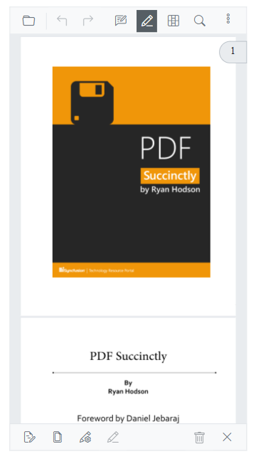
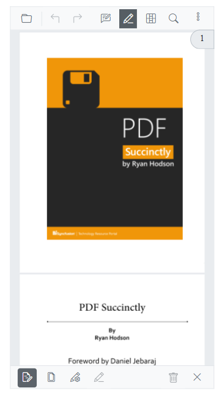
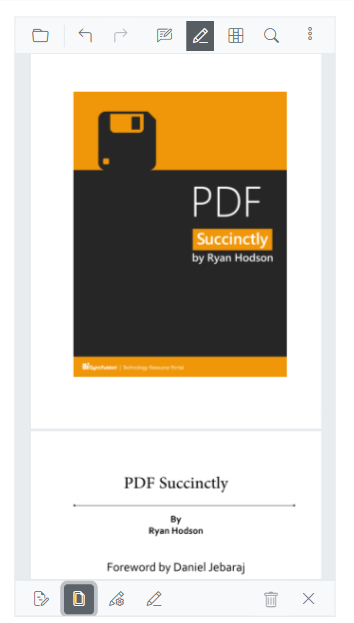
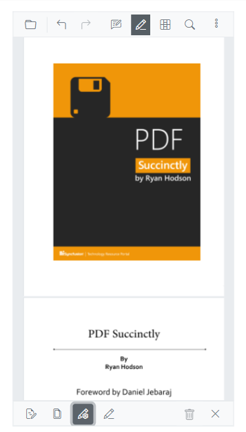
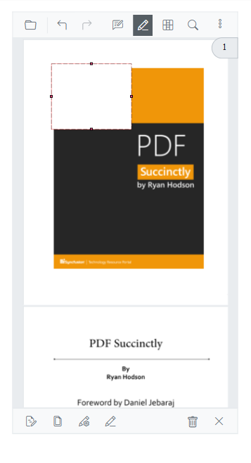
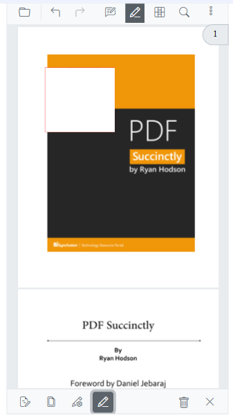
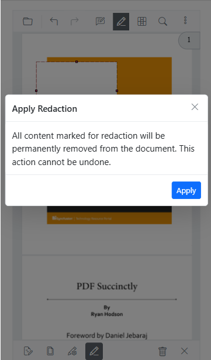
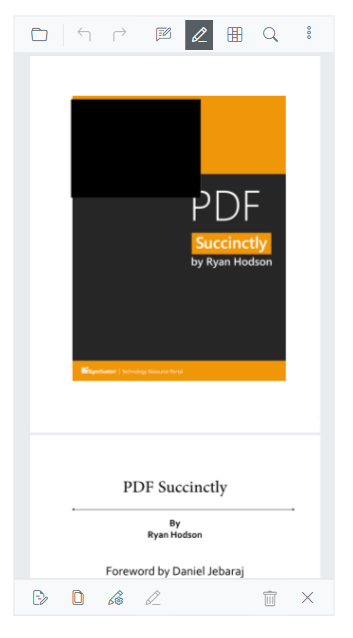
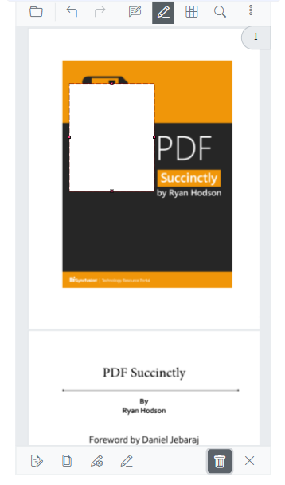

# Redaction in mobile view

Redaction mode in mobile view provides a touch-optimized toolbar and tools to mark, review, and apply redactions on the go.



N> In mobile view, the redaction toolbar appears at the bottom of the viewer for easy thumb access. Mobile layout activates automatically on small screens.

## Enable redaction in mobile view

Configure the viewer toolbar to include redaction tools for both desktop and mobile. Example:

```cshtml
@page "/"

<SfPdfViewer2 @ref="SfPdfViewer2" 
               Height="640px" 
               Width="100%" 
               DocumentPath="@DocumentPath">
    <PdfViewerToolbarSettings ToolbarItems="ToolbarItems" 
                              MobileToolbarItems="MobileToolbarItems">
    </PdfViewerToolbarSettings>
</SfPdfViewer2>

@code {
    SfPdfViewer2? SfPdfViewer2;
    private string DocumentPath { get; set; } = "https://cdn.syncfusion.com/content/pdf/pdf-succinctly.pdf";
    
    public List<ToolbarItem>? ToolbarItems { get; set; }
    public List<MobileToolbarItem>? MobileToolbarItems { get; set; }
    
    protected override void OnInitialized()
    {
        // Configure desktop toolbar items including redaction
        ToolbarItems = new List<ToolbarItem>()
        {
            ToolbarItem.OpenOption,
            ToolbarItem.PageNavigationTool,
            ToolbarItem.MagnificationTool,
            ToolbarItem.SelectionTool,
            ToolbarItem.PanTool,
            ToolbarItem.UndoRedoTool,
            ToolbarItem.CommentTool,
            ToolbarItem.SubmitForm,
            ToolbarItem.SearchOption,
            ToolbarItem.AnnotationEditTool,
            ToolbarItem.Redaction,
            ToolbarItem.FormDesigner,
            ToolbarItem.PrintOption,
            ToolbarItem.DownloadOption
        };
        
        // Configure mobile toolbar items optimized for touch interaction
        MobileToolbarItems = new List<MobileToolbarItem>()
        {
            MobileToolbarItem.Open,
            MobileToolbarItem.UndoRedo,
            MobileToolbarItem.EditAnnotation,
            MobileToolbarItem.Redaction,
            MobileToolbarItem.FormDesigner,
            MobileToolbarItem.Search
        };
    }
}
```

## Toolbar tools overview

### Redaction annotation

Draw rectangular overlays to mark selective content for redaction. Overlays are editable until applied.



### Page redaction

Redact whole pages or page ranges using patterns (odd/even/ranges/current page).



### Redaction properties

Customize overlay color, outline, overlay text, font, alignment, and size before applying redactions.



## Enabling Redaction Mode in Mobile View

**Step 1:** Tap the **Redaction** button in the mobile toolbar to activate redaction mode. The redaction toolbar will appear at the bottom of the viewer.


**Step 2:** From the redaction toolbar, select your desired redaction tool:
- **First Tool (Redaction Annotation)**: For selective content redaction
- **Second Tool (Page Redaction)**: For page-wide or pattern-based redaction
- **Third Tool (Redaction Properties)**: For appearance customization

**Step 3:** Configure your redaction parameters using the selected tool interface

## Applying Different Redaction Types in Mobile View

### Selective Content Redaction
1. **Select Redaction Annotation** tool (first button)
2. **Choose Content**: Tap and drag over text or draw rectangular areas
3. **Preview**: Check redaction overlays for accuracy
4. **Apply**: Tap "Apply Redactions" button

### Page-Wide Redaction
1. **Select Page Redaction** tool (second button)
2. **Choose Pattern**: Select odd pages, even pages, or custom range
3. **Review**: Verify affected pages in the viewer
4. **Apply**: Confirm page redaction scope and apply

### Custom Appearance Redaction
1. **Select Redaction Properties** tool (third button)
2. **Customize**: Adjust colors, overlay text, and formatting
3. **Preview**: See changes applied to existing annotations
4. **Apply**: Use customized appearance for final redaction

## Apply redactions

N> Applying redactions is permanent. After applying, the underlying content and text are removed from the document and cannot be recovered.

Once you have configured redactions using any combination of tools.

**Step 1:** Review all redaction marks and configurations.



**Step 2:** Tap the **Apply Redactions** button in the redaction toolbar



**Step 3:** Confirm the action when prompted - this operation is permanent and cannot be undone



The selected content will be permanently removed and replaced according to your redaction properties (solid color blocks or custom overlay text).



## Removing Redaction Annotations

To remove existing redaction annotations before they are applied:

- **Step 1:** Tap the **Redaction Edit** button in the mobile toolbar to enter annotation editing mode
- **Step 2:** Tap on any existing redaction annotation you wish to remove
- **Step 3:** Select **Delete** from the context menu that appears

**Alternative**: Tap redaction annotation → Use delete button in annotation properties panel



N> After redactions are applied they become part of the PDF content and cannot be removed.

[View sample in GitHub](https://github.com/SyncfusionExamples/blazor-pdf-viewer-examples/tree/master/Toolbar)

## See also

* [Mobile Toolbar](../toolbar-customization/mobile-toolbar)
* [Annotation in Mobile View](../annotation/annotations-in-mobile-view)
* [Form Designer in Mobile View](../form-designer/form-designer-in-mobile-view)