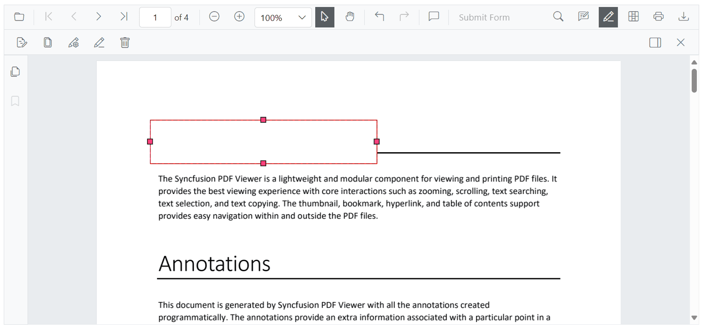
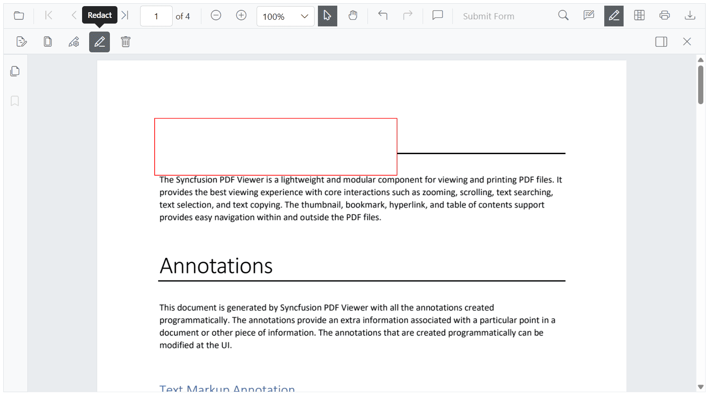

# Redaction annotations in Blazor SfPdfViewer Component

Check the following video to learn how to work with redaction annotations in the Blazor PDF Viewer.


N> Prerequisites: Add the `SfPdfViewer` component to your Blazor app and ensure your Syncfusion package version includes the redaction feature. Applying redactions permanently removes underlying content.

## Add a redaction annotation

Add redaction annotations using the toolbar or programmatically. Click the Redaction tool and draw over content to mark it for redaction. You can optionally add overlay text (for example, "Confidential") and customize appearance such as fill color, border color, and opacity.

## Delete redaction annotations

Remove redaction annotations through the UI or the API:

* Click the Delete button on the toolbar, or
* Press the **Delete** key after selecting the annotation.

## Page redaction

Redact entire pages or page ranges using the built-in page-redaction dialog, or perform page redaction programmatically.

## Apply redaction to the document

Applying redactions permanently removes the marked content from the PDF. Use the toolbar button or API to apply redactions.

* The Apply Redaction button is disabled when no redaction annotations exist.
* It enables automatically when at least one redaction annotation is present.

A confirmation dialog appears before applying redactions to confirm this irreversible operation.

N> The redaction process is irreversible. Once applied, the original content cannot be recovered.

## Comment panel support

Redaction annotations support comments via the built-in comment panel. Use comments to add notes, track reviews, or record reasons for redaction. Comments are available through both the UI and API; see the Comments documentation for details.

For details, see the [Comments documentation](../annotation/comments).

## Export and import support

The viewer supports exporting and importing redaction annotations in JSON format so annotations can be saved and reloaded later.

For details, see the [Export and import annotations documentation](../annotation/import-export-annotation).

## See also

* [UI Interaction in Redaction Annotation](./ui-interactions)
* [Programmatic Support in Redaction](./create-programmatically)
* [Redaction in Mobile View](./mobile-view)
