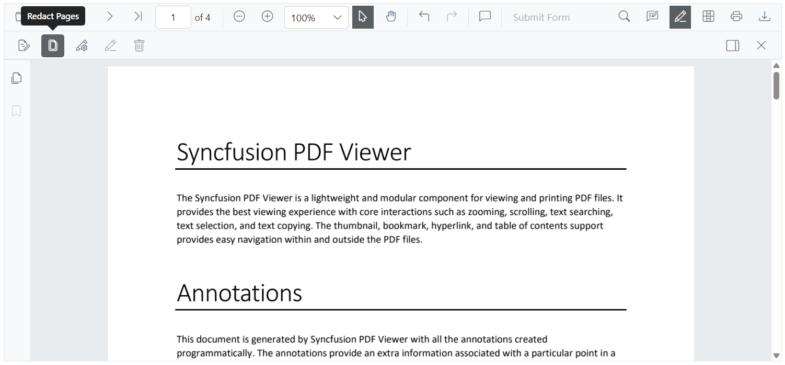

# Redaction annotations in Blazor SfPdfViewer

Watch the following video to learn how to work with redaction annotations in the Blazor PDF Viewer.


The video above demonstrates how to add, update, and apply redaction annotations using the toolbar, context menu, and built-in dialogs in the Blazor PDF Viewer.

## Add a redaction annotation

Add a redaction annotation by clicking the Redaction tool on the toolbar and drawing over the content to mark it for redaction. You can optionally add overlay text (for example, "Confidential") and customize the fill color, border color, and opacity.

For step-by-step UI instructions, see [UI Interaction in Redaction Annotation](./ui-interactions). To add a redaction annotation programmatically, see [Programmatic Support in Redaction](./create-programmatically).

## Delete redaction annotations

Delete a redaction annotation by using any of the following:

* Click the Delete button on the toolbar.
* Press the **Delete** key after selecting the annotation.
* Right-click the annotation and choose Delete from the context menu.

For more deletion options, see [UI Interaction in Redaction Annotation](./ui-interactions#delete-redaction-annotations). To delete a redaction annotation programmatically, see [Programmatic Support in Redaction](./create-programmatically#delete-redaction-annotations-programmatically).

## Page redaction

Redact entire pages or page ranges using the built-in **Redact Pages** dialog. The dialog offers **Current Page**, **Odd Pages Only**, **Even Pages Only**, and **Specific Pages** (for example, `1, 3–5, 7`).

For step-by-step UI instructions, see [UI Interaction in Redaction Annotation](./ui-interactions#redact-pages-using-the-ui). To redact pages programmatically, see [Programmatic Support in Redaction](./create-programmatically).

## Apply redaction to the document

Applying redactions permanently removes the marked content from the PDF. Click the Apply Redaction button on the toolbar, or use the API, to apply redactions.

* The Apply Redaction button is disabled when no redaction annotations exist.
* It enables automatically when at least one redaction annotation is present.

A confirmation dialog appears before redactions are applied because the operation is permanent and irreversible.

N> The redaction process is irreversible. Once applied, the original content cannot be recovered.

To apply redactions programmatically, see [Programmatic Support in Redaction](./create-programmatically).

## Comment panel support

Use the built-in comment panel to add notes, track reviews, or record reasons for redaction. Access comments via the UI or the API; see the [Comments documentation](../annotation/comments) for details.

## Export and import support

Export and import redaction annotations in JSON format so annotations can be saved and reloaded later. See the [Export and import annotations documentation](../annotation/import-export-annotation) for details.

## See also

* [UI Interaction in Redaction Annotation](./ui-interactions)
* [Programmatic Support in Redaction](./create-programmatically)
* [Redaction in Mobile View](./mobile-view)
