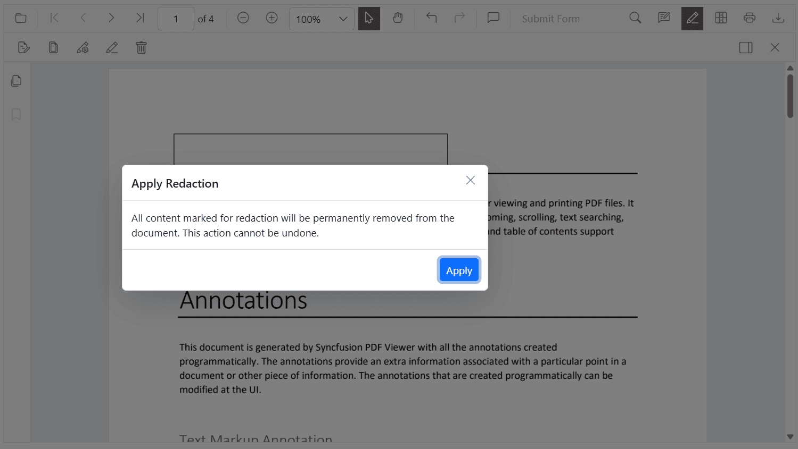

# Redaction annotations in Blazor SfPdfViewer Component

Redaction annotations conceal sensitive content in a PDF. The Syncfusion Blazor PDF Viewer (SfPdfViewer) supports both interactive and programmatic redaction with customizable appearance and a one-click final apply action.

N> Prerequisites: Add the SfPdfViewer component to the Blazor app and ensure the redaction feature is available in the used version. Redaction permanently removes content when applied.

## Add a Redaction annotation to the PDF document

The redaction feature hides sensitive information by adding redaction annotations to pages. Annotations can be added from the toolbar or programmatically.

Click the Redaction tool on the toolbar and draw over the content to redact. After marking, optionally show overlay text (for example, "Confidential") and customize appearance, including fill color, border color, and opacity.

## Delete Redaction Annotations

Redaction annotations can be removed through the UI or programmatically.

* Click the Delete button on the toolbar, or
* Press the **Delete** key after selecting the annotation.

## Add Page Redaction in Blazor SfPdfViewer Component

The Blazor PDF Viewer supports redacting entire pages that contain sensitive or confidential information. Use the built-in UI dialog (to choose specific pages, ranges, or all pages) or perform page redaction programmatically.

## Apply Redaction to the Document in Blazor SfPdfViewer Component

The Blazor PDF Viewer can permanently apply redaction annotations to the document, removing the marked content. This action is irreversible. Apply redaction using the toolbar button or programmatically.

The Apply Redaction button on the toolbar applies all redaction annotations in the document.

* The button is disabled when no redaction annotations exist.
* The button automatically enables when at least one redaction annotation is present.

A confirmation dialog appears before applying redaction to confirm the irreversible operation.

N> The redaction process is irreversible. Once applied, the original content cannot be recovered.

## Comment Panel Support for Redaction Annotations

Redaction annotations support comments through the built-in comment panel. Use comments to add notes, track reviews, or record the reason for redaction.

Comments are available through the UI and API. For details, see the Comments documentation.

For details, see the [Comments documentation](../annotation/comments).

## Export and Import Support for the Redaction Annotations

The viewer supports exporting and importing redaction annotations to save and reload them for future use. Annotations can be exchanged in JSON format for persistence and sharing.

For details, see the [Export and import annotations documentation](../annotation/import-export-annotation).

## See also

* [UI Interaction in Redaction Annotation](./ui-interactions)
* [Programmatic Support in Redaction](./create-programmatically)
* [Redaction in Mobile View](./redaction-in-mobile-view)
