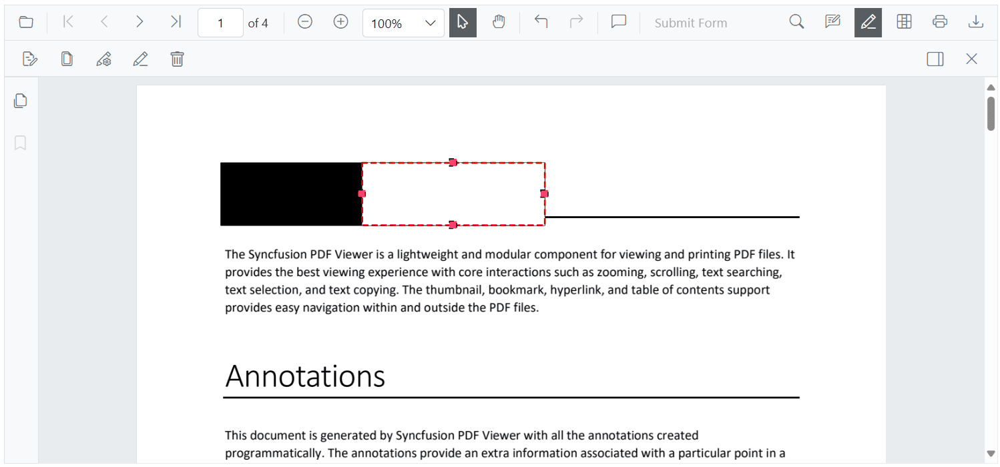
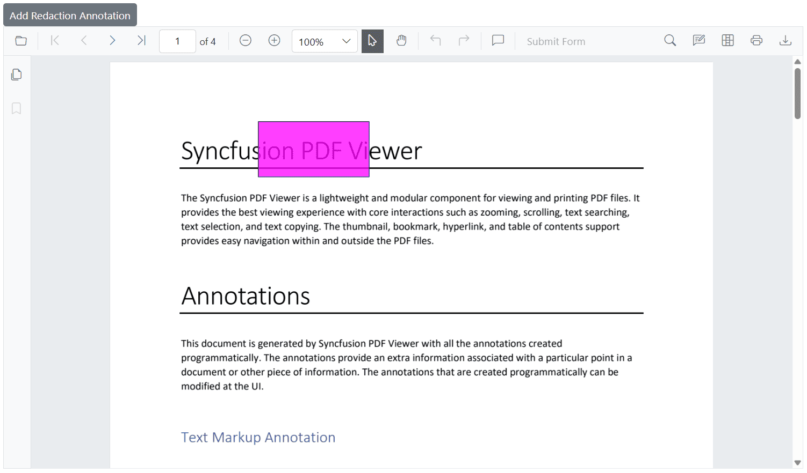
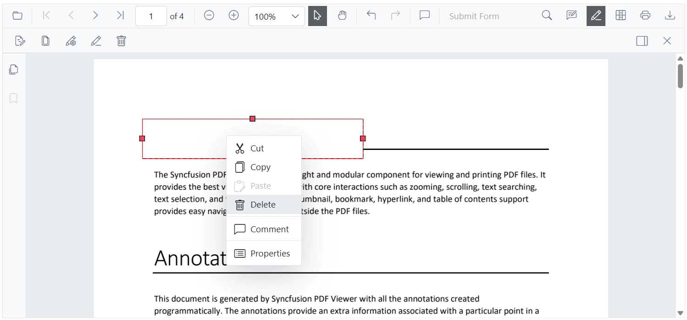
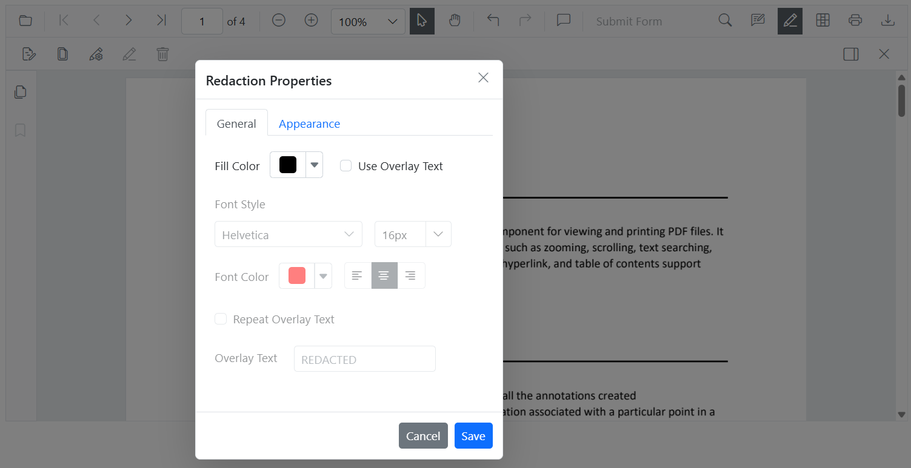

# Redaction annotations in Blazor SfPdfViewer Component

Redaction annotations conceal sensitive content in a PDF. The Syncfusion Blazor PDF Viewer supports interactive and programmatic redaction with appearance customization and final application.


## Adding a Redaction annotation to the PDF document

The redaction feature allows hiding sensitive information by adding redaction annotations to pages. Annotations can be added from the toolbar or programmatically.

### Adding a Redaction annotation using the Toolbar

Use the redaction tool on the toolbar to draw over content that should be redacted. After marking, an annotation can display overlay text (for example, “Confidential”) and can be styled using fill color and other properties.


#### Redaction annotations are fully interactive:

* **Movable**: Reposition an annotation within the same page.


* **Resizable**: Adjust the size to cover the required region.



N> The redaction tool is not shown on the toolbar by default. Customize the toolbar to include it. For instructions, see the [Toolbar customization](./../toolbar-customization).

### Adding a Redaction annotation using Programmatically

Use the [`AddAnnotationAsync`](https://help.syncfusion.com/cr/blazor/Syncfusion.Blazor.PdfViewer.SfPdfViewer2.html#Syncfusion_Blazor_PdfViewer_SfPdfViewer2_AddAnnotationAsync_Syncfusion_Blazor_PdfViewer_PdfAnnotation_) method to add a redaction annotation by creating a [`PdfAnnotation`](https://help.syncfusion.com/cr/blazor/Syncfusion.Blazor.PdfViewer.PdfAnnotation.html) instance. Configure redaction-specific settings with [`RedactionProperties`](https://help.syncfusion.com/cr/blazor/Syncfusion.Blazor.PdfViewer.RedactionProperties.html).

The example below creates a redaction annotation with custom appearance, redaction options, and position on the first page.

```cshtml
@page "/"

<SfButton OnClick="AddRedactionAnnotation">Add Redaction Annotation</SfButton>
<SfPdfViewer2 @ref="SfPdfViewer2" DocumentPath="@DocumentPath" Height="800px" Width="100%">
</SfPdfViewer2>

@code{

    private string DocumentPath { get; set; } = "wwwroot/data/Annotations.pdf";
    private SfPdfViewer2? SfPdfViewer2;

    // Adds a redaction annotation to the first page of the PDF Viewer
    private async void AddRedactionAnnotation()
    {
        // Create a redaction annotation with custom appearance and properties
        PdfAnnotation annotation = new PdfAnnotation()
        {
            Id = "redaction_Annotation",
            FontSize = 20,
            Bound = new Bound()
            {
                X = 200,
                Y = 80,
                Width = 150,
                Height = 75
            },
            PageNumber = 0,

            // Configure redaction-specific properties
            AnnotationProperties = new RedactionProperties()
            {
                MarkerFillColor = "#FF00FF",
                MarkerOpacity = 0.5,
                MarkerBorderColor = "#233A77",
                OverlayText = "Hello",
                IsRepeat = false
            },

            // Set the font and fill style
            FontColor = "#0000FF",
            FontFamily = "Courier",
            FillColor = "#EEEEEE",

            // Specify the annotation type
            Type = AnnotationType.Redaction
        };

        // Add the annotation to the PDF Viewer
        await SfPdfViewer2.AddAnnotationAsync(annotation);
    }
}
```

The following image illustrates the result.



The `RedactionProperties` configuration customizes the annotation’s appearance and behavior. Key options include `MarkerFillColor` (overlay color), `MarkerOpacity` (0.0–1.0), `MarkerBorderColor` (border color), `OverlayText` (text over the redacted area), and `IsRepeat` (repeat overlay text across the area).


## Deleting Redaction Annotations

Redaction annotations can be removed through the UI or programmatically.

### Deleting Redaction Annotations Using the UI

Delete redaction annotations using any of the following:

* **Right-click and select _Delete_** from the context menu.



* **Click the _Delete_ button** on the toolbar.


* **Press the `Delete` key** after selecting the annotation.

### Deleting Redaction Annotations Programmatically

Delete redaction annotations programmatically using the [`DeleteAnnotationAsync`](https://help.syncfusion.com/cr/blazor/Syncfusion.Blazor.SfPdfViewer.PdfViewerBase.html#Syncfusion_Blazor_SfPdfViewer_PdfViewerBase_DeleteAnnotationsAsync) method by passing the annotation ID or object reference.

For additional examples, see [Delete annotation programmatically](./text-markup-annotation#delete-annotation-programmatically).

## Configuring Default Properties for Redaction Annotations

Use [`PdfViewerRedactionSettings`](https://help.syncfusion.com/cr/blazor/Syncfusion.Blazor.PdfViewer.PdfViewerRedactionSettings.html) inside the viewer to set default redaction properties for newly created annotations, including fill color, overlay text, font style, and alignment.

These defaults apply to newly added annotations created from the toolbar unless overridden.

The following example shows how to set default properties for redaction annotations using [`PdfViewerRedactionSettings`](https://help.syncfusion.com/cr/blazor/Syncfusion.Blazor.PdfViewer.PdfViewerRedactionSettings.html).

```cshtml
@* 
    This component demonstrates how to configure default redaction annotation settings 
    in the Syncfusion Blazor PDF Viewer.
*@
<SfPdfViewer2 @ref="SfPdfViewer2" DocumentPath="@DocumentPath" Height="800px" Width="100%">
    <PdfViewerRedactionSettings OverlayText="Confidential" 
                                MarkerFillColor="#FF0000"
                                MarkerBorderColor="#000000"
                                IsRepeat="false"
                                FillColor="#F8F8F8" 
                                FontColor="#333333"
                                FontSize="14" 
                                FontFamily="Symbol" 
                                TextAlignment="TextAlignment.Right" />
        <PdfViewerToolbarSettings ToolbarItems="ToolbarItems" MobileToolbarItems="MobileToolbarItems"></PdfViewerToolbarSettings>
</SfPdfViewer2>
```

This uses the [`PdfViewerRedactionSettings`](https://help.syncfusion.com/cr/blazor/Syncfusion.Blazor.PdfViewer.PdfViewerRedactionSettings.html) class to define defaults.

## Redaction Property Panel

When no annotation is selected, the property panel displays **default values** from [`PdfViewerRedactionSettings`](https://help.syncfusion.com/cr/blazor/Syncfusion.Blazor.PdfViewer.PdfViewerRedactionSettings.html). When a redaction is selected, it shows the selected annotation’s properties.

Use the panel to update overlay text, font settings, opacity, and related options.



## Comment Panel Support for Redaction Annotations

Redaction annotations support **comments** through the built-in **comment panel**. Add notes, track reviews, or record reasons for redaction.

Commenting is available through the UI and API. For details, see the [Comments documentation](./comments).

## Export and Import Support for the Redaction Annotations

The viewer supports exporting and importing redaction annotations to save and reload them for future use.

For details, see the [Export and import annotations documentation](./import-export-annotation).

## See also

* [Adding the shape annotation in PDF viewer](./shape-annotation)
* [Toolbar customization in PDF viewer](./../toolbar-customization)
* [Form designer in PDF viewer](../form-designer/overview)
* [Page Redaction](./page-redaction)
* [Redaction to Document](./redaction-to-document)
* [Redaction Properties](./redaction-properties)