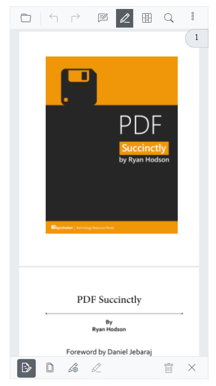
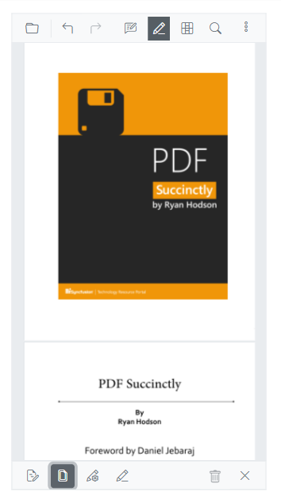
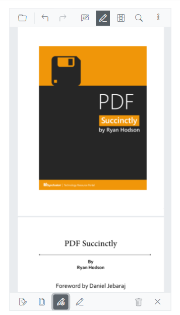
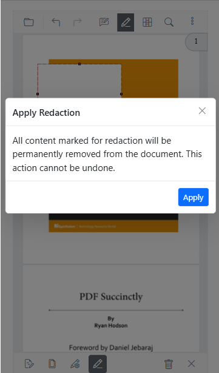
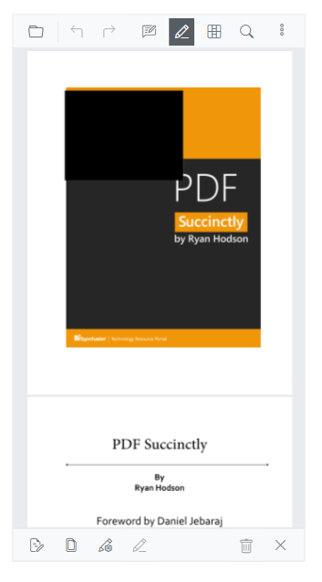
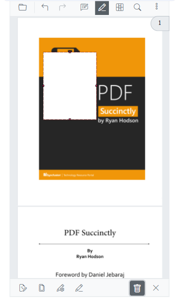

# Redaction in Mobile View in Blazor SfPdfViewer Component

The **Redaction Tool** enables users to permanently mark and remove sensitive content from PDF documents in mobile view using the SfPdfViewer component. This feature is optimized for touch interactions and provides a streamlined redaction workflow specifically designed for mobile devices.


In mobile mode, the redaction toolbar is conveniently positioned at the bottom of the PDF viewer for easy thumb access, similar to other annotation tools.

## Adding Redaction in Mobile View

To enable redaction functionality in your Blazor application, configure the PDF Viewer with the following setup,

```cshtml
@page "/"

<SfPdfViewer2 @ref="SfPdfViewer2" 
               Height="640px" 
               Width="100%" 
               DocumentPath="@DocumentPath">
    <PdfViewerToolbarSettings ToolbarItems="ToolbarItems" 
                              MobileToolbarItems="MobileToolbarItems">
    </PdfViewerToolbarSettings>
</SfPdfViewer2>

@code {
    SfPdfViewer2? SfPdfViewer2;
    private string DocumentPath { get; set; } = "https://cdn.syncfusion.com/content/pdf/pdf-succinctly.pdf";
    
    public List<ToolbarItem>? ToolbarItems { get; set; }
    public List<MobileToolbarItem>? MobileToolbarItems { get; set; }
    
    protected override void OnInitialized()
    {
        // Configure desktop toolbar items including redaction
        ToolbarItems = new List<ToolbarItem>()
        {
            ToolbarItem.OpenOption,
            ToolbarItem.PageNavigationTool,
            ToolbarItem.MagnificationTool,
            ToolbarItem.SelectionTool,
            ToolbarItem.PanTool,
            ToolbarItem.UndoRedoTool,
            ToolbarItem.CommentTool,
            ToolbarItem.SubmitForm,
            ToolbarItem.SearchOption,
            ToolbarItem.AnnotationEditTool,
            ToolbarItem.Redaction,
            ToolbarItem.FormDesigner,
            ToolbarItem.PrintOption,
            ToolbarItem.DownloadOption
        };
        
        // Configure mobile toolbar items optimized for touch interaction
        MobileToolbarItems = new List<MobileToolbarItem>()
        {
            MobileToolbarItem.Open,
            MobileToolbarItem.UndoRedo,
            MobileToolbarItem.EditAnnotation,
            MobileToolbarItem.Redaction,
            MobileToolbarItem.FormDesigner,
            MobileToolbarItem.Search
        };
    }
}
```

N> In mobile mode, the redaction toolbar is conveniently displayed at the bottom of the viewer for easy thumb access, similar to other annotation tools.

## Understanding Mobile Redaction Toolbar Tools

When you enter redaction mode in mobile view, a specialized redaction toolbar appears with multiple tools optimized for touch interaction. Each tool serves a specific purpose in the redaction workflow.

### 1. Redaction Annotation Tool (First Tool)

The **Redaction Annotation** tool is the primary redaction feature that allows you to draw redaction rectangles on specific content:

**Function**: Creates visual redaction annotations that mark content for permanent removal
**Usage**: 
Touch and drag to draw rectangular redaction overlays on any content area.

**Process**: 
- Selected content appears with a customizable overlay (default black)
- Annotations remain editable until explicitly applied
- Can be repositioned or deleted before final application



### 2. Page Redaction Tool (Second Tool)

The **Page Redaction** tool enables batch redaction of entire pages based on specific patterns.



**Function**: Redacts complete pages or page ranges with a single action
**Options Available**:
- **Odd Pages**: Redacts only odd-numbered pages (1, 3, 5, etc.)
- **Even Pages**: Redacts only even-numbered pages (2, 4, 6, etc.)
- **Specific Page**: Specify custom page numbers or ranges (e.g., 1-5, 10-15)
- **Current Page**: Redacts only the currently displayed page

**Usage**: 
Select desired pattern → Review affected pages in the viewer → Confirm redaction scope


### 3. Redaction Properties Tool (Third Tool)

The **Redaction Properties** tool allows customization of redaction appearance before application.



**Function**: Customize the visual appearance of redaction overlays and text replacement
**Customizable Properties**:
- **Fill Color**: Change the redaction overlay color (default: black)
- **Outline Color**: Set outline color for redaction boxes (optional)
- **Overlay Text**: Add custom text to appear on redacted areas (e.g., "REDACTED", "CONFIDENTIAL")
- **Text Color**: Change overlay text color for better visibility
- **Text Font**: Select font family for overlay text
- **Text Alignment**: Position overlay text within redaction boxes
- **Text Size**: Adjust overlay text size relative to redaction area


## Enabling Redaction Mode in Mobile View

**Step 1:** Tap the **Redaction** button in the mobile toolbar to activate redaction mode. The redaction toolbar will appear at the bottom of the viewer.


**Step 2:** From the redaction toolbar, select your desired redaction tool:
- **First Tool (Redaction Annotation)**: For selective content redaction
- **Second Tool (Page Redaction)**: For page-wide or pattern-based redaction
- **Third Tool (Redaction Properties)**: For appearance customization

**Step 3:** Configure your redaction parameters using the selected tool interface

## Applying Different Redaction Types in Mobile View

### Selective Content Redaction
1. **Select Redaction Annotation** tool (first button)
2. **Choose Content**: Tap and drag over text or draw rectangular areas
3. **Preview**: Check redaction overlays for accuracy
4. **Apply**: Tap "Apply Redactions" button

### Page-Wide Redaction
1. **Select Page Redaction** tool (second button)
2. **Choose Pattern**: Select odd pages, even pages, or custom range
3. **Review**: Verify affected pages in the viewer
4. **Apply**: Confirm page redaction scope and apply

### Custom Appearance Redaction
1. **Select Redaction Properties** tool (third button)
2. **Customize**: Adjust colors, overlay text, and formatting
3. **Preview**: See changes applied to existing annotations
4. **Apply**: Use customized appearance for final redaction

## Applying Redactions in Mobile View

Once you have configured redactions using any combination of tools.

**Step 1:** Review all redaction marks and configurations.


**Step 2:** Tap the **Apply Redactions** button in the redaction toolbar


**Step 3:** Confirm the action when prompted - this operation is permanent and cannot be undone



The selected content will be permanently removed and replaced according to your redaction properties (solid color blocks or custom overlay text).



## Removing Redaction Annotations (Before Applying)

To remove existing redaction annotations before they are applied:

**Step 1:** Tap the **Redaction Edit** button in the mobile toolbar to enter annotation editing mode
**Step 2:** Tap on any existing redaction annotation you wish to remove
**Step 3:** Select **Delete** from the context menu that appears
**Alternative**: Tap redaction annotation → Use delete button in annotation properties panel



N> Once redactions have been applied to the document, they become part of the PDF content and cannot be removed or modified.

[View sample in GitHub](https://github.com/SyncfusionExamples/blazor-pdf-viewer-examples/tree/master/Toolbar)

## See Also

* [Overview of Redaction](./overview)
* [Page Redaction](./page-redaction)
* [Redaction Properties](./redaction-properties)
* [Redaction to Document](./redaction-to-document)
* [Mobile Toolbar](../mobile-toolbar)
* [Annotation in Mobile View](../annotation/annotations-in-mobile-view)
* [Form Designer in Mobile View](../form-designer/formdesigner-in-mobile-view)