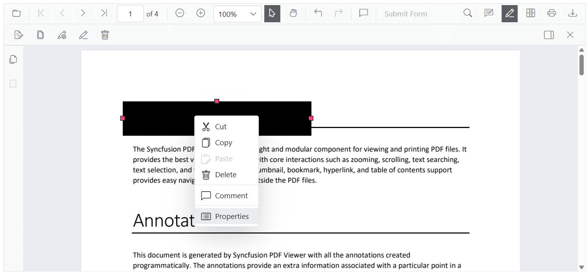

# Updating the properties of the Redaction  Annotations

The Blazor PDF Viewer allows users to update redaction annotations after they have been added, providing flexibility to adjust redaction details as needed. Updates can be made either interactively through the **Property panel** or programmatically via the [`EditAnnotationAsync`](https://help.syncfusion.com/cr/blazor/Syncfusion.Blazor.PdfViewer.SfPdfViewer2.html#Syncfusion_Blazor_PdfViewer_SfPdfViewer2_EditAnnotationAsync_Syncfusion_Blazor_PdfViewer_PdfAnnotation_). API.

## Updating Redaction Annotations Using the Property Panel

When a redaction annotation is selected, users can update its properties like font, overlay text, or fill color using the **property panel**. This instantly updates the annotation in the viewer.

The property panel can be accessed in multiple ways:

* By clicking the **redaction panel** icon available on the redaction toolbar.


* Through the **context menu** by right-clicking (or long-pressing on mobile) the redaction annotation and selecting the Properties option.



## Updating Redaction Annotations Programmatically

To update an existing redaction annotation, first retrieve it using [`GetAnnotationsAsync`](https://help.syncfusion.com/cr/blazor/Syncfusion.Blazor.PdfViewer.SfPdfViewer2.html#Syncfusion_Blazor_PdfViewer_SfPdfViewer2_GetAnnotationsAsync), then modify the required properties and apply the changes using [`EditAnnotationAsync`](https://help.syncfusion.com/cr/blazor/Syncfusion.Blazor.PdfViewer.SfPdfViewer2.html#Syncfusion_Blazor_PdfViewer_SfPdfViewer2_EditAnnotationAsync_Syncfusion_Blazor_PdfViewer_PdfAnnotation_).

The following example demonstrates how to update an existing redaction annotation in the PDF Viewer. It retrieves the annotation, modifies redaction-specific properties such as overlay text, fill color, border color, and opacity, along with general appearance settings like font size and text alignment, and then applies the changes using the [`EditAnnotationAsync`](https://help.syncfusion.com/cr/blazor/Syncfusion.Blazor.SfPdfViewer.PdfViewerBase.html#Syncfusion_Blazor_SfPdfViewer_PdfViewerBase_EditAnnotationAsync_Syncfusion_Blazor_SfPdfViewer_PdfAnnotation_) method.

```cshtml
@page "/"

<SfButton OnClick="EditRedaction">Edit Redaction</SfButton>

<SfPdfViewer2 @ref="SfPdfViewer2" DocumentPath="@DocumentPath" Height="800px" Width="100%">  
</SfPdfViewer2>

@code{
    private string DocumentPath { get; set; } = "wwwroot/data/Annotations.pdf";
    private SfPdfViewer2? SfPdfViewer2;
    // Updates the first redaction annotation's properties in the PDF Viewer
    private async void EditRedaction()
    {
        // Retrieve all annotations from the viewer
        List<PdfAnnotation> annotations = await SfPdfViewer2.GetAnnotationsAsync();

        // Get the first annotation to update
        PdfAnnotation annotation = annotations[0];

        // Check if the annotation is a redaction type and update redaction-specific properties
        if (annotation.AnnotationProperties is RedactionProperties redaction)
        {
            redaction.OverlayText = "Updated Text";
            redaction.MarkerFillColor = "#9bc7b8";
            redaction.MarkerBorderColor = "#888f8c";
            redaction.IsRepeat = true;
            redaction.MarkerOpacity = 0.2;
        }

        // Update general annotation properties
        annotation.FontSize = 15;
        annotation.FontColor = "Yellow";
        annotation.TextAlignment = TextAlignment.Left;

        // Apply the changes to the annotation in the viewer
        await SfPdfViewer2.EditAnnotationAsync(annotation);
    }
}
```
Refer to the Image below for details.


## See also

* [Overview of Redaction Annotation](./overview)
* [Page Redaction](./page-redaction)
* [Redaction to Document](./redaction-to-document)
