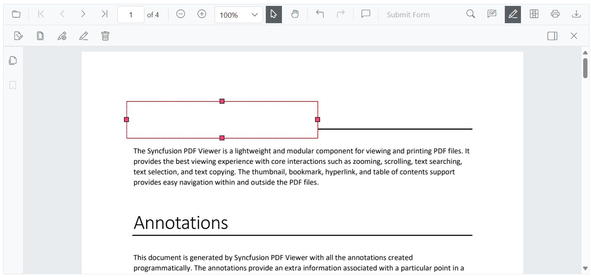
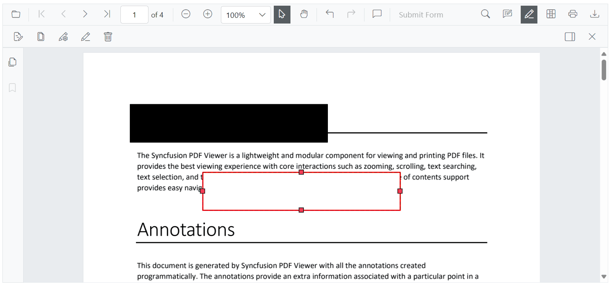
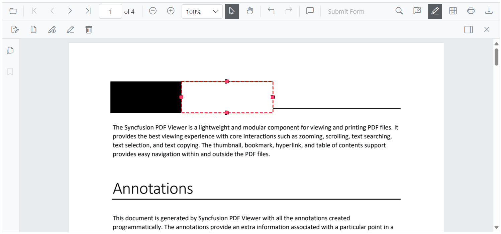
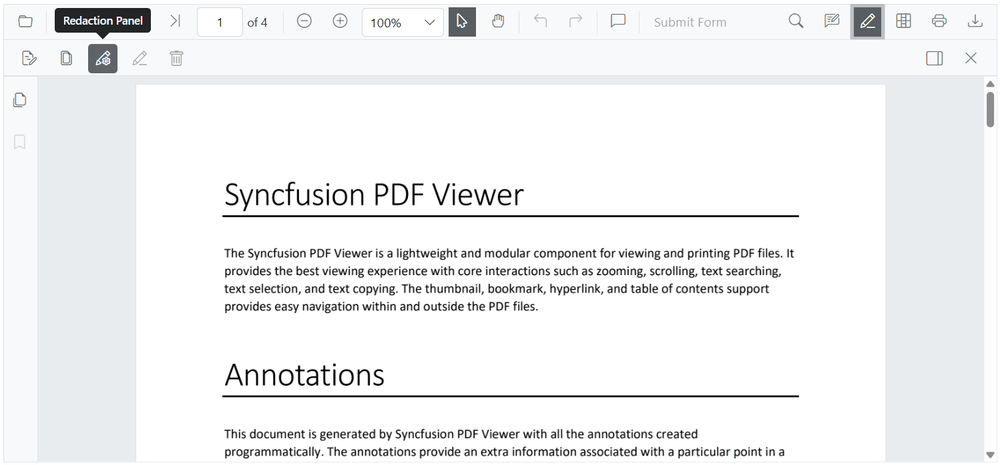
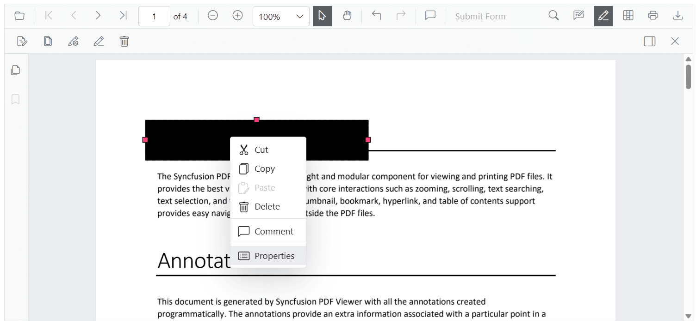
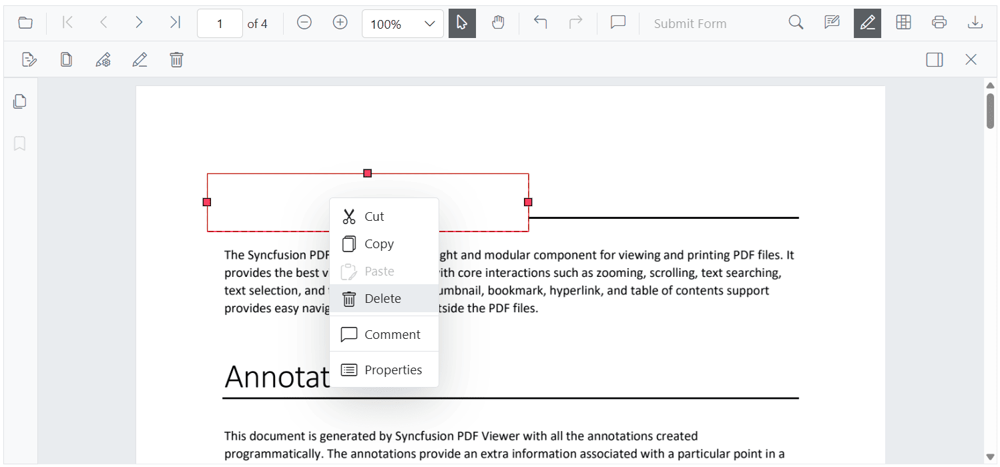
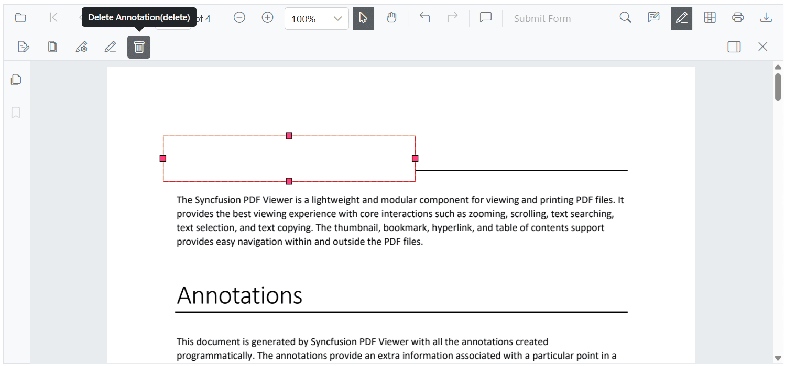
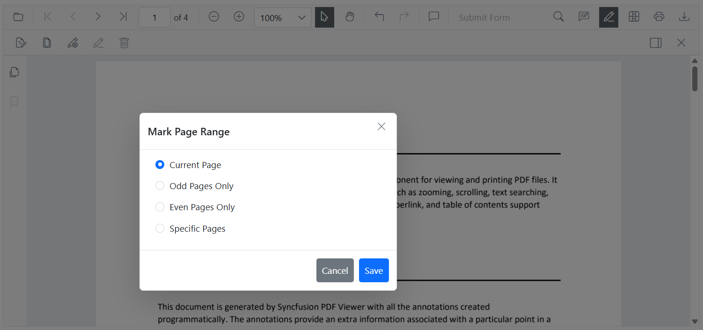
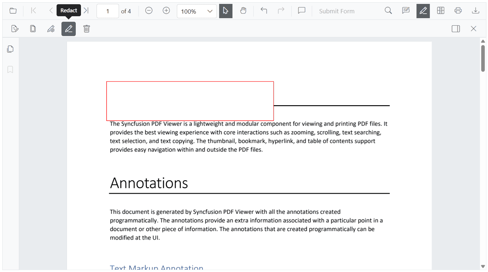
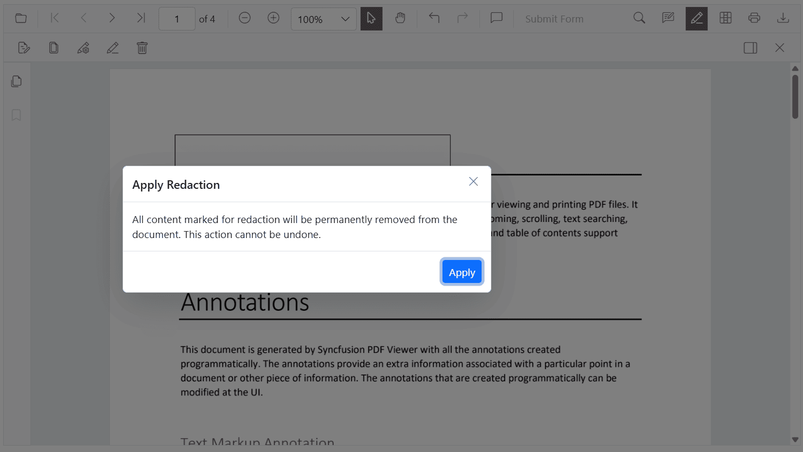

# Redaction UI interactions in Blazor PDF Viewer

## Add redaction annotations from the toolbar

Use the redaction tool on the toolbar to draw over content to be redacted. A mark can display overlay text (for example, "Confidential") and be styled with fill color and other properties.

### Interactive redaction annotations

* **Movable**: Reposition an annotation within the same page.

* **Resizable**: Adjust the size to cover the required region.

N> The redaction tool is hidden by default. Customize the toolbar to include it. For instructions, see [Toolbar customization](../toolbar-customization-overview) in the See also section.

## Update redaction properties

Update redaction marks after they are added. Changes can be made using the property panel for the selected redaction or programmatically via the [EditAnnotationAsync](https://help.syncfusion.com/cr/blazor/Syncfusion.Blazor.SfPdfViewer.PdfViewerBase.html#Syncfusion_Blazor_SfPdfViewer_PdfViewerBase_EditAnnotationAsync_Syncfusion_Blazor_SfPdfViewer_PdfAnnotation_) API.

### Using the property panel

Select a redaction mark and edit its properties (overlay text, font, and fill color) in the property panel. Changes appear immediately in the viewer.

Access the panel by:

* Clicking the **redaction panel** icon on the redaction toolbar.

* Using the **context menu** (right-click or long-press on mobile) and choosing Properties.

## Delete redaction marks

Delete a redaction mark using any of the following methods:

* Right-click and select Delete from the context menu.

* Click the Delete button on the toolbar.

* Press the Delete key after selecting the annotation.

## Mark pages for redaction using the UI

Use the Redact Pages option on the redaction toolbar to mark whole pages. This step adds redaction marks to pages only; the marks must be applied to become permanent (see the following section). The Mark Page Range dialog offers:

* **Current Page**: Redacts the currently visible page.
* **Odd Pages Only**: Redacts all odd-numbered pages.
* **Even Pages Only**: Redacts all even-numbered pages.
* **Specific Pages**: Enter a list or ranges (for example, 1, 3–5, 7).

After choosing a range, select Save to add redaction marks to the selected pages.

## Apply redaction from the toolbar

The Apply Redaction button permanently applies all redaction marks in the document.

* The button is disabled when no redaction marks exist.
* It is enabled automatically when redaction marks are present.

A confirmation dialog appears, warning that the operation is permanent and irreversible.

N> The redaction process is irreversible. Once applied, the original content cannot be recovered.

## See also

* [Overview of Redaction](./overview)
* [Programmatic Support in Redaction](./create-programmatically)
* [Redaction in Mobile View](./mobile-view)
* [Toolbar customization](../toolbar/overview)
