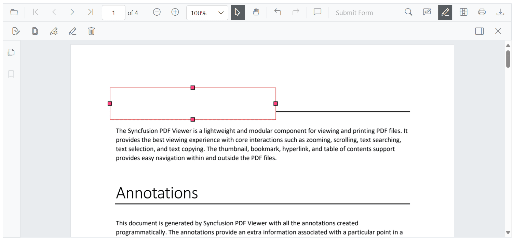
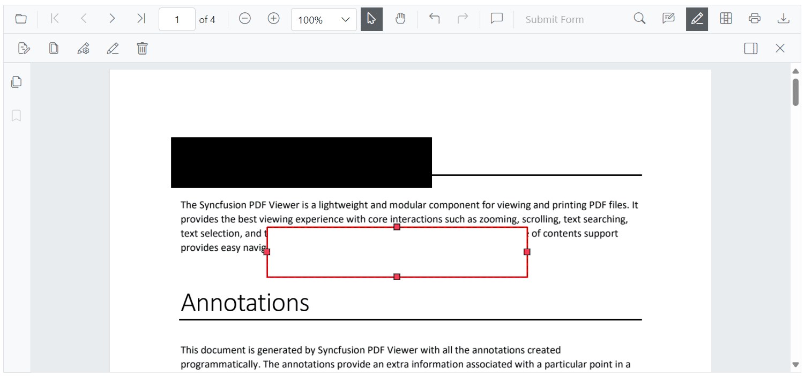
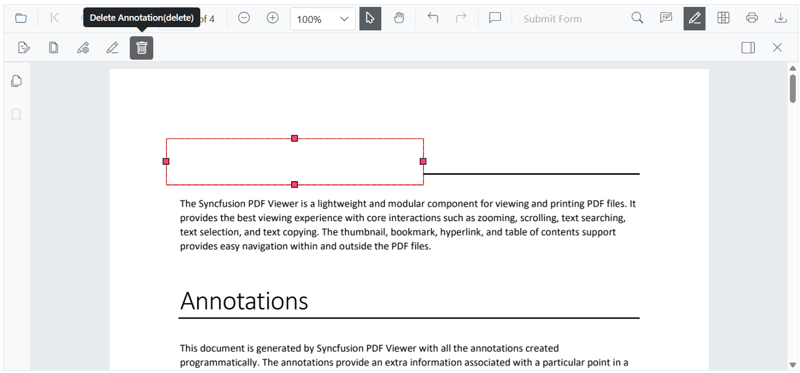
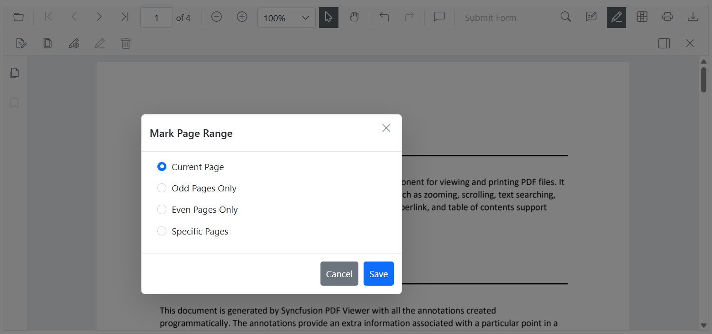

# Redaction UI Interactions in Blazor PDF Viewer

## Adding a Redaction annotation using the Toolbar

Use the redaction tool on the toolbar to draw over content that should be redacted. After marking, an annotation can display overlay text (for example, “Confidential”) and can be styled using fill color and other properties.

#### Redaction annotations are fully interactive:

* **Movable**: Reposition an annotation within the same page.

* **Resizable**: Adjust the size to cover the required region.

N> The redaction tool is not shown on the toolbar by default. Customize the toolbar to include it. For instructions, see the [Toolbar customization](./../toolbar-customization).

## Updating the properties of the Redaction  Annotations

The Blazor PDF Viewer allows users to update redaction annotations after they have been added, providing flexibility to adjust redaction details as needed. Updates can be made either interactively through the **Property panel** or programmatically via the [`EditAnnotationAsync`](https://help.syncfusion.com/cr/blazor/Syncfusion.Blazor.PdfViewer.SfPdfViewer2.html#Syncfusion_Blazor_PdfViewer_SfPdfViewer2_EditAnnotationAsync_Syncfusion_Blazor_PdfViewer_PdfAnnotation_) API.

### Updating Redaction Annotations Using the Property Panel

When a redaction annotation is selected, users can update its properties like font, overlay text, or fill color using the **property panel**. This instantly updates the annotation in the viewer.

The property panel can be accessed in multiple ways:

* By clicking the **redaction panel** icon available on the redaction toolbar.

* Through the **context menu** by right-clicking (or long-pressing on mobile) the redaction annotation and selecting the Properties option.

## Deleting Redaction Annotations Using the UI

Delete redaction annotations using any of the following:

* **Right-click and select _Delete_** from the context menu.

* **Click the _Delete_ button** on the toolbar.

* **Press the `Delete` key** after selecting the annotation.

## Adding Redact Pages Using the UI

Users can redact entire pages using the Redact Pages option from the redaction toolbar. Upon clicking the redact pages icon, a Mark Page Range popup appears with the following options:

* **Current Page** – Redacts the currently visible page.

* **Odd Pages Only** – Redacts all odd-numbered pages.

* **Even Pages Only** – Redacts all even-numbered pages.

* **Specific Pages** – Allows the user to manually enter a list of specific page numbers to redact (e.g., 1, 3–5, 7).

After selecting the desired range, clicking the Save button applies redaction marks to the selected pages.

Refer to the Image below for details.

## Applying Redaction Using the Redact Button

The redact button in the toolbar allows users to permanently apply all redaction annotations present in the document.

* The redact button is disabled when no redaction annotations exist in the document.
* The button automatically enables when redaction annotations are present.

A confirmation dialog is displayed before applying redaction to ensure users are aware that the redaction process is permanent and irreversible.

Refer to the Image below for details.

N> The redaction process is irreversible. Once applied, the original content cannot be recovered.

## See also

* [Overview of Redaction](./overview)
* [Programmatic Support in Redaction](./create-programmatically)
* [Redaction in Mobile View](./redaction-in-mobileView)