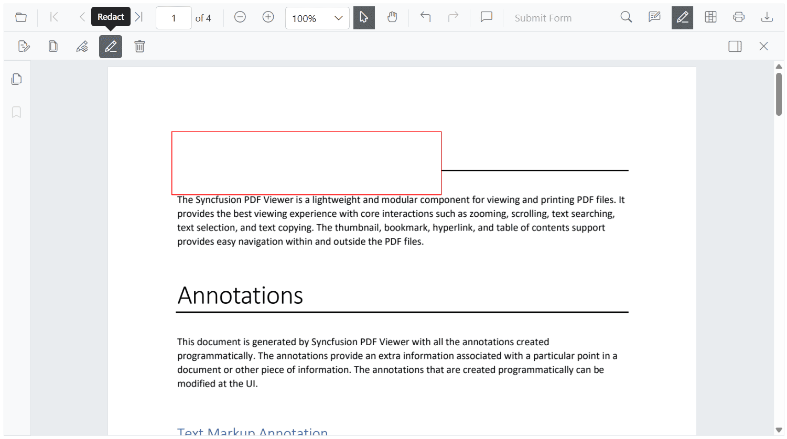

# Redaction UI interactions in Blazor PDF Viewer

## Add redaction annotations from the toolbar

Use the redaction tool on the toolbar to draw over content that should be redacted. After marking, an annotation can display overlay text (for example, “Confidential”) and can be styled using fill color and other properties.

#### Redaction annotations are interactive

* **Movable**: Reposition an annotation within the same page.

* **Resizable**: Adjust the size to cover the required region.

N> The redaction tool is hidden by default. Customize the toolbar to include it. For instructions, see the [Toolbar customization](../toolbar-customization-overview).

## Update redaction properties

Update redaction annotations after they are added. Changes can be made using the property panel for the selected redaction or programmatically via the [EditAnnotationAsync](https://help.syncfusion.com/cr/blazor/Syncfusion.Blazor.SfPdfViewer.PdfViewerBase.html#Syncfusion_Blazor_SfPdfViewer_PdfViewerBase_EditAnnotationAsync_Syncfusion_Blazor_SfPdfViewer_PdfAnnotation_) API.

### Update redaction annotations using the property panel

When a redaction annotation is selected, update properties such as overlay text, font, and fill color using the property panel. Changes are applied immediately in the viewer.

The property panel can be accessed in multiple ways:

* By clicking the **redaction panel** icon available on the redaction toolbar.

* Through the **context menu** by right-clicking (or long-pressing on mobile) the redaction annotation and selecting the Properties option.

## Delete redaction annotations

Delete redaction annotations using any of the following:

* **Right-click and select Delete** from the context menu.

* **Click the Delete button** on the toolbar.

* **Press the Delete key** after selecting the annotation.

## Redact pages using the UI

Users can redact entire pages using the Redact Pages option from the redaction toolbar. Upon clicking the redact pages icon, a Mark Page Range popup appears with the following options:

* **Current Page** – Redacts the currently visible page.

* **Odd Pages Only** – Redacts all odd-numbered pages.

* **Even Pages Only** – Redacts all even-numbered pages.

* **Specific Pages** – Allows the user to manually enter a list of specific page numbers to redact (e.g., 1, 3–5, 7).

After selecting the desired range, selecting Save applies redaction marks to the selected pages.

## Apply redaction from the toolbar

The redact button in the toolbar allows users to permanently apply all redaction annotations present in the document.

* The redact button is disabled when no redaction annotations exist in the document.
* The button automatically enables when redaction annotations are present.

A confirmation dialog appears before applying redaction to confirm that the process is permanent and irreversible.

N> The redaction process is irreversible. Once applied, the original content cannot be recovered.

## See also

* [Overview of Redaction](./overview)
* [Programmatic Support in Redaction](./create-programmatically)
* [Redaction in Mobile View](./mobile-view)