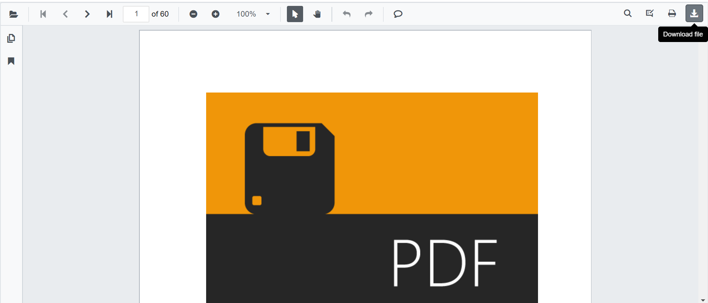

# Saving PDF file in Blazor SfPdfViewer Component

After editing a PDF with annotations or form fields, the updated document can be saved to a server, persisted to a database, or downloaded to the local file system. Examples below illustrate common approaches and recommended practices.

## Save PDF file to Server

Use this approach to persist the modified PDF to a server-side folder. Ensure the application has write permissions to the target directory and use framework services (for example, `IWebHostEnvironment`) to resolve application paths.

```cshtml
@using Syncfusion.Blazor.SfPdfViewer
@using Syncfusion.Blazor.Buttons
@using System.IO

<SfButton OnClick="OnClick">Save</SfButton>
<SfPdfViewer2 DocumentPath="@DocumentPath"
              @ref="viewer"
              Height="100%"
              Width="100%"></SfPdfViewer2>

@code{  
    SfPdfViewer2 viewer;
    public async void OnClick(MouseEventArgs args)
    {
        byte[] data = await viewer.GetDocumentAsync();
        //PDF document file stream
        Stream stream = new MemoryStream(data);
        using (var fileStream = new FileStream(@"wwwroot/Data/PDF_Succinctly_Updated.pdf", FileMode.Create, FileAccess.Write))
        {
            //Saving the new file in root path of application
            stream.CopyTo(fileStream);
            fileStream.Close();
        }
        stream.Close();
    }
    public string DocumentPath { get; set; } = "wwwroot/Data/PDF_Succinctly.pdf";
}
```

N> For production scenarios, prefer `using` statements for stream disposal, handle I/O exceptions, and validate input. Avoid writing files to `wwwroot` at runtime unless the behavior is intentional and secure.

## Save PDF file to Database

Use this method to update PDF content stored in a relational database when documents are managed centrally and retrieved by name or identifier.

```cshtml
@using Syncfusion.Blazor.SfPdfViewer
@using Syncfusion.Blazor.Buttons
@using System.Data.SqlClient

<SfButton OnClick="OnClick">Save</SfButton>
<SfPdfViewer2 DocumentPath="@DocumentPath"
              @ref="viewer"
              Height="100%"
              Width="100%">
</SfPdfViewer2>

@code{
    SfPdfViewer2 viewer;

    public async void OnClick(MouseEventArgs args)
    {
        string DocumentName = "PDF_Succinctly";
        byte[] data = await viewer.GetDocumentAsync();
        string connectionString = @"Data Source=(LocalDB)\MSSQLLocalDB;AttachDbFilename=D:\database.mdf;";
        string queryStmt = "Update PDFFiles SET Content = @Content where DocumentName = '" + DocumentName + "'";
        using (SqlConnection con = new SqlConnection(connectionString))
        {
            using (SqlCommand cmd = new SqlCommand(queryStmt, con))
            {
                SqlParameter param = cmd.Parameters.Add("@Content", System.Data.SqlDbType.VarBinary);
                param.Value = data;
                con.Open();
                cmd.ExecuteNonQuery();
                con.Close();
            }
        }

    }
    private string DocumentPath { get; set; } = "wwwroot/Data/PDF_Succinctly.pdf";
}
```

N> Use parameterized queries for all user or variable input to prevent SQL injection. Wrap database operations with error handling, transactions, and appropriate connection disposal patterns.

## Download

The `SfPdfViewer` includes a built-in toolbar button to download the loaded or modified PDF. Control this behavior with the [EnableDownload](https://help.syncfusion.com/cr/blazor/Syncfusion.Blazor.SfPdfViewer.PdfViewerBase.html#Syncfusion_Blazor_SfPdfViewer_PdfViewerBase_EnableDownload) API.

```cshtml

@using Syncfusion.Blazor.SfPdfViewer
<SfPdfViewer2 Width="100%"
              Height="100%"
              DocumentPath="@DocumentPath"
              EnableDownload="true" />
@code{
    public string DocumentPath { get; set; } = "wwwroot/Data/PDF_Succinctly.pdf";
}

```



Programmatic download can also be triggered from application UI, for example by calling `DownloadAsync()` from a button click handler.

```cshtml

@using Syncfusion.Blazor.Buttons
@using Syncfusion.Blazor.SfPdfViewer

<SfButton OnClick="OnClick">Download</SfButton>
<SfPdfViewer2 Width="100%"
              Height="100%"
              DocumentPath="@DocumentPath"
              @ref="@Viewer" />

@code {
    SfPdfViewer2 Viewer;
    public string DocumentPath { get; set; } = "wwwroot/Data/PDF_Succinctly.pdf";
    public async void OnClick(MouseEventArgs args)
    {
        await Viewer.DownloadAsync();
    }
}

```

### Download filename

Use the [DownloadFileName](https://help.syncfusion.com/cr/blazor/Syncfusion.Blazor.SfPdfViewer.PdfViewerBase.html#Syncfusion_Blazor_SfPdfViewer_PdfViewerBase_DownloadFileName) property to set the default file name for the downloaded PDF.

The following example shows how to specify a custom file name.

```cshtml

@using Syncfusion.Blazor.SfPdfViewer

<SfPdfViewer2 DocumentPath="@documentPath"
              DownloadFileName="@downloadFileName"
              Height="100%"
              Width="100%">
</SfPdfViewer2>

@code
{
    //Sets the PDF document path for initial loading.
    public string documentPath { get; set; } = "wwwroot/Data/PDF_Succinctly.pdf";

    //Sets the name of the file to be downloaded.
    private string downloadFileName { get; set; } = "TOP-View_CutSheets.pdf";

}

```
[View sample in GitHub](https://github.com/SyncfusionExamples/blazor-pdf-viewer-examples/tree/master/Load%20and%20Save/Modify%20the%20file%20name).

### Download PDF file as a copy

Use the built-in toolbar option or the programmatic API to download the updated PDF as a copy to the local file system.

```cshtml
@using Syncfusion.Blazor.Buttons
@using Syncfusion.Blazor.SfPdfViewer

<SfButton @onclick="OnClick">Download</SfButton>
<SfPdfViewer2 @ref="@viewer"
              Height="100%"
              Width="100%"
              DocumentPath="@DocumentPath" />

@code{
SfPdfViewer2 viewer;
public async void OnClick(MouseEventArgs args)
{
    await viewer.DownloadAsync();
}
public string DocumentPath { get; set; } = "wwwroot/data/PDF_Succinctly.pdf";
}
```

## See also

* [How to open PDF files various storage location](./opening-pdf-file)