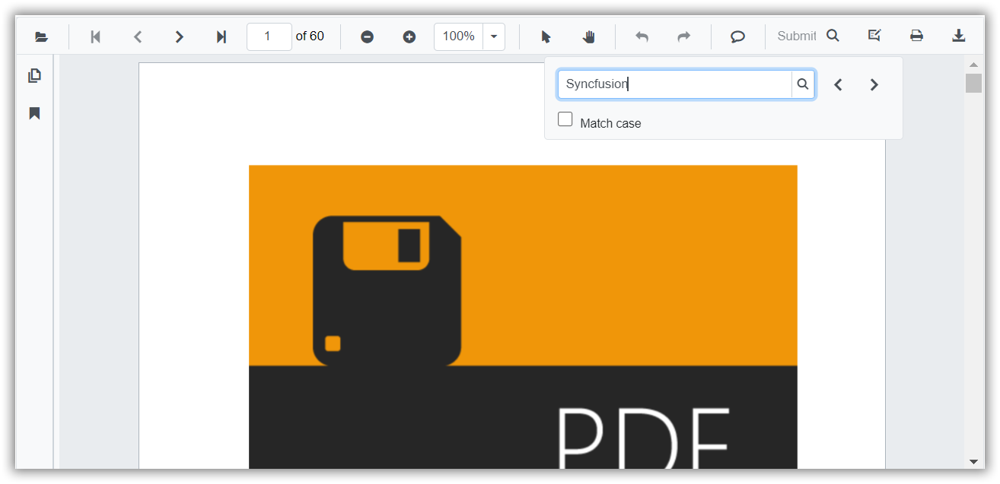
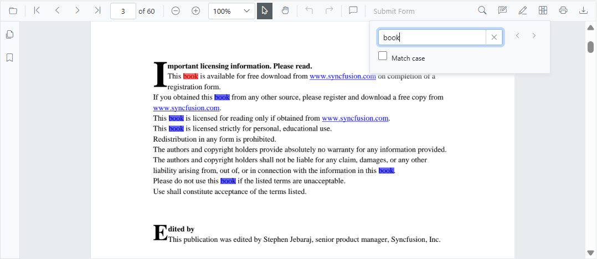

# Text Search in Blazor SfPdfViewer Component

Use the built-in toolbar to find text in a PDF document. When a search is initiated, the viewer highlights all matches across pages and supports navigation between occurrences with next and previous controls.



Enable or disable the text search UI using the [EnableTextSearch](https://help.syncfusion.com/cr/blazor/Syncfusion.Blazor.SfPdfViewer.PdfViewerBase.html#Syncfusion_Blazor_SfPdfViewer_PdfViewerBase_EnableTextSearch) property. When disabled, search commands are unavailable.

```cshtml

@using Syncfusion.Blazor.SfPdfViewer

<SfPdfViewer2 Height="100%" Width="100%" DocumentPath="@DocumentPath" EnableTextSearch="true" />

@code{
    public string DocumentPath { get; set; } = "wwwroot/Data/PDF_Succinctly.pdf";
}

```

Text search can also be performed programmatically using the following APIs: [SearchTextAsync](https://help.syncfusion.com/cr/blazor/Syncfusion.Blazor.SfPdfViewer.PdfViewerBase.html#Syncfusion_Blazor_SfPdfViewer_PdfViewerBase_SearchTextAsync_System_String_System_Boolean_), [SearchNextAsync](https://help.syncfusion.com/cr/blazor/Syncfusion.Blazor.SfPdfViewer.PdfViewerBase.html#Syncfusion_Blazor_SfPdfViewer_PdfViewerBase_SearchNextAsync), [SearchPreviousAsync](https://help.syncfusion.com/cr/blazor/Syncfusion.Blazor.SfPdfViewer.PdfViewerBase.html#Syncfusion_Blazor_SfPdfViewer_PdfViewerBase_SearchPreviousAsync), and [CancelTextSearchAsync](https://help.syncfusion.com/cr/blazor/Syncfusion.Blazor.SfPdfViewer.PdfViewerBase.html#Syncfusion_Blazor_SfPdfViewer_PdfViewerBase_CancelTextSearchAsync). These APIs enable programmatic control of search initiation, navigation, and cancellation.

```cshtml

@using Syncfusion.Blazor.Buttons
@using Syncfusion.Blazor.SfPdfViewer

<div style="display:inline-block">
    <SfButton OnClick="OnSearchClick">Search Text</SfButton>
</div>

<div style="display:inline-block">
    <SfButton OnClick="OnSearchNext">Search Next</SfButton>
</div>

<div style="display:inline-block">
    <SfButton OnClick="OnSearchPrevious">Search Previous</SfButton>
</div>

<div style="display:inline-block">
    <SfButton OnClick="OnCancelSearch">Cancel Search</SfButton>
</div>

<SfPdfViewer2 Height="100%" Width="100%" DocumentPath="@DocumentPath" @ref="@Viewer" />

@code {
    SfPdfViewer2 Viewer;
    public string DocumentPath { get; set; } = "wwwroot/data/PDF_Succinctly.pdf";

    public async void OnSearchClick(MouseEventArgs args)
    {
        //Here PDF is to be serached from the loaded document
        await Viewer.SearchTextAsync("pdf", false);
    }

    public async void OnSearchNext(MouseEventArgs args)
    {
        await Viewer.SearchNextAsync();
    }

    public async void OnSearchPrevious(MouseEventArgs args)
    {
        await Viewer.SearchPreviousAsync();
    }

    public async void OnCancelSearch(MouseEventArgs args)
    {
        await Viewer.CancelTextSearchAsync();
    }

}

```

## Customize text search highlight colors

Use the [PdfViewerTextSearchColorSettings](https://help.syncfusion.com/cr/blazor/Syncfusion.Blazor.SfPdfViewer.PdfViewerTextSearchColorSettings.html) to customize the highlight appearance used for search results. Configure [SearchColor](https://help.syncfusion.com/cr/blazor/Syncfusion.Blazor.SfPdfViewer.PdfViewerTextSearchColorSettings.html#Syncfusion_Blazor_SfPdfViewer_PdfViewerTextSearchColorSettings_SearchColor) for other matches and [SearchHighlightColor](https://help.syncfusion.com/cr/blazor/Syncfusion.Blazor.SfPdfViewer.PdfViewerTextSearchColorSettings.html#Syncfusion_Blazor_SfPdfViewer_PdfViewerTextSearchColorSettings_SearchHighlightColor) for the current match. By default, distinct colors are applied for the current occurrence and other matches; adjust these to align with application theme and accessibility contrast requirements.

```cshtml

@using Syncfusion.Blazor.SfPdfViewer

<SfPdfViewer2 Height="100%" Width="100%" DocumentPath="@DocumentPath">
    <PdfViewerTextSearchColorSettings SearchColor="blue" SearchHighlightColor="red"></PdfViewerTextSearchColorSettings>
</SfPdfViewer2>

@code{
    public string DocumentPath { get; set; } = "wwwroot/Data/PDF_Succinctly.pdf";
}

```



## Text search events

The following events are available for text search in the `SfPdfViewer` component.

|Name|Description|
|---|---|
|OnTextSearchStart|Triggers when a text search begins.|
|OnTextSearchComplete|Triggers when a text search completes.|
|OnTextSearchHighlight|Triggers when search results are highlighted.|

### OnTextSearchStart event

The [OnTextSearchStart](https://help.syncfusion.com/cr/blazor/Syncfusion.Blazor.SfPdfViewer.PdfViewerEvents.html#Syncfusion_Blazor_SfPdfViewer_PdfViewerEvents_OnTextSearchStart) event triggers when a text search begins.

#### Event arguments

See [TextSearchStartEventArgs](https://help.syncfusion.com/cr/blazor/Syncfusion.Blazor.SfPdfViewer.TextSearchStartEventArgs.html) for details such as `SearchText` and `MatchCase`.

The following example illustrates how to handle the `OnTextSearchStart` event.

```cshtml

@using Syncfusion.Blazor.SfPdfViewer 
<SfPdfViewer2 DocumentPath="@DocumentPath" Height="100%" Width="100%"> 
    <PdfViewerEvents OnTextSearchStart="@TextSearchStart"></PdfViewerEvents>
</SfPdfViewer2>
@code{ 
    private string DocumentPath { get; set; } = "wwwroot/Data/PDF_Succintly.pdf"; 
    public async Task TextSearchStart(TextSearchStartEventArgs args) 
    {
        Console.WriteLine($"Text search word: {args.SearchText}");
    }	 
}

```

### OnTextSearchComplete event

The [OnTextSearchComplete](https://help.syncfusion.com/cr/blazor/Syncfusion.Blazor.SfPdfViewer.PdfViewerEvents.html#Syncfusion_Blazor_SfPdfViewer_PdfViewerEvents_OnTextSearchComplete) event triggers when a text search completes.

#### Event arguments

See [TextSearchCompleteEventArgs](https://help.syncfusion.com/cr/blazor/Syncfusion.Blazor.SfPdfViewer.TextSearchCompleteEventArgs.html) for details such as total match counts and summary information.

The following example illustrates how to handle the `OnTextSearchComplete` event.

```cshtml

@using Syncfusion.Blazor.SfPdfViewer 
<SfPdfViewer2 DocumentPath="@DocumentPath" Height="100%" Width="100%"> 
    <PdfViewerEvents OnTextSearchComplete="@TextSearchComplete"></PdfViewerEvents>
</SfPdfViewer2>
@code{ 
    private string DocumentPath { get; set; } = "wwwroot/Data/PDF_Succintly.pdf"; 
    public async Task TextSearchComplete(TextSearchCompleteEventArgs args) 
    {
        Console.WriteLine("Text search completed");
    }	 
}

```

### OnTextSearchHighlight event

The [OnTextSearchHighlight](https://help.syncfusion.com/cr/blazor/Syncfusion.Blazor.SfPdfViewer.PdfViewerEvents.html#Syncfusion_Blazor_SfPdfViewer_PdfViewerEvents_OnTextSearchHighlight) event triggers when search results are highlighted on the page.

#### Event arguments

See [TextSearchHighlightEventArgs](https://help.syncfusion.com/cr/blazor/Syncfusion.Blazor.SfPdfViewer.TextSearchHighlightEventArgs.html) for details such as highlight bounds and `PageNumber`.

The following example illustrates how to handle the `OnTextSearchHighlight` event.

```cshtml

@using Syncfusion.Blazor.SfPdfViewer 
<SfPdfViewer2 DocumentPath="@DocumentPath" Height="100%" Width="100%"> 
    <PdfViewerEvents OnTextSearchHighlight="@TextSearchHighlight"></PdfViewerEvents>
</SfPdfViewer2>
@code{ 
    private string DocumentPath { get; set; } = "wwwroot/Data/PDF_Succintly.pdf"; 
    public async Task TextSearchHighlight(TextSearchHighlightEventArgs args) 
    {
        Console.WriteLine($"Highlighted word pagenumber : {args.PageNumber}");
    }	 
}

```

## See Also

* [Extract and Highlight Text in Blazor PDF Viewer Component](./faqs/how-to-extract-particular-text-and-highlight)