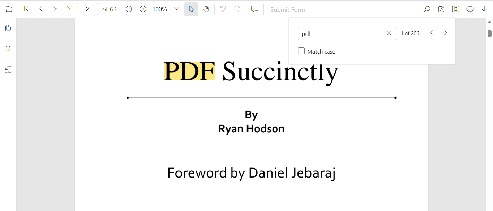
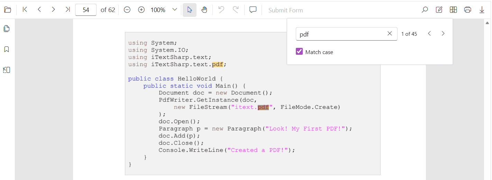
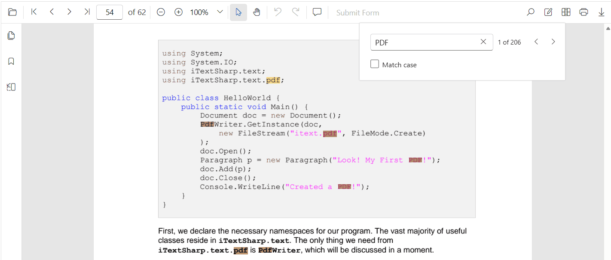
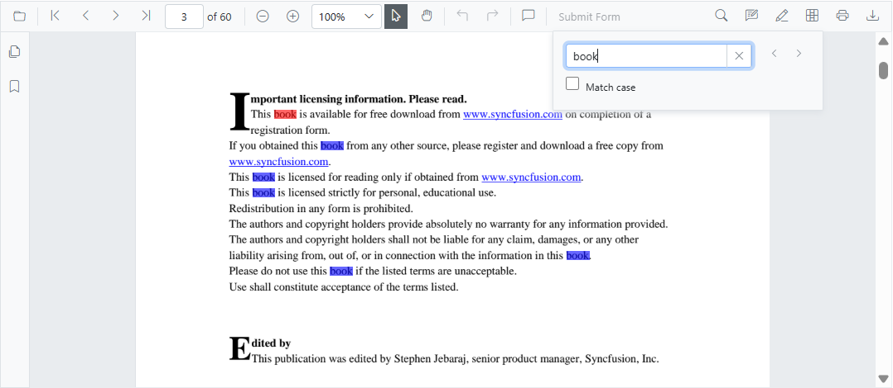

# Text search in Blazor PDF Viewer Component

The text search feature in the Blazor PDF Viewer locates and highlights matching content within a document. Enable or disable this capability using the following configuration.



N> The text search functionality requires setting [`EnableTextSearch`](https://help.syncfusion.com/cr/blazor/Syncfusion.Blazor.SfPdfViewer.PdfViewerBase.html#Syncfusion_Blazor_SfPdfViewer_PdfViewerBase_EnableTextSearch) property to `true`. Otherwise, the search UI and APIs will not be accessible.

## Text search features in UI

### Search text with the Match Case option

Enable the Match Case checkbox to limit results to case-sensitive matches. Navigation commands then step through each exact match in sequence.



### Search text without the Match Case option

Leave the Match Case option cleared to highlight every occurrence of the query, regardless of capitalization, and navigate through each result.



## Programmatic text search

The Blazor PDF Viewer provides options to toggle the text search feature and APIs to customize the text search behavior programmatically.

### Enable or disable text search

Use the following snippet to enable text search.



@using Syncfusion.Blazor.SfPdfViewer

<SfPdfViewer2 EnableTextSearch="true"
             DocumentPath="https://cdn.syncfusion.com/content/pdf/pdf-succinctly.pdf"
             Height="100%"
             Width="100%">
</SfPdfViewer2>



Use the following snippet to disable text search.



@using Syncfusion.Blazor.SfPdfViewer

<SfPdfViewer2 EnableTextSearch="false"
             DocumentPath="https://cdn.syncfusion.com/content/pdf/pdf-succinctly.pdf"
             Height="100%"
             Width="100%">
</SfPdfViewer2>



### Programmatic text search APIs

While the PDF Viewer toolbar offers an interactive search experience, you can also trigger and customize searches programmatically by calling the following APIs.

#### `SearchTextAsync`

Use the [`SearchTextAsync`](https://help.syncfusion.com/cr/blazor/Syncfusion.Blazor.SfPdfViewer.SfPdfViewer2.html#Syncfusion_Blazor_SfPdfViewer_SfPdfViewer2_SearchTextAsync_System_String_System_Boolean_) method to start a search with optional filters that control case sensitivity.

```cshtml
// SearchTextAsync(string searchText, bool isMatchCase)
await pdfViewer.SearchTextAsync("search text", false);
```

Set the `isMatchCase` parameter to `true` to perform a case-sensitive search that mirrors the Match Case option in the search panel.

```cshtml
// This will only find instances of "PDF" in uppercase.
await pdfViewer.SearchTextAsync("PDF", true);
```

If `SearchNextAsync` or `SearchPreviousAsync` is called before `SearchTextAsync`, no navigation occurs because there is no active search query.

#### `SearchNextAsync`

[`SearchNextAsync`](https://help.syncfusion.com/cr/blazor/Syncfusion.Blazor.SfPdfViewer.SfPdfViewer2.html#Syncfusion_Blazor_SfPdfViewer_SfPdfViewer2_SearchNextAsync) method searches for the next occurrence of the current query starting from the currently active match.

```cshtml
// SearchNextAsync()
await pdfViewer.SearchNextAsync();
```

#### `SearchPreviousAsync`

[`SearchPreviousAsync`](https://help.syncfusion.com/cr/blazor/Syncfusion.Blazor.SfPdfViewer.SfPdfViewer2.html#Syncfusion_Blazor_SfPdfViewer_PdfViewer2_SearchPreviousAsync) method searches for the previous occurrence of the current query starting from the currently active match.

```cshtml
// SearchPreviousAsync()
await pdfViewer.SearchPreviousAsync();
```

#### `CancelTextSearchAsync`

[`CancelTextSearchAsync`](https://help.syncfusion.com/cr/blazor/Syncfusion.Blazor.SfPdfViewer.SfPdfViewer2.html#Syncfusion_Blazor_SfPdfViewer_PdfViewer2_CancelTextSearchAsync) method cancels the current text search and removes the highlighted occurrences from the PDF Viewer.

```cshtml
// CancelTextSearchAsync()
await pdfViewer.CancelTextSearchAsync();
```

#### Complete example

Use the following code snippet to implement text search using the `SearchTextAsync` API. Place the sample PDF in `wwwroot/Data` so the `DocumentPath` resolves at runtime.



@using Syncfusion.Blazor.SfPdfViewer

<button @onclick="SearchText">Search Text</button>
<button @onclick="PreviousSearch">Previous Search</button>
<button @onclick="NextSearch">Next Search</button>
<button @onclick="CancelSearch">Cancel Search</button>

<SfPdfViewer2 @ref="pdfViewer"
             DocumentPath="https://cdn.syncfusion.com/content/pdf/pdf-succinctly.pdf"
             Height="100%"
             Width="100%">
</SfPdfViewer2>

@code {
    private SfPdfViewer2 pdfViewer;

    private async Task SearchText()
    {
        await pdfViewer.SearchTextAsync("search text", false);
    }

    private async Task PreviousSearch()
    {
        await pdfViewer.SearchPreviousAsync();
    }

    private async Task NextSearch()
    {
        await pdfViewer.SearchNextAsync();
    }

    private async Task CancelSearch()
    {
        await pdfViewer.CancelTextSearchAsync();
    }
}



**Expected result:** the viewer highlights occurrences of `search text` and navigation commands jump between matches.

## Customize text search highlight colors

Use [PdfViewerTextSearchColorSettings](https://help.syncfusion.com/cr/blazor/Syncfusion.Blazor.SfPdfViewer.PdfViewerTextSearchColorSettings.html) to customize the highlight appearance used for search results. Configure [SearchColor](https://help.syncfusion.com/cr/blazor/Syncfusion.Blazor.SfPdfViewer.PdfViewerTextSearchColorSettings.html#Syncfusion_Blazor_SfPdfViewer_PdfViewerTextSearchColorSettings_SearchColor) for other matches and [SearchHighlightColor](https://help.syncfusion.com/cr/blazor/Syncfusion.Blazor.SfPdfViewer.PdfViewerTextSearchColorSettings.html#Syncfusion_Blazor_SfPdfViewer_PdfViewerTextSearchColorSettings_SearchHighlightColor) for the current match. By default, distinct colors are applied for the current occurrence and other matches; adjust these to align with application theme and accessibility contrast requirements. The `SearchColor` and `SearchHighlightColor` properties accept CSS color values, such as named colors (`red`, `blue`) or hex codes (`#FF0000`).



@using Syncfusion.Blazor.SfPdfViewer

<SfPdfViewer2 Height="100%" Width="100%" DocumentPath="@DocumentPath">
    <PdfViewerTextSearchColorSettings SearchColor="blue" SearchHighlightColor="red"></PdfViewerTextSearchColorSettings>
</SfPdfViewer2>

@code{
    private string DocumentPath { get; set; } = "wwwroot/Data/PDF_Succinctly.pdf";
}






## See also

- [Text Search Events](./text-search-events)
- [Text Selection overview](../text-selection/overview)
- [Extract and highlight text in Blazor PDF Viewer component](../faqs/how-to-extract-particular-text-and-highlight)