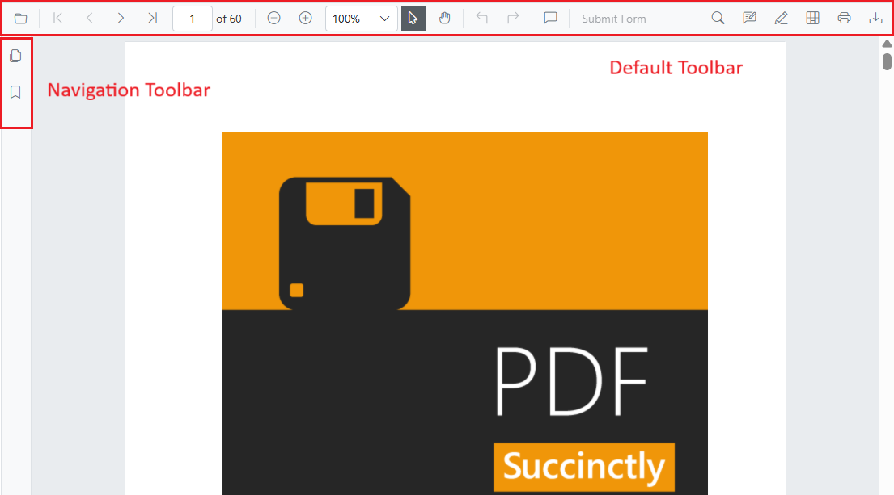
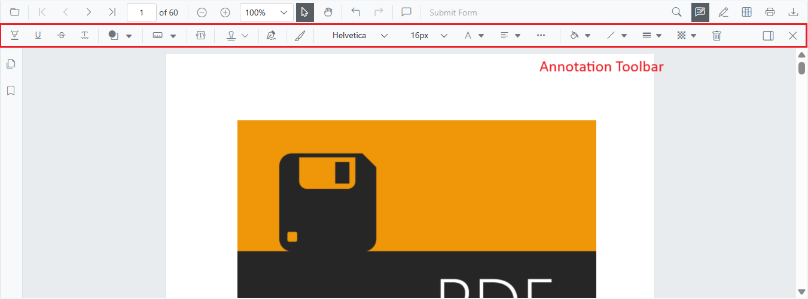
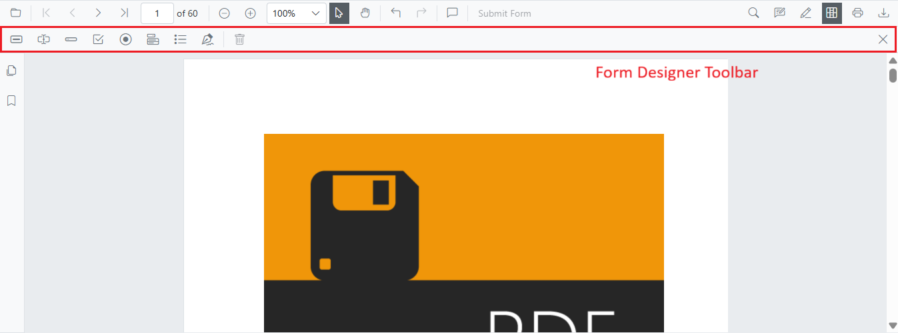
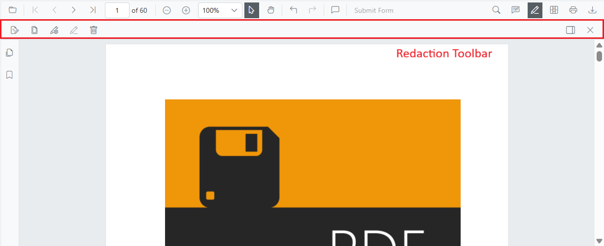

# Toolbar in Blazor SfPdfViewer Component

The `SfPdfViewer` provides a built-in, responsive toolbar that surfaces common PDF actions and exposes feature-specific toolbars. The toolbar adapts to desktop, tablet, and mobile layouts and supports customization to show or hide items, reorder commands, add custom items, and handle toolbar events.

There are four toolbar groups in `SfPdfViewer`:
* Primary toolbar
* Annotation toolbar
* Form designer toolbar
* Redaction toolbar

## Primary Toolbar in Blazor SfPdfViewer Component

The primary toolbar provides quick access to common viewer actions and entry points to feature-specific toolbars. It adapts to available width and presents controls appropriate for the current device and layout.

Primary toolbar options include:

* Open file
* Page navigation
* Magnification
* Pan tool
* Text selection
* Text search
* Print
* Submit form
* Comments panel
* Download
* Undo and redo
* Annotation tools
* Form designer tools
* Redaction tools
* Bookmark panel
* Thumbnail panel

See [Primary toolbar customization](./toolbar-customization/primary-toolbar) for configuration options and examples.

## Annotation toolbar in Blazor SfPdfViewer Component

The annotation toolbar appears below the primary toolbar when annotation features are enabled. It provides tools to create and edit annotations.

Annotation toolbar options include:

* Text markup: Highlight, Underline, Strikethrough, Squiggly
* Shapes: Line, Arrow, Rectangle, Circle, Polygon
* Measurement: Distance, Perimeter, Area, Radius, Volume
* Freehand: Ink, Signature
* Text: Free text
* Stamp: Built-in and custom stamps
* Properties: Color, opacity, thickness, font
* Edit helpers: Comments panel, Delete
* Close

See [Annotation toolbar customization](./toolbar-customization/annotation-toolbar) for configuration and examples.

## Form Designer toolbar in Blazor SfPdfViewer Component

The form designer toolbar appears when form designer mode is enabled and provides tools to add and configure interactive form fields.

Form designer toolbar options include:

* Field types: Button, Text box, Password, Checkbox, Radio button, Drop-down, List box, Signature, Initial
* Edit helpers: Delete
* Close

See [Form designer toolbar customization](./toolbar-customization/form-designer-toolbar) for configuration details.

## Redaction toolbar in Blazor SfPdfViewer Component

The redaction toolbar provides tools to mark and permanently remove sensitive content. It appears below the primary toolbar when redaction is enabled.

Redaction toolbar options include:

* Redaction marks: Mark for redaction, Redact page
* Apply redactions: Permanently remove marked content
* Properties: Redaction properties
* Edit helpers: Delete
* Close

See [Redaction toolbar customization](./toolbar-customization/redaction-toolbar) for configuration and examples.

## See also

* [Mobile toolbar](./toolbar-customization/mobile-toolbar)
* [Adding the shape annotation in PDF viewer](./annotation/shape-annotation)
* [Adding the redaction annotation in PDF viewer](./annotation/redaction-annotation)
* [Form designer in PDF viewer](./form-designer/overview)
