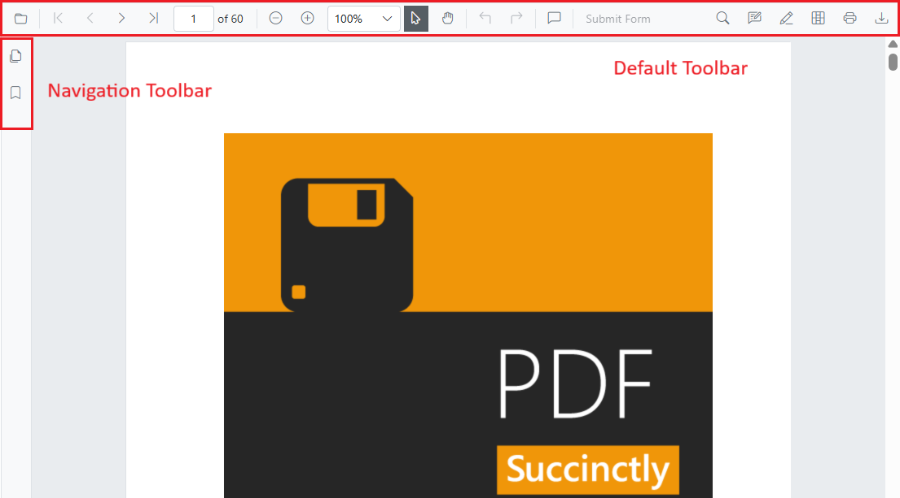
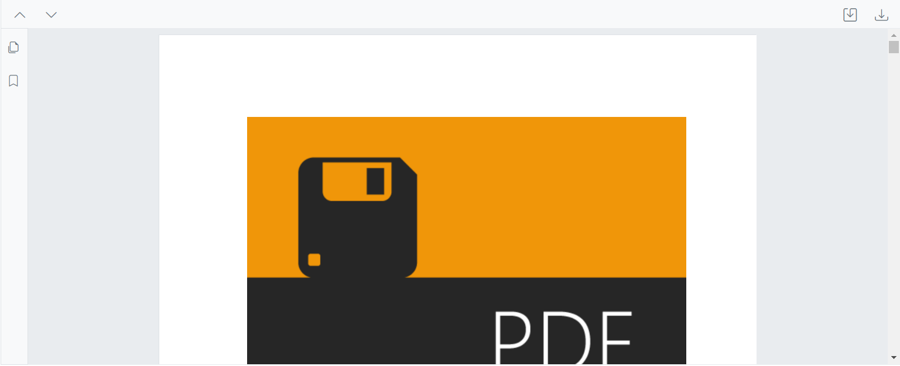
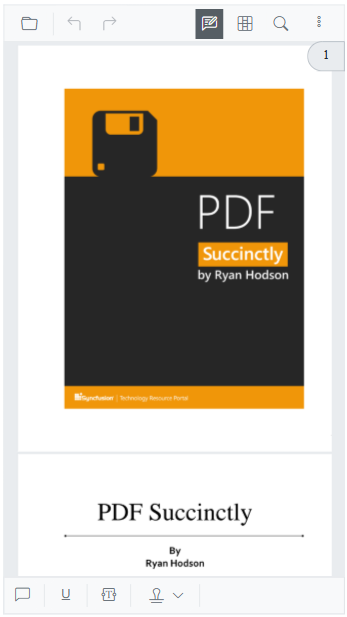

# Toolbar Customization in Blazor SfPdfViewer Component

The SfPdfViewer includes a built-in toolbar that offers the following options:

* Open PDF file
* Page navigation
* Magnification
* Pan tool
* Text selection tool
* Text search
* Print
* Download
* Undo and redo
* Various annotation tools
* Bookmark panel
* Thumbnail panel



## Show or hide toolbar

In scenarios where a custom toolbar is required, the built-in toolbar can be hidden. Use the [EnableToolbar](https://help.syncfusion.com/cr/blazor/Syncfusion.Blazor.SfPdfViewer.PdfViewerBase.html#Syncfusion_Blazor_SfPdfViewer_PdfViewerBase_EnableToolbar) property or the [ShowToolbar](https://help.syncfusion.com/cr/blazor/Syncfusion.Blazor.SfPdfViewer.PdfViewerBase.html#Syncfusion_Blazor_SfPdfViewer_PdfViewerBase_ShowToolbarAsync_System_Boolean_) method to show or hide the primary toolbar.

The following code snippet explains how to show or hide toolbar using the EnableToolbar property.

```cshtml

@using Syncfusion.Blazor.SfPdfViewer

<SfPdfViewer2 EnableToolbar="false" Height="100%" Width="100%" >
</SfPdfViewer2>
```

The following code snippet explains how to show or hide toolbar using the ShowToolbar method.

```cshtml

@using Syncfusion.Blazor.Buttons
@using Syncfusion.Blazor.SfPdfViewer

<SfButton @onclick="OnClick">Hide Toolbar</SfButton>

<SfPdfViewer2 Height="100%"
              Width="100%"
              @ref="@pdfViewer"
              DocumentPath="@DocumentPath">
</SfPdfViewer2>

@code {

    SfPdfViewer2 pdfViewer;
    public string DocumentPath { get; set; } = "wwwroot/Data/PDF_Succinctly.pdf";

    public async void OnClick(MouseEventArgs args)
    {
        await pdfViewer.ShowToolbarAsync(false);
    }
}

```

[View the sample on GitHub](https://github.com/SyncfusionExamples/blazor-pdf-viewer-examples/tree/master/Toolbar/Custom%20Toolbar/Custom%20Toolbar).

## Show or hide navigation toolbar

The navigation toolbar is the sidebar that provides options to expand or collapse the bookmark and page thumbnail panels. Toggle its visibility by using the [EnableNavigationToolbar](https://help.syncfusion.com/cr/blazor/Syncfusion.Blazor.SfPdfViewer.PdfViewerBase.html#Syncfusion_Blazor_SfPdfViewer_PdfViewerBase_EnableNavigationToolbar) property or the [ShowNavigationToolbar](https://help.syncfusion.com/cr/blazor/Syncfusion.Blazor.SfPdfViewer.PdfViewerBase.html#Syncfusion_Blazor_SfPdfViewer_PdfViewerBase_ShowNavigationToolbar_System_Boolean_) method.

The following code snippet explains how to show or hide navigation toolbar using the EnableNavigationToolbar property.

```cshtml

@using Syncfusion.Blazor.SfPdfViewer

<SfPdfViewer2 EnableNavigationToolbar="false" Height="100%" Width="100%"></SfPdfViewer2>

```

The following code snippet explains how to show or hide navigation toolbar using the ShowNavigationToolbar method.

```cshtml

@using Syncfusion.Blazor.Buttons
@using Syncfusion.Blazor.SfPdfViewer

<SfButton @onclick="OnClick">Hide Navigation Toolbar</SfButton>
<SfPdfViewer2 EnableNavigationToolbar="true"
              Height="100%"
              Width="100%"
              @ref="@pdfViewer"
              DocumentPath="@DocumentPath">
</SfPdfViewer2>

@code {

    SfPdfViewer2 pdfViewer;
    public string DocumentPath { get; set; } = "wwwroot/Data/PDF_Succinctly.pdf";

    public void OnClick(MouseEventArgs args)
    {
        pdfViewer.ShowNavigationToolbar(false);
    }
}

```

## Show or hide the toolbar item

Toolbar items can be shown or hidden by configuring the `PdfViewerToolbarSettings` class. The following example demonstrates how to display only the specified items in the toolbar. The toolbar will render the items listed in the collection.

```cshtml

@using Syncfusion.Blazor.SfPdfViewer

<SfPdfViewer2 Height="100%"
              Width="100%"
              DocumentPath="@DocumentPath">
    <PdfViewerToolbarSettings ToolbarItems="ToolbarItems"></PdfViewerToolbarSettings>
</SfPdfViewer2>

@code{

    public string DocumentPath { get; set; } = "wwwroot/data/PDF_Succinctly.pdf";

    List<ToolbarItem> ToolbarItems = new List<ToolbarItem>()
    {
        ToolbarItem.PageNavigationTool,
        ToolbarItem.MagnificationTool,
        ToolbarItem.CommentTool,
        ToolbarItem.SelectionTool,
        ToolbarItem.PanTool,
        ToolbarItem.UndoRedoTool,
        ToolbarItem.CommentTool,
        ToolbarItem.AnnotationEditTool,
        ToolbarItem.SearchOption,
        ToolbarItem.PrintOption,
        ToolbarItem.DownloadOption
    };
}
```

## Show or hide annotation toolbar

The annotation toolbar appears below the primary toolbar and provides options to edit annotations. Toggle its visibility using the [EnableAnnotationToolbar](https://help.syncfusion.com/cr/blazor/Syncfusion.Blazor.SfPdfViewer.PdfViewerBase.html#Syncfusion_Blazor_SfPdfViewer_PdfViewerBase_EnableAnnotationToolbar) property or the [ShowAnnotationToolbar](https://help.syncfusion.com/cr/blazor/Syncfusion.Blazor.SfPdfViewer.PdfViewerBase.html#Syncfusion_Blazor_SfPdfViewer_PdfViewerBase_ShowAnnotationToolbar_System_Boolean_) method.

The following code snippet explains how to show or hide annotation toolbar using the ShowAnnotationToolbar method.

```cshtml

@using Syncfusion.Blazor.SfPdfViewer

<SfPdfViewer2 @ref="viewer" Height="100%" Width="100%" DocumentPath="@documentPath">
    <PdfViewerEvents DocumentLoaded="DocumentLoad"></PdfViewerEvents>
</SfPdfViewer2>

@code {

    private string documentPath { get; set; } = "wwwroot/Data/PDF_Succinctly.pdf";

    SfPdfViewer2 viewer;

    //Invokes while loading document in the PDFViewer.
    public void DocumentLoad(LoadEventArgs args)
    {
        //Shows the annotation toolbar on initial loading.
        viewer.ShowAnnotationToolbar(true);
        //Code to hide the annoatation toolbar.
        //viewer.ShowAnnotationToolbar(false);
    }
}

```
[View the sample on GitHub](https://github.com/SyncfusionExamples/blazor-pdf-viewer-examples/tree/master/Toolbar/Annotation%20Toolbar/Show%20or%20hide%20on%20loading).

## Primary Toolbar Customization

The primary toolbar can be customized by rearranging existing options, disabling default options, and adding new items. A specific index can also be provided to place new items among existing options.

## Rearrange the default options of toolbar

Reorder the [ToolbarItems](https://help.syncfusion.com/cr/blazor/Syncfusion.Blazor.SfPdfViewer.PdfViewerToolbarSettings.html#Syncfusion_Blazor_SfPdfViewer_PdfViewerToolbarSettings_ToolbarItems) list to control the display order. The toolbar renders items in the order defined in the collection.

```cshtml

@using Syncfusion.Blazor.SfPdfViewer

<SfPdfViewer2 Height="100%" Width="100%" DocumentPath="@DocumentPath">
    <PdfViewerToolbarSettings ToolbarItems="ToolbarItems"></PdfViewerToolbarSettings>
</SfPdfViewer2>

@code {

    public string DocumentPath { get; set; } = "wwwroot/data/PDF_Succinctly.pdf";

    List<ToolbarItem> ToolbarItems = new List<ToolbarItem>()
    {
        ToolbarItem.OpenOption,
        ToolbarItem.PageNavigationTool,
        ToolbarItem.SelectionTool,
        ToolbarItem.MagnificationTool,
        ToolbarItem.PanTool,
        ToolbarItem.UndoRedoTool,
        ToolbarItem.CommentTool,
        ToolbarItem.AnnotationEditTool,
        ToolbarItem.SearchOption,
        ToolbarItem.DownloadOption,
        ToolbarItem.PrintOption,
    };
}

```


[View the sample on GitHub](https://github.com/SyncfusionExamples/blazor-pdf-viewer-examples/tree/master/Toolbar/Custom%20Toolbar/Primary%20Custom%20Toolbar/Rearrange-Default-Options).

## Disable the default items and Add new items in Primary Toolbar

To customize the primary toolbar by replacing defaults with custom items, set the [ToolbarItems](https://help.syncfusion.com/cr/blazor/Syncfusion.Blazor.SfPdfViewer.PdfViewerToolbarSettings.html#Syncfusion_Blazor_SfPdfViewer_PdfViewerToolbarSettings_ToolbarItems) property to null and provide a list of [PdfToolbarItem](https://help.syncfusion.com/cr/blazor/Syncfusion.Blazor.SfPdfViewer.PdfToolbarItem.html#Syncfusion_Blazor_SfPdfViewer_PdfToolbarItem__ctor) objects. Each PdfToolbarItem defines a **RenderFragment** and an **Index** to position the custom item. Assign the list to [CustomToolbarItems](https://help.syncfusion.com/cr/blazor/Syncfusion.Blazor.SfPdfViewer.PdfViewerToolbarSettings.html#Syncfusion_Blazor_SfPdfViewer_PdfViewerToolbarSettings_CustomToolbarItems).

```cshtml

@using Syncfusion.Blazor.SfPdfViewer; 
@using Syncfusion.Blazor.Navigations; 

<SfPdfViewer2 @ref="@Viewer" DocumentPath="@DocumentPath" Height="100%" Width="100%">  
    <PdfViewerToolbarSettings CustomToolbarItems="@CustomToolbarItems" ToolbarItems="null" />   
    <PdfViewerEvents ToolbarClicked="ClickAction"></PdfViewerEvents>              
</SfPdfViewer2>  

@code{ 
    private string DocumentPath { get; set; } = "wwwroot/Data/PDF_Succinctly.pdf"; 
    SfPdfViewer2 Viewer; 
    MemoryStream stream; 

    // List provide the position and element for the custom toolbar items
    public List<PdfToolbarItem> CustomToolbarItems = new List<PdfToolbarItem>() 
    {    
        new PdfToolbarItem (){ Index = 0, Template = @GetTemplate("PreviousPage")}, 
        new PdfToolbarItem (){ Index = 1, Template = @GetTemplate("NextPage")}, 
        new PdfToolbarItem (){ Index = 2, Template = @GetTemplate("Save")}, 
        new PdfToolbarItem (){ Index = 3, Template = @GetTemplate("Download")} 
    };  

    // Get the renderfragment element for the custom toolbaritems in the primary toolbar
    private static RenderFragment GetTemplate(string name)  
    {  
        return __builder => 
            {  
                if (name == "PreviousPage")
                { 
                    <ToolbarItem PrefixIcon="e-icons e-chevron-up" 
                          		Text="Previous Page" 
                                TooltipText="Previous Page" 
                                Id="previousPage" 
                                Align="ItemAlign.Left"> 
                    </ToolbarItem> 
                }  
                else if(name == "NextPage")
                { 
                    <ToolbarItem PrefixIcon="e-icons e-chevron-down" 
                                Text="Next Page" 
                                TooltipText="Next Page" 
                                Id="nextPage" 
                                Align="ItemAlign.Left"> 
                    </ToolbarItem> 
                }  
                else if(name == "Save")
                { 
                    <ToolbarItem PrefixIcon="e-icons e-save" 
                                Text="Save" 
                                TooltipText="Save Document" 
                                Id="save" 
                                Align="ItemAlign.Right"> 
                    </ToolbarItem>
                }  
                else if(name == "Download")
                { 
                    <ToolbarItem PrefixIcon="e-icons e-download" 
                                Text="Download"
                                TooltipText="Download" 
                                Id="download" 
                                Align="ItemAlign.Right"> 
                    </ToolbarItem> 
                }  
            };            
    }  

    // Click for the custom toolbaritems in the primary toolbar
    public async void ClickAction(ClickEventArgs Item) 
    {  
        if (Item.Item.Id == "previousPage") 
        {
            //Navigate to previous page of the PDF document.
            await Viewer.GoToPreviousPageAsync(); 
        }  
        else if (Item.Item.Id == "nextPage") 
        {
            //Navigate to next page page of the PDF document.
            await Viewer.GoToNextPageAsync(); 
        }  
        else if(Item.Item.Id == "save")  
        {
            //Gets the loaded PDF document with the changes.
            byte[] data = await Viewer.GetDocumentAsync();
            //Save the PDF document to a MemoryStream. 
            stream = new MemoryStream(data);
            //Load a PDF document from the MemoryStream. 
            await Viewer.LoadAsync(stream); 
        } 
        else if (Item.Item.Id == "download") 
        {
            //Downloads the PDF document
            await Viewer.DownloadAsync(); 
        } 
    }  
} 

```



[View the sample on GitHub](https://github.com/SyncfusionExamples/blazor-pdf-viewer-examples/tree/master/Toolbar/Custom%20Toolbar/Primary%20Custom%20Toolbar/Without-Default-Options).

## How to customize the Primary Toolbar with default options

Both [ToolbarItems](https://help.syncfusion.com/cr/blazor/Syncfusion.Blazor.SfPdfViewer.PdfViewerToolbarSettings.html#Syncfusion_Blazor_SfPdfViewer_PdfViewerToolbarSettings_ToolbarItems) and [CustomToolbarItems](https://help.syncfusion.com/cr/blazor/Syncfusion.Blazor.SfPdfViewer.PdfViewerToolbarSettings.html#Syncfusion_Blazor_SfPdfViewer_PdfViewerToolbarSettings_CustomToolbarItems) can be used together. Items defined in CustomToolbarItems are inserted at the specified index positions among the ToolbarItems.

```cshtml

@using Syncfusion.Blazor.SfPdfViewer; 
@using Syncfusion.Blazor.Navigations;

<SfPdfViewer2 @ref="@Viewer" DocumentPath="@DocumentPath" Height="100%" Width="100%">  
         <PdfViewerToolbarSettings CustomToolbarItems="@CustomToolbarItems" ToolbarItems="@ToolbarItems" />   
         <PdfViewerEvents ToolbarClicked="ClickAction"></PdfViewerEvents>              
</SfPdfViewer2>  

@code { 
    private string DocumentPath { get; set; } = "wwwroot/Data/PDF_Succinctly.pdf"; 
    SfPdfViewer2 Viewer; 
    MemoryStream stream; 

    // List provide the position and element for the custom toolbar items
    public List<PdfToolbarItem> CustomToolbarItems = new List<PdfToolbarItem>() 
    {  
        new PdfToolbarItem (){ Index = 1, Template = @GetTemplate("PreviousPage")}, 
        new PdfToolbarItem (){ Index = 2, Template = @GetTemplate("NextPage")}, 
        new PdfToolbarItem (){ Index = 4, Template = @GetTemplate("Save")}, 
        new PdfToolbarItem (){ Index = 7, Template = @GetTemplate("Download")} 
    }; 

    // GetTemaplate and ClickAction function as same as the previous example

    // Default toolbar items list provided for the toolbaritems
    public List<Syncfusion.Blazor.SfPdfViewer.ToolbarItem> ToolbarItems = new List<Syncfusion.Blazor.SfPdfViewer.ToolbarItem>() 
    { 
        Syncfusion.Blazor.SfPdfViewer.ToolbarItem.OpenOption, 
        Syncfusion.Blazor.SfPdfViewer.ToolbarItem.SelectionTool, 
        Syncfusion.Blazor.SfPdfViewer.ToolbarItem.SearchOption,
        Syncfusion.Blazor.SfPdfViewer.ToolbarItem.PrintOption 
    }; 
} 

```


[View the sample on GitHub](https://github.com/SyncfusionExamples/blazor-pdf-viewer-examples/tree/master/Toolbar/Custom%20Toolbar/Primary%20Custom%20Toolbar/With-Default-Options).

## How modify the toolbar Icons in the Primary Toolbar

The appearance of toolbar icons can be customized. The following example demonstrates a custom toolbar with custom icon styles.

```cshtml

@using Syncfusion.Blazor.SfPdfViewer; 
@using Syncfusion.Blazor.Navigations; 

<SfPdfViewer2 @ref="@Viewer" DocumentPath="@DocumentPath" Height="100%" Width="100%">  
    <PdfViewerToolbarSettings CustomToolbarItems="@CustomToolbarItems" ToolbarItems="@ToolbarItems" />   
    <PdfViewerEvents ToolbarClicked="ClickAction"></PdfViewerEvents>              
</SfPdfViewer2>  

@code { 
    private string DocumentPath { get; set; } = "wwwroot/Data/PDF_Succinctly.pdf"; 
    SfPdfViewer2 Viewer; 
    MemoryStream stream; 

    // List provide the position and element for the custom toolbar items
    public List<PdfToolbarItem> CustomToolbarItems = new List<PdfToolbarItem>() 
    {  
        new PdfToolbarItem (){ Index = 1, Template = @GetTemplate("PreviousPage")}, 
        new PdfToolbarItem (){ Index = 2, Template = @GetTemplate("NextPage")}, 
        new PdfToolbarItem (){ Index = 4, Template = @GetTemplate("Save")}, 
        new PdfToolbarItem (){ Index = 7, Template = @GetTemplate("Download")} 
    }; 

    // GetTemaplate and ClickAction function as same as the previous example

    // Default toolbar items list provided for the toolbaritems
    public List<Syncfusion.Blazor.SfPdfViewer.ToolbarItem> ToolbarItems = new List<Syncfusion.Blazor.SfPdfViewer.ToolbarItem>() 
    { 
        Syncfusion.Blazor.SfPdfViewer.ToolbarItem.OpenOption, 
        Syncfusion.Blazor.SfPdfViewer.ToolbarItem.SelectionTool, 
        Syncfusion.Blazor.SfPdfViewer.ToolbarItem.SearchOption,
        Syncfusion.Blazor.SfPdfViewer.ToolbarItem.PrintOption 
    };
} 

<style> 
    .e-icons.e-chevron-up::before {
        content: '\e87a';
    }

    .e-icons.e-chevron-down::before {
        content: '\e70d';
    }

    .e-icons.e-download::before {
        content: '\e7a0';
    }

    .e-icons.e-save::before {
        content: '\e7a8'
    }
</style> 

```


[View the sample on GitHub](https://github.com/SyncfusionExamples/blazor-pdf-viewer-examples/tree/master/Toolbar/Custom%20Toolbar/Primary%20Custom%20Toolbar/Icon-Style-Change).

N> This applies only to a custom toolbar.

## How to customize the Annotation Toolbar

The [`PdfViewerToolbarSettings`](https://help.syncfusion.com/cr/blazor/Syncfusion.Blazor.SfPdfViewer.PdfViewerToolbarSettings.html) in [SfPdfViewer](https://help.syncfusion.com/cr/blazor/Syncfusion.Blazor.SfPdfViewer.html) allows customization of the Annotation Toolbar by specifying which annotation tools should be displayed. The [`AnnotationToolbarItems`](https://help.syncfusion.com/cr/blazor/Syncfusion.Blazor.SfPdfViewer.PdfViewerToolbarSettings.html#Syncfusion_Blazor_SfPdfViewer_PdfViewerToolbarSettings_AnnotationToolbarItems) property accepts a list of [`AnnotationToolbarItem`](https://help.syncfusion.com/cr/blazor/Syncfusion.Blazor.SfPdfViewer.AnnotationToolbarItem.html) values, ensuring that only the selected tools are available while hiding others. This helps create a simplified and user-friendly toolbar based on the application's needs.

The following example demonstrates how to customize the Annotation Toolbar by specifying a selected set of tools using [`AnnotationToolbarItem`](https://help.syncfusion.com/cr/blazor/Syncfusion.Blazor.SfPdfViewer.AnnotationToolbarItem.html).

```cshtml
<!-- Container for the PDF Viewer -->
<div class="Pdf-viewer-container">
    <!-- SfPdfViewer2 component with Annotation Toolbar enabled -->
    <SfPdfViewer2 @ref="PdfViewerInstance" EnableFormDesigner="true" 
                  DocumentPath="wwwroot/data/Form_Designer.pdf"
                  Height="650px"
                  Width="100%">
                  
                  <!-- Configuring the Annotation Toolbar items -->
                  <PdfViewerToolbarSettings AnnotationToolbarItems="AnnotationToolbarItems"></PdfViewerToolbarSettings>
    </SfPdfViewer2>
</div>

@code {
    // Reference to the SfPdfViewer2 instance
    SfPdfViewer2 PdfViewerInstance { get; set; }

    // Define a list of annotation toolbar items to be displayed and usable
    List<AnnotationToolbarItem> AnnotationToolbarItems { get; set; } = new List<AnnotationToolbarItem>() 
    {
        AnnotationToolbarItem.UnderlineTool,
        AnnotationToolbarItem.StampAnnotationTool,
        AnnotationToolbarItem.FreeTextAnnotationTool,
        AnnotationToolbarItem.FontSizeAnnotationTool,
        AnnotationToolbarItem.CloseTool
    };
}
```
Refer to the image below for the desktop view.


Refer to the image below for the mobile view.



[View the sample on GitHub](https://github.com/SyncfusionExamples/blazor-pdf-viewer-examples/blob/master/Form%20Designer/Components/Pages/CustomAnnotationToolbar.razor).

## How to customize the Form Designer Toolbar

The [`PdfViewerToolbarSettings`](https://help.syncfusion.com/cr/blazor/Syncfusion.Blazor.SfPdfViewer.PdfViewerToolbarSettings.html) component in [SfPdfViewer](https://help.syncfusion.com/cr/blazor/Syncfusion.Blazor.SfPdfViewer.html) enables customization of the Form Designer Toolbar by defining the available form design tools. The [`FormDesignerToolbarItems`](https://help.syncfusion.com/cr/blazor/Syncfusion.Blazor.SfPdfViewer.PdfViewerToolbarSettings.html#Syncfusion_Blazor_SfPdfViewer_PdfViewerToolbarSettings_FormDesignerToolbarItems) property takes a list of [`FormDesignerToolbarItem`](https://help.syncfusion.com/cr/blazor/Syncfusion.Blazor.SfPdfViewer.FormDesignerToolbarItem.html) values, allowing you to display only the necessary tools while hiding others. This ensures a more focused and user-friendly form designing experience.

The following example demonstrates how to customize the Form Designer Toolbar by configuring specific tools using [`FormDesignerToolbarItem`](https://help.syncfusion.com/cr/blazor/Syncfusion.Blazor.SfPdfViewer.FormDesignerToolbarItem.html).

```cshtml
<SfPdfViewer2 @ref="PdfViewerInstance" EnableFormDesigner="true" 
                  DocumentPath="wwwroot/data/Form_Designer.pdf"
                  Height="650px"
                  Width="100%">
                  
                  <!-- Configuring the Form Designer Toolbar items -->
                  <PdfViewerToolbarSettings FormDesignerToolbarItems="FormDesignerToolbarItems"></PdfViewerToolbarSettings>
</SfPdfViewer2>

@code {
    // Reference to the SfPdfViewer2 instance
    SfPdfViewer2 PdfViewerInstance { get; set; }

    // Define a list of form designer toolbar items to be displayed and usable
    List<FormDesignerToolbarItem> FormDesignerToolbarItems { get; set; } = new List<FormDesignerToolbarItem>() 
    {
        FormDesignerToolbarItem.TextBox,   
        FormDesignerToolbarItem.CheckBox,  
        FormDesignerToolbarItem.ListBox,   
        FormDesignerToolbarItem.Delete    
    };
}
```

Refer to the image below for the desktop view.


Refer to the image below for the mobile view.


[View the sample on GitHub](https://github.com/SyncfusionExamples/blazor-pdf-viewer-examples/blob/master/Form%20Designer/Components/Pages/CustomFormDesignerToolbar.razor).

## How to customize the  Redaction Toolbar

The Redaction toolbar allows users to mark and permanently redact sensitive content in a PDF document. The following sections explain how to enable and customize the Redaction toolbar for desktop and mobile views and how to control its visibility.

### Enabling the Redaction Toolbar on Desktop

To enable the Redaction toolbar on desktop, include the required `ToolbarItems` in the `SfPdfViewer` component as shown below:

#### Code Example

```cshtml
@page "/"

<SfPdfViewer2 Height="100%" Width="100%" DocumentPath="Annotations.pdf">
    <PdfViewerToolbarSettings ToolbarItems="ToolbarItems"></PdfViewerToolbarSettings>
</SfPdfViewer2>

@code {
    private List<ToolbarItem> ToolbarItems = new List<ToolbarItem>();
    protected override void OnInitialized()
    {
        ToolbarItems = new List<ToolbarItem>()
        {
            ToolbarItem.OpenOption,
            ToolbarItem.PageNavigationTool,
            ToolbarItem.MagnificationTool,
            ToolbarItem.SelectionTool,
            ToolbarItem.PanTool,
            ToolbarItem.UndoRedoTool,
            ToolbarItem.CommentTool,
            ToolbarItem.SubmitForm,
            ToolbarItem.SearchOption,
            ToolbarItem.AnnotationEditTool,
            ToolbarItem.Redaction,              // Enables Redaction toolbar
            ToolbarItem.FormDesigner,
            ToolbarItem.PrintOption,
            ToolbarItem.DownloadOption
        };
    }
}
```
Refer to the following image for the desktop view.


### Enabling the Redaction Toolbar on Mobile

To enable the Redaction toolbar on mobile, configure the `MobileToolbarItems` property as shown below:

#### Code Example

```cshtml
@page "/"

<SfPdfViewer2 Height="100%" Width="100%" DocumentPath="Annotations.pdf">
    <PdfViewerToolbarSettings MobileToolbarItems="MobileToolbarItems"></PdfViewerToolbarSettings>
</SfPdfViewer2>

@code {
    private List<MobileToolbarItem> MobileToolbarItems = new List<MobileToolbarItem>();
    protected override void OnInitialized()
    {
        MobileToolbarItems = new List<MobileToolbarItem>()
        {
            MobileToolbarItem.Open,
            MobileToolbarItem.UndoRedo,
            MobileToolbarItem.EditAnnotation,
            MobileToolbarItem.Redaction,        // Enables Redaction toolbar
            MobileToolbarItem.FormDesigner,
            MobileToolbarItem.Search
        };
    }
}
```

Refer to the following image for the mobile view.


## Showing or Hiding the Redaction Toolbar

The Redaction toolbar can be shown or hidden using the built-in toolbar icon or programmatically through the `ShowRedactionToolbar` API.

### Displaying the Redaction Toolbar Using the Toolbar Icon

When `ToolbarItem.Redaction` or `MobileToolbarItem.Redaction` is enabled, selecting the redaction icon in the primary toolbar toggles the visibility of the Redaction toolbar.

Refer to the following image for details.


### Displaying the Redaction Toolbar Programmatically

The visibility of the Redaction toolbar can also be controlled programmatically by invoking the `ShowRedactionToolbar` method on the SfPdfViewer instance. This is useful when visibility must be driven by application logic, permissions, or context.

The following example demonstrates how to toggle the visibility of the Redaction toolbar using a button:

```cshtml
private void ToggleRedactionToolbar()
{
    isRedactionToolbarVisible = !isRedactionToolbarVisible;
    SfPdfViewer2.ShowRedactionToolbar(isRedactionToolbarVisible);
}
```

Refer to the following image for details.


## See also

* [Adding the shape annotation in PDF viewer](./annotation/shape-annotation)
* [Adding the redaction annotation in PDF viewer](./annotation/redaction-annotation)
* [Form designer in PDF viewer](./form-designer/overview)
