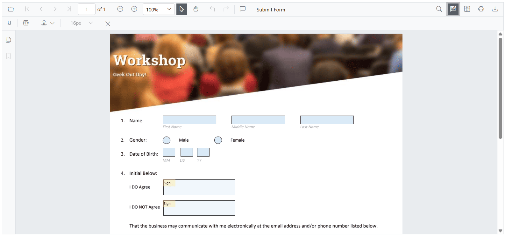
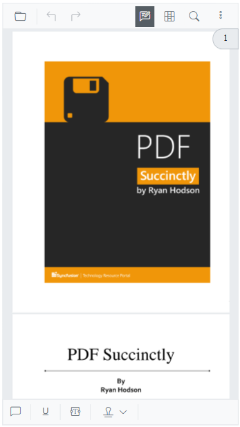

# Annotation toolbar customization

Customize which tools appear in the annotation toolbar, control their order, and toggle toolbar visibility programmatically.

## Show or hide the annotation toolbar

Toggle the annotation toolbar during initialization or at runtime using the [EnableAnnotationToolbar](https://help.syncfusion.com/cr/blazor/Syncfusion.Blazor.SfPdfViewer.PdfViewerBase.html#Syncfusion_Blazor_SfPdfViewer_PdfViewerBase_EnableAnnotationToolbar) property or the [ShowAnnotationToolbar](https://help.syncfusion.com/cr/blazor/Syncfusion.Blazor.SfPdfViewer.PdfViewerBase.html#Syncfusion_Blazor_SfPdfViewer_PdfViewerBase_ShowAnnotationToolbar_System_Boolean_) method.

Example: show the annotation toolbar when a document loads.

```cshtml

@using Syncfusion.Blazor.SfPdfViewer

<SfPdfViewer2 @ref="viewer" Height="100%" Width="100%" DocumentPath="@documentPath">
    <PdfViewerEvents DocumentLoaded="DocumentLoad"></PdfViewerEvents>
</SfPdfViewer2>

@code {

    private string documentPath { get; set; } = "wwwroot/Data/PDF_Succinctly.pdf";

    SfPdfViewer2 viewer;

    //Invokes while loading document in the PDFViewer.
    public void DocumentLoad(LoadEventArgs args)
    {
        //Shows the annotation toolbar on initial loading.
        viewer.ShowAnnotationToolbar(true);
        //Code to hide the annoatation toolbar.
        //viewer.ShowAnnotationToolbar(false);
    }
}

```
[View the sample on GitHub](https://github.com/SyncfusionExamples/blazor-pdf-viewer-examples/tree/master/Toolbar/Annotation%20Toolbar/Show%20or%20hide%20on%20loading).

## Customize annotation toolbar items

Use [PdfViewerToolbarSettings](https://help.syncfusion.com/cr/blazor/Syncfusion.Blazor.SfPdfViewer.PdfViewerToolbarSettings.html) to specify which annotation tools are shown and their order. The property accepts a list of [AnnotationToolbarItems](https://help.syncfusion.com/cr/blazor/Syncfusion.Blazor.SfPdfViewer.PdfViewerToolbarSettings.html#Syncfusion_Blazor_SfPdfViewer_PdfViewerToolbarSettings_AnnotationToolbarItems) values; only listed items are rendered, and the displayed order follows the list sequence.

Include the Close tool so users can exit the annotation toolbar when needed. The annotation toolbar appears when entering annotation mode in `SfPdfViewer2` and adapts responsively to available width.

Example: configure a custom set of annotation tools.

```cshtml

<!-- Container for the PDF Viewer -->
<div class="Pdf-viewer-container">
    <!-- SfPdfViewer2 component with annotation toolbar enabled -->
    <SfPdfViewer2 @ref="PdfViewerInstance" EnableFormDesigner="true" 
                  DocumentPath="wwwroot/data/Form_Designer.pdf"
                  Height="650px"
                  Width="100%">
                  
                  <!-- Configuring the annotation toolbar items -->
                  <PdfViewerToolbarSettings AnnotationToolbarItems="AnnotationToolbarItems"></PdfViewerToolbarSettings>
    </SfPdfViewer2>
</div>

@code {
    // Reference to the SfPdfViewer2 instance
    SfPdfViewer2 PdfViewerInstance { get; set; }

    // Define a list of annotation toolbar items to be displayed and usable
    List<AnnotationToolbarItem> AnnotationToolbarItems { get; set; } = new List<AnnotationToolbarItem>() 
    {
        AnnotationToolbarItem.UnderlineTool,
        AnnotationToolbarItem.StampAnnotationTool,
        AnnotationToolbarItem.FreeTextAnnotationTool,
        AnnotationToolbarItem.FontSizeAnnotationTool,
        AnnotationToolbarItem.CloseTool
    };
}

```
Refer to the image below for the desktop view (items shown in the order configured).



Refer to the image below for the mobile view (responsive layout adapts to width).



[View the sample on GitHub](https://github.com/SyncfusionExamples/blazor-pdf-viewer-examples/blob/master/Form%20Designer/Components/Pages/CustomAnnotationToolbar.razor)
 
N> Properties tools (color, opacity, thickness, font, etc.) now appear only after you select or add the related annotation. Until you select or add one, these tools are hidden.

N> This change reduces clutter and shows options only when they’re relevant to the selected annotation.

## See also

* [Adding the shape annotation in PDF viewer](../annotation/shape-annotation)