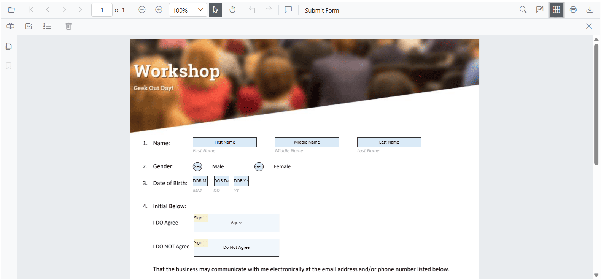
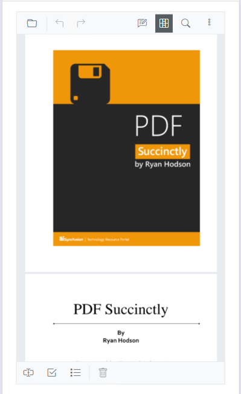

# Form designer toolbar customization

The form designer toolbar can be customized by showing or hiding default items and by controlling the order in which the items appear.

## Show or hide the form designer toolbar

Show or hide the form designer toolbar programmatically.

Use the [EnableFormDesigner](https://help.syncfusion.com/cr/blazor/Syncfusion.Blazor.SfPdfViewer.PdfViewerBase.html#Syncfusion_Blazor_SfPdfViewer_PdfViewerBase_EnableFormDesigner) property to toggle visibility.

The following code snippet explains how to show or hide the toolbar using the EnableFormDesigner property.

```cshtml

@using Syncfusion.Blazor.SfPdfViewer

<SfPdfViewer2 EnableFormDesigner="false" Height="100%" Width="100%" >
</SfPdfViewer2>

```

## How to customize the form designer toolbar

Choose which tools appear and control their order in the form designer toolbar.

The [PdfViewerToolbarSettings](https://help.syncfusion.com/cr/blazor/Syncfusion.Blazor.SfPdfViewer.PdfViewerToolbarSettings.html) component in [SfPdfViewer2](https://help.syncfusion.com/cr/blazor/Syncfusion.Blazor.SfPdfViewer.html) customizes which form design tools are available. The [FormDesignerToolbarItems](https://help.syncfusion.com/cr/blazor/Syncfusion.Blazor.SfPdfViewer.PdfViewerToolbarSettings.html#Syncfusion_Blazor_SfPdfViewer_PdfViewerToolbarSettings_FormDesignerToolbarItems) property accepts a list of [FormDesignerToolbarItem](https://help.syncfusion.com/cr/blazor/Syncfusion.Blazor.SfPdfViewer.FormDesignerToolbarItem.html) values. The items you include are both displayed and rendered in the order listed; any items you omit are hidden. This provides a streamlined, user-friendly form design experience across devices.

The following example demonstrates how to customize the form designer toolbar by configuring specific tools using `FormDesignerToolbarItem`.

```cshtml

<SfPdfViewer2 @ref="PdfViewerInstance" EnableFormDesigner="true" 
                  DocumentPath="wwwroot/data/Form_Designer.pdf"
                  Height="650px"
                  Width="100%">          
                  <!-- Configuring the Form Designer Toolbar items -->
                  <PdfViewerToolbarSettings FormDesignerToolbarItems="FormDesignerToolbarItems"></PdfViewerToolbarSettings>
</SfPdfViewer2>

@code {
    // Reference to the SfPdfViewer2 instance
    SfPdfViewer2 PdfViewerInstance { get; set; }

    // Define a list of form designer toolbar items to be displayed and usable
    List<FormDesignerToolbarItem> FormDesignerToolbarItems { get; set; } = new List<FormDesignerToolbarItem>() 
    {
        FormDesignerToolbarItem.TextBox,   
        FormDesignerToolbarItem.CheckBox,  
        FormDesignerToolbarItem.ListBox,   
        FormDesignerToolbarItem.Delete    
    };
}

```

Refer to the image below for the desktop view.



Refer to the image below for the mobile view.



[View the sample on GitHub](https://github.com/SyncfusionExamples/blazor-pdf-viewer-examples/blob/master/Form%20Designer/Components/Pages/CustomFormDesignerToolbar.razor).

## See also

* [Form designer in PDF viewer](../form-designer/overview)