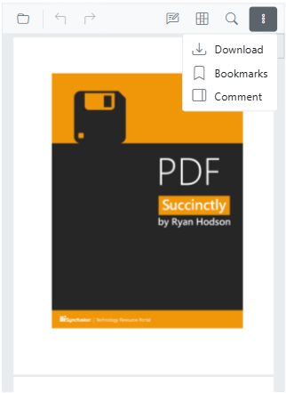

# Mobile toolbar in Blazor SfPdfViewer

Use the mobile toolbar to access core viewer actions and feature tools on small screens. The primary toolbar adapts to the available width, and feature toolbars (annotation, form designer, redaction) when the corresponding feature is enabled and activated.

## Primary toolbar in mobile mode

The SfPdfViewer includes a built-in, responsive primary toolbar that provides quick access to common viewer actions and feature-specific toolbars. In mobile mode, the toolbar adapts to available width.

The primary toolbar includes the following options:

* Open PDF File
* Undo and Redo
* Annotation tools
* Form designer tools
* Redaction tools
* Text search

Reorder the [MobileToolbarItems](https://help.syncfusion.com/cr/blazor/Syncfusion.Blazor.SfPdfViewer.PdfViewerToolbarSettings.html#Syncfusion_Blazor_SfPdfViewer_PdfViewerToolbarSettings_MobileToolbarItems) list to control the display order. The toolbar renders items in the order they appear in the collection.

Use the following code snippet to add the redaction toolbar to the PDF Viewer.

```cshtml

@page "/";

<SfPdfViewer2 @ref="SfPdfViewer2" Height="640px" Width="100%" DocumentPath="@DocumentPath">
    <PdfViewerToolbarSettings MobileToolbarItems="MobileToolbarItems"></PdfViewerToolbarSettings>
</SfPdfViewer2>
@code {
    SfPdfViewer2? SfPdfViewer2;
    bool redactionToolbar;
    private string DocumentPath { get; set; } = "https://cdn.syncfusion.com/content/pdf/pdf-succinctly.pdf";
    public List<ToolbarItem>? ToolbarItems { get; set; }
    public List<MobileToolbarItem>? MobileToolbarItems { get; set; }
    protected override void OnInitialized()
    {
        MobileToolbarItems = new List<MobileToolbarItem>()
        {
            MobileToolbarItem.Open,
            MobileToolbarItem.UndoRedo,
            MobileToolbarItem.EditAnnotation,
            MobileToolbarItem.Redaction,
            MobileToolbarItem.FormDesigner,
            MobileToolbarItem.Search
        };
    }
}

```


### More options menu

Open the overflow (three-dots) menu to access additional actions such as:

- Download: Download the currently opened PDF document.
- Bookmark: View and navigate bookmarks within the document.



## Annotation toolbar in mobile mode

The annotation toolbar appears when annotation features are enabled and provides tools to create and edit annotations. In mobile mode, it appears at the bottom of the viewer.

* Text markup: Highlight, Underline, Strikethrough, Squiggly
* Shapes: Line, Arrow, Rectangle, Circle, Polygon, Volume
* Measurement: Distance, Perimeter, Area, Radius
* Freehand: Ink, Signature
* Text: Free text
* Stamp: Predefined and custom stamps
* Properties: Color, Opacity, Thickness, Font
* Edit helpers: Delete
* Close


## Form designer toolbar in mobile mode

Use the form designer toolbar to add and configure interactive form fields in the PDF. In mobile mode, it appears at the bottom of the viewer.

* Field types: Button, Text box, Password, Check box, Radio button, Drop-down, List box, Signature, Initial
* Edit helpers: Delete
* Close


## Redaction toolbar in mobile mode

The redaction toolbar provides tools to mark and permanently remove sensitive content from the document. In mobile mode, it appears at the bottom of the viewer.

* Redaction marks: Mark for redaction, Redact page
* Apply redactions: Permanently remove marked content
* Properties: Redaction properties
* Edit helpers: Delete
* Close


## Enable desktop mode on mobile

Enable the desktop toolbar on mobile devices with the [EnableDesktopMode](https://help.syncfusion.com/cr/blazor/Syncfusion.Blazor.SfPdfViewer.PdfViewerBase.html#Syncfusion_Blazor_SfPdfViewer_PdfViewerBase_EnableDesktopMode) API. This replaces the mobile toolbar with the desktop layout and provides access to additional actions and controls.

```cshtml

@using Syncfusion.Blazor.SfPdfViewer

<SfPdfViewer2 DocumentPath="https://cdn.syncfusion.com/content/pdf/pdf-succinctly.pdf"
              Height="100%"
              Width="100%" EnableDesktopMode="true">
</SfPdfViewer2>

```

[View sample in GitHub](https://github.com/SyncfusionExamples/blazor-pdf-viewer-examples/tree/master/Toolbar)

## Modern navigation panel in mobile view

On mobile devices, the navigation toolbar collapses into a toggle menu to save space. Any custom items added appear at the beginning of this menu.


Enable the modern navigation panel by setting [EnableNavigationPanel](https://help.syncfusion.com/cr/blazor/Syncfusion.Blazor.SfPdfViewer.PdfViewerBase.html#Syncfusion_Blazor_SfPdfViewer_PdfViewerBase_EnableNavigationPanel) to true.

```cshtml

@using Syncfusion.Blazor.SfPdfViewer

<SfPdfViewer2 DocumentPath="https://cdn.syncfusion.com/content/pdf/pdf-succinctly.pdf"
              Height="100%"
              Width="100%" EnableNavigationPanel="true">
</SfPdfViewer2>

```

[View sample in GitHub](https://github.com/SyncfusionExamples/blazor-pdf-viewer-examples/tree/master/Toolbar)

## Enable scrolling in desktop mode with touch gestures

To enable smooth scrolling of PDF documents on mobile while in desktop mode, disable text selection by setting [EnableTextSelection](https://help.syncfusion.com/cr/blazor/Syncfusion.Blazor.SfPdfViewer.PdfViewerBase.html#Syncfusion_Blazor_SfPdfViewer_PdfViewerBase_EnableTextSelection) to false to allow touch panning.

```cshtml

@using Syncfusion.Blazor.SfPdfViewer

<SfPdfViewer2 DocumentPath="https://cdn.syncfusion.com/content/pdf/pdf-succinctly.pdf"
              Height="100%"
              Width="100%" EnableDesktopMode="true" EnableTextSelection="false">
</SfPdfViewer2>

```

[View sample in GitHub](https://github.com/SyncfusionExamples/blazor-pdf-viewer-examples/tree/master/Toolbar)

## Print option availability

The Print option is not available in mobile mode by default. To use printing on mobile, enable the desktop toolbar with the [EnableDesktopMode](https://help.syncfusion.com/cr/blazor/Syncfusion.Blazor.SfPdfViewer.PdfViewerBase.html#Syncfusion_Blazor_SfPdfViewer_PdfViewerBase_EnableDesktopMode) API. Availability and behavior may vary by mobile browser.

## See also

- [Annotations in mobile view](../annotation/annotations-in-mobile-view)
- [Form designer in mobile view](../form-designer/form-designer-in-mobile-view)