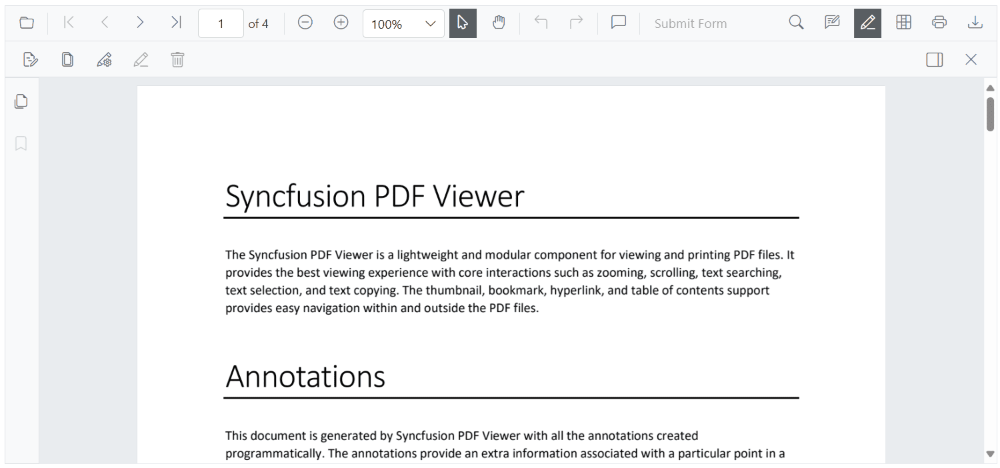
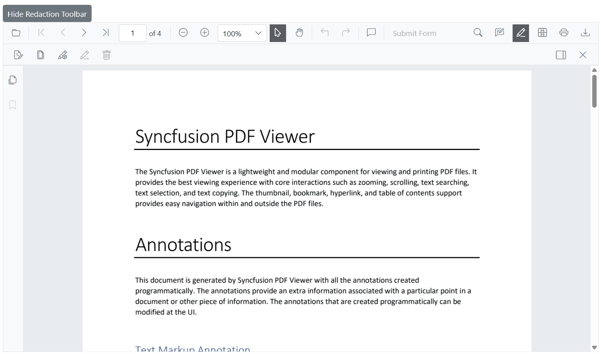

# Redaction toolbar customization

The redaction toolbar can be customized by rearranging existing items, disabling default items, and adding custom items. New items can be placed at specific index positions among the existing items.

## Enable the redaction toolbar on desktop

Show the redaction toolbar on desktop by including the required [ToolbarItems](https://help.syncfusion.com/cr/blazor/Syncfusion.Blazor.SfPdfViewer.ToolbarItem.html) in the SfPdfViewer2 component.

The following example demonstrates how to enable the redaction toolbar on desktop.

```cshtml

@page "/"

<SfPdfViewer2 Height="100%" Width="100%" DocumentPath="Annotations.pdf">
    <PdfViewerToolbarSettings ToolbarItems="ToolbarItems"></PdfViewerToolbarSettings>
</SfPdfViewer2>

@code {
    private List<ToolbarItem> ToolbarItems = new List<ToolbarItem>();
    protected override void OnInitialized()
    {
        ToolbarItems = new List<ToolbarItem>()
        {
            ToolbarItem.OpenOption,
            ToolbarItem.PageNavigationTool,
            ToolbarItem.MagnificationTool,
            ToolbarItem.SelectionTool,
            ToolbarItem.PanTool,
            ToolbarItem.UndoRedoTool,
            ToolbarItem.CommentTool,
            ToolbarItem.SubmitForm,
            ToolbarItem.SearchOption,
            ToolbarItem.AnnotationEditTool,
            ToolbarItem.Redaction,              // Enables Redaction toolbar
            ToolbarItem.FormDesigner,
            ToolbarItem.PrintOption,
            ToolbarItem.DownloadOption
        };
    }
}

```

Refer to the following image for the desktop view.


## Enable the redaction toolbar on mobile

Show the redaction toolbar on mobile by configuring the [MobileToolbarItems](https://help.syncfusion.com/cr/blazor/Syncfusion.Blazor.SfPdfViewer.MobileToolbarItem.html) property.

The following example demonstrates how to enable the redaction toolbar on mobiles.

```cshtml

@page "/"

<SfPdfViewer2 Height="100%" Width="100%" DocumentPath="Annotations.pdf">
    <PdfViewerToolbarSettings MobileToolbarItems="MobileToolbarItems"></PdfViewerToolbarSettings>
</SfPdfViewer2>

@code {
    private List<MobileToolbarItem> MobileToolbarItems = new List<MobileToolbarItem>();
    protected override void OnInitialized()
    {
        MobileToolbarItems = new List<MobileToolbarItem>()
        {
            MobileToolbarItem.Open,
            MobileToolbarItem.UndoRedo,
            MobileToolbarItem.EditAnnotation,
            MobileToolbarItem.Redaction,        // Enables Redaction toolbar
            MobileToolbarItem.FormDesigner,
            MobileToolbarItem.Search
        };
    }
}

```

Refer to the following image for the mobile view.


## Show or hide the redaction toolbar

Show or hide the redaction toolbar using the built-in toolbar icon or programmatically with the [ShowRedactionToolbar](https://help.syncfusion.com/cr/blazor/Syncfusion.Blazor.SfPdfViewer.PdfViewerBase.html#Syncfusion_Blazor_SfPdfViewer_PdfViewerBase_ShowRedactionToolbar) API.

### Display the redaction toolbar using the toolbar icon

When [ToolbarItem.Redaction](https://help.syncfusion.com/cr/blazor/Syncfusion.Blazor.SfPdfViewer.ToolbarItem.html#Syncfusion_Blazor_SfPdfViewer_ToolbarItem_Redaction) or [MobileToolbarItem.Redaction](https://help.syncfusion.com/cr/blazor/Syncfusion.Blazor.SfPdfViewer.MobileToolbarItem.html#Syncfusion_Blazor_SfPdfViewer_MobileToolbarItem_Redaction) is enabled, selecting the redaction icon in the primary toolbar toggles the redaction toolbar.

Refer to the following image for details.


### Display the redaction toolbar programmatically

Control visibility through application logic by invoking the `ShowRedactionToolbar` method on the viewer instance.

The following example demonstrates how to toggle the visibility of the redaction toolbar using a button:

```cshtml

private void ToggleRedactionToolbar()
{
    isRedactionToolbarVisible = !isRedactionToolbarVisible;
    SfPdfViewer2.ShowRedactionToolbar(isRedactionToolbarVisible);
}

```

Refer to the following image for details.



## See also

* [Adding the redaction annotation in PDF viewer](../redaction/overview)